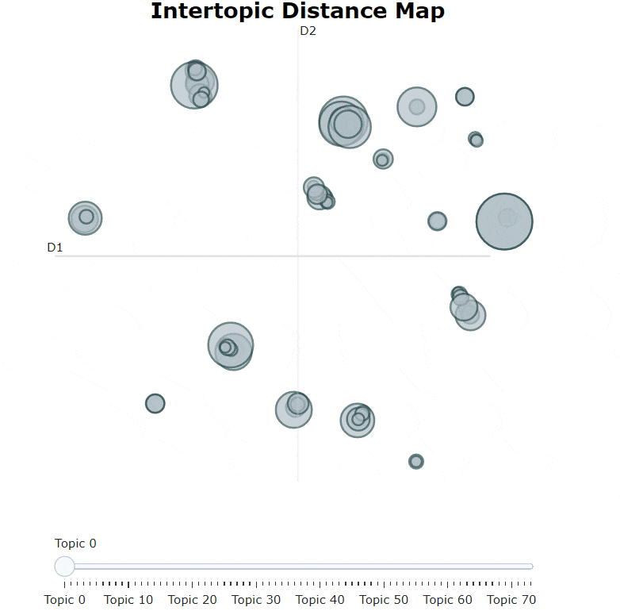

[](https://pypi.org/project/bertopic/)
[](https://pypi.org/project/bertopic/)
[](https://maartengr.github.io/BERTopic/)
[](https://pypi.org/project/bertopic/)
[](https://github.com/MaartenGr/VLAC/blob/master/LICENSE)
[](https://doi.org/10.5281/zenodo.4381785)

# BERTopic


BERTopic is a topic modeling technique that leverages 🤗 transformers and c-TF-IDF to create dense clusters
allowing for easily interpretable topics whilst keeping important words in the topic descriptions. It even supports 
visualizations similar to LDAvis! 

Corresponding medium posts can be found [here](https://towardsdatascience.com/topic-modeling-with-bert-779f7db187e6?source=friends_link&sk=0b5a470c006d1842ad4c8a3057063a99) 
and [here](https://towardsdatascience.com/interactive-topic-modeling-with-bertopic-1ea55e7d73d8?sk=03c2168e9e74b6bda2a1f3ed953427e4).

## Installation

Installation, with sentence-transformers, can be done using [pypi](https://pypi.org/project/bertopic/):

```bash
pip install bertopic
```

You may want to install more depending on the transformers and language backends that you will be using. 
The possible installations are: 

```bash
pip install bertopic[flair]
pip install bertopic[gensim]
pip install bertopic[spacy]
pip install bertopic[use]
```

To install all backends:

```bash
pip install bertopic[all]
```


## Getting Started
For an in-depth overview of the features of BERTopic 
you can check the full documentation [here](https://maartengr.github.io/BERTopic/) or you can follow along 
with one of the examples below:

| Name  | Link  |
|---|---|
| Topic Modeling with BERTopic  | [](https://colab.research.google.com/drive/1FieRA9fLdkQEGDIMYl0I3MCjSUKVF8C-?usp=sharing)  |
| (Custom) Embedding Models in BERTopic  | [](https://colab.research.google.com/drive/18arPPe50szvcCp_Y6xS56H2tY0m-RLqv?usp=sharing) |
| Advanced Customization in BERTopic  |  [](https://colab.research.google.com/drive/1ClTYut039t-LDtlcd-oQAdXWgcsSGTw9?usp=sharing) |
| (semi-)Supervised Topic Modeling with BERTopic  |  [](https://colab.research.google.com/drive/1bxizKzv5vfxJEB29sntU__ZC7PBSIPaQ?usp=sharing)  |
| Dynamic Topic Modeling with Trump's Tweets  | [](https://colab.research.google.com/drive/1un8ooI-7ZNlRoK0maVkYhmNRl0XGK88f?usp=sharing)  |


## Quick Start
We start by extracting topics from the well-known 20 newsgroups dataset which is comprised of english documents:

```python
from bertopic import BERTopic
from sklearn.datasets import fetch_20newsgroups
 
docs = fetch_20newsgroups(subset='all',  remove=('headers', 'footers', 'quotes'))['data']

topic_model = BERTopic()
topics, _ = topic_model.fit_transform(docs)
```

After generating topics, we can access the frequent topics that were generated:

```python
>>> topic_model.get_topic_info()

Topic	Count	Name
-1	4630	-1_can_your_will_any
0	693	49_windows_drive_dos_file
1	466	32_jesus_bible_christian_faith
2	441	2_space_launch_orbit_lunar
3	381	22_key_encryption_keys_encrypted
```

-1 refers to all outliers and should typically be ignored. Next, let's take a look at the most 
frequent topic that was generated, topic 0:

```python
>>> topic_model.get_topic(0)

[('windows', 0.006152228076250982),
 ('drive', 0.004982897610645755),
 ('dos', 0.004845038866360651),
 ('file', 0.004140142872194834),
 ('disk', 0.004131678774810884),
 ('mac', 0.003624848635985097),
 ('memory', 0.0034840976976789903),
 ('software', 0.0034415334250699077),
 ('email', 0.0034239554442333257),
 ('pc', 0.003047105930670237)]
```  

**NOTE**: Use `BERTopic(language="multilingual")` to select a model that supports 50+ languages. 

## Visualize Topics
After having trained our BERTopic model, we can iteratively go through hundreds of topics to get a good 
understanding of the topics that were extracted. However, that takes quite some time and lacks a global representation. 
Instead, we can visualize the topics that were generated in a way very similar to 
[LDAvis](https://github.com/cpsievert/LDAvis):

```python
topic_model.visualize_topics()
``` 




## Embedding Models
BERTopic supports many embedding models that can be used to embed the documents and words:
* Sentence-Transformers
* Flair
* Spacy
* Gensim
* USE

Click [here](https://maartengr.github.io/BERTopic/tutorial/embeddings/embeddings.html) 
for a full overview of all supported embedding models. 

### Sentence-Transformers  
You can select any model from sentence-transformers [here](https://www.sbert.net/docs/pretrained_models.html) 
and pass it to BERTopic:

```python
topic_model = BERTopic(embedding_model="xlm-r-bert-base-nli-stsb-mean-tokens")
```

Or select a SentenceTransformer model with your own parameters:

```python
from sentence_transformers import SentenceTransformer

sentence_model = SentenceTransformer("distilbert-base-nli-mean-tokens", device="cpu")
topic_model = BERTopic(embedding_model=sentence_model)
```

### Flair  
[Flair](https://github.com/flairNLP/flair) allows you to choose almost any embedding model that 
is publicly available. Flair can be used as follows:

```python
from flair.embeddings import TransformerDocumentEmbeddings

roberta = TransformerDocumentEmbeddings('roberta-base')
topic_model = BERTopic(embedding_model=roberta)
```

You can select any 🤗 transformers model [here](https://huggingface.co/models).

**Custom Embeddings**    
You can also use previously generated embeddings by passing it to `fit_transform()`:

```python
topic_model = BERTopic()
topics, _ = topic_model.fit_transform(docs, embeddings)
```

## Dynamic Topic Modeling
Dynamic topic modeling (DTM) is a collection of techniques aimed at analyzing the evolution of topics 
over time. These methods allow you to understand how a topic is represented across different times. 
Here, we will be using all of Donald Trump's tweet so see how he talked over certain topics over time: 

```python
import re
import pandas as pd

trump = pd.read_csv('https://drive.google.com/uc?export=download&id=1xRKHaP-QwACMydlDnyFPEaFdtskJuBa6')
trump.text = trump.apply(lambda row: re.sub(r"http\S+", "", row.text).lower(), 1)
trump.text = trump.apply(lambda row: " ".join(filter(lambda x:x[0]!="@", row.text.split())), 1)
trump.text = trump.apply(lambda row: " ".join(re.sub("[^a-zA-Z]+", " ", row.text).split()), 1)
trump = trump.loc[(trump.isRetweet == "f") & (trump.text != ""), :]
timestamps = trump.date.to_list()
tweets = trump.text.to_list()
```

Then, we need to extract the global topic representations by simply creating and training a BERTopic model:

```python
topic_model = BERTopic(verbose=True)
topics, _ = topic_model.fit_transform(tweets)
```

From these topics, we are going to generate the topic representations at each timestamp for each topic. We do this 
by simply calling `topics_over_time` and pass in his tweets, the corresponding timestamps, and the related topics:

```python
topics_over_time = topic_model.topics_over_time(tweets, topics, timestamps, nr_bins=20)
```

Finally, we can visualize the topics by simply calling `visualize_topics_over_time()`: 

```python
topic_model.visualize_topics_over_time(topics_over_time, top_n_topics=6)
```


## Overview
For quick access to common functions, here is an overview of BERTopic's main methods:

| Method | Code  | 
|-----------------------|---|
| Fit the model    |  `BERTopic().fit(docs)` |
| Fit the model and predict documents    |  `BERTopic().fit_transform(docs)` |
| Predict new documents    |  `BERTopic().transform([new_doc])` |
| Access single topic   | `BERTopic().get_topic(topic=12)`  |   
| Access all topics     |  `BERTopic().get_topics()` |
| Get topic freq    |  `BERTopic().get_topic_freq()` |
| Get all topic information|  `BERTopic().get_topic_info()` |
| Get topics per class | `BERTopic().topics_per_class(docs, topics, classes)` |
| Dynamic Topic Modeling | `BERTopic().topics_over_time(docs, topics, timestamps)` |
| Update topic representation | `BERTopic().update_topics(docs, topics, n_gram_range=(1, 3))` |
| Reduce nr of topics | `BERTopic().reduce_topics(docs, topics, nr_topics=30)` |
| Find topics | `BERTopic().find_topics("vehicle")` |
| Save model    |  `BERTopic().save("my_model")` |
| Load model    |  `BERTopic.load("my_model")` |
| Get parameters |  `BERTopic().get_params()` |

For an overview of BERTopic's visualization methods:

| Method | Code  | 
|-----------------------|---|
| Visualize Topics    |  `BERTopic().visualize_topics()` |
| Visualize Topic Hierarchy    |  `BERTopic().visualize_hierarchy()` |
| Visualize Topic Terms    |  `BERTopic().visualize_barchart()` |
| Visualize Topic Similarity  |  `BERTopic().visualize_heatmap()` |
| Visualize Term Score Decline  |  `BERTopic().visualize_term_rank()` |
| Visualize Topic Probability Distribution    |  `BERTopic().visualize_distribution(probs[0])` |
| Visualize Topics over Time   |  `BERTopic().visualize_topics_over_time(topics_over_time)` |
| Visualize Topics per Class | `BERTopic().visualize_topics_per_class(topics_per_class)` | 

## Citation
To cite BERTopic in your work, please use the following bibtex reference:

```bibtex
@misc{grootendorst2020bertopic,
  author       = {Maarten Grootendorst},
  title        = {BERTopic: Leveraging BERT and c-TF-IDF to create easily interpretable topics.},
  year         = 2020,
  publisher    = {Zenodo},
  version      = {v0.7.0},
  doi          = {10.5281/zenodo.4381785},
  url          = {https://doi.org/10.5281/zenodo.4381785}
}
```
