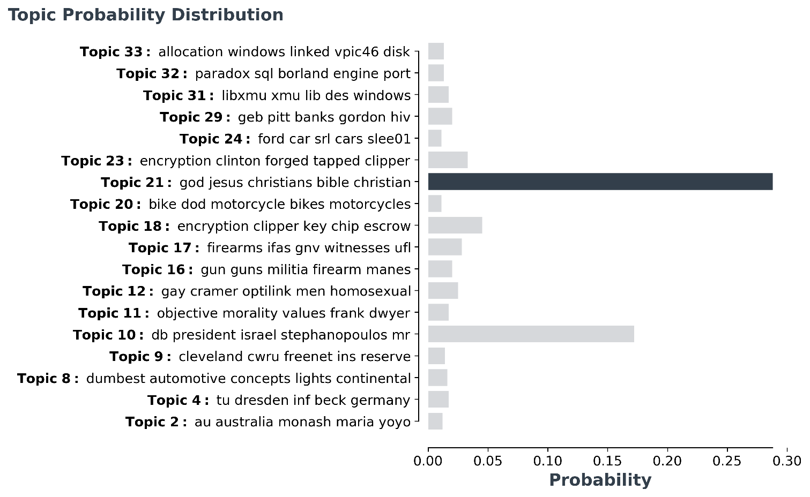

[](https://pypi.org/project/bertopic/)
[](https://github.com/MaartenGr/VLAC/blob/master/LICENSE)
[](https://pypi.org/project/bertopic/)
[](https://pypi.org/project/bertopic/)
[](https://maartengr.github.io/BERTopic/)  


# BERTopic


BERTopic is a topic modeling technique that leverages 🤗 transformers and c-TF-IDF to create dense clusters
allowing for easily interpretable topics whilst keeping important words in the topic descriptions. 

Corresponding medium post can be found [here](https://towardsdatascience.com/topic-modeling-with-bert-779f7db187e6?source=friends_link&sk=0b5a470c006d1842ad4c8a3057063a99).

## Installation

PyTorch 1.4.0 or higher is recommended. If the install below gives an
error, please install pytorch first [here](https://pytorch.org/get-started/locally/). 

Installation can be done using [pypi](https://pypi.org/project/bertopic/):

```bash
pip install bertopic
```

To use the visualization option, install BERTopic as follows:

```bash
pip install bertopic[visualization]
```


## Getting Started
For an in-depth overview of the possibilities of `BERTopic` 
you can check the full documentation [here](https://maartengr.github.io/BERTopic/) or you can follow along 
with the Google Colab notebook [here](https://colab.research.google.com/drive/1FieRA9fLdkQEGDIMYl0I3MCjSUKVF8C-?usp=sharing).

### Quick Start

Below is an example of how to use the model. The example uses the 
[20 newsgroups](https://scikit-learn.org/0.19/datasets/twenty_newsgroups.html) dataset.  

```python
from bertopic import BERTopic
from sklearn.datasets import fetch_20newsgroups
 
docs = fetch_20newsgroups(subset='all')['data']

model = BERTopic(language="english")
topics, probabilities = model.fit_transform(docs)
```

The resulting topics can be accessed through `model.get_topic(topic)`:

```python
>>> model.get_topic(9)
[('game', 0.005251396890032802),
 ('team', 0.00482651185323754),
 ('hockey', 0.004335032060690186),
 ('players', 0.0034782716706978963),
 ('games', 0.0032873248432630227),
 ('season', 0.003218987432255393),
 ('play', 0.0031855141725669637),
 ('year', 0.002962343114817677),
 ('nhl', 0.0029577648449943144),
 ('baseball', 0.0029245163154193524)]
```  

For a list of supported languages, please select the link below. 

<details>
<summary>Supported Languages</summary>

The following languages are supported:
Afrikaans, Albanian, Amharic, Arabic, Armenian, Assamese,
Azerbaijani, Basque, Belarusian, Bengali, Bengali Romanize, Bosnian,
Breton, Bulgarian, Burmese, Burmese zawgyi font, Catalan, Chinese (Simplified),
Chinese (Traditional), Croatian, Czech, Danish, Dutch, English, Esperanto,
Estonian, Filipino, Finnish, French, Galician, Georgian, German, Greek,
Gujarati, Hausa, Hebrew, Hindi, Hindi Romanize, Hungarian, Icelandic, Indonesian,
Irish, Italian, Japanese, Javanese, Kannada, Kazakh, Khmer, Korean,
Kurdish (Kurmanji), Kyrgyz, Lao, Latin, Latvian, Lithuanian, Macedonian,
Malagasy, Malay, Malayalam, Marathi, Mongolian, Nepali, Norwegian,
Oriya, Oromo, Pashto, Persian, Polish, Portuguese, Punjabi, Romanian,
Russian, Sanskrit, Scottish Gaelic, Serbian, Sindhi, Sinhala, Slovak,
Slovenian, Somali, Spanish, Sundanese, Swahili, Swedish, Tamil,
Tamil Romanize, Telugu, Telugu Romanize, Thai, Turkish, Ukrainian,
Urdu, Urdu Romanize, Uyghur, Uzbek, Vietnamese, Welsh, Western Frisian,
Xhosa, Yiddish
</details>  

### Embedding model
You can select any model from `sentence-transformers` and pass it through 
BERTopic with `embedding_model`:

```python
from bertopic import BERTopic
model = BERTopic(embedding_model="xlm-r-bert-base-nli-stsb-mean-tokens")
```

Click [here](https://www.sbert.net/docs/pretrained_models.html) for a list of supported sentence transformers models.  

### Custom Embeddings
If you use BERTopic as shown above, then you are forced to use `sentence-transformers` as the main
package for which to create embeddings. However, you might have your own model or package that
you believe is better suited for representing documents. 

Fortunately, for those that want to use their own embeddings there is an option in BERTopic.
For this example I will still be using `sentence-transformers` but the general principle holds:

```python
from bertopic import BERTopic
from sklearn.datasets import fetch_20newsgroups
from sentence_transformers import SentenceTransformer

# Prepare embeddings
docs = fetch_20newsgroups(subset='all')['data']
sentence_model = SentenceTransformer("distilbert-base-nli-mean-tokens")
embeddings = sentence_model.encode(docs, show_progress_bar=False)

# Create topic model
model = BERTopic()
topics, probabilities = model.fit_transform(docs, embeddings)
```

### Visualize Topic Probabilities

The variable `probabilities` that is returned from `transform()` or `fit_transform()` can 
be used to understand how confident BERTopic is that certain topics can be found in a document. 

To visualize the distributions, we simply call:
```python
# Make sure to input the probabilities of a single document!
model.visualize_distribution(probabilities[0])
```




**NOTE**: The distribution of the probabilities does not give an indication to 
the distribution of the frequencies of topics across a document. It merely shows
how confident BERTopic is that certain topics can be found in a document. 

### Overview

| Methods | Code  | Returns  |
|-----------------------|---|---|
| Access single topic   | `model.get_topic(12)`  | Tuple[Word, Score]  |   
| Access all topics     |  `model.get_topics()` | List[Tuple[Word, Score]]  |
| Get single topic freq |  `model.get_topic_freq(12)` | int |
| Get all topic freq    |  `model.get_topics_freq()` | DataFrame  |
| Fit the model    |  `model.fit(docs])` | -  |
| Fit the model and predict documents    |  `model.fit_transform(docs])` | List[int], List[float]  |
| Predict new documents    |  `model.transform([new_doc])` | List[int], List[float]  |
| Visualize Topic Probability Distribution    |  `model.visualize_distribution(probabilities)` | Matplotlib.Figure  |
| Save model    |  `model.save("my_model")` | -  |
| Load model    |  `BERTopic.load("my_model")` | - |
   
**NOTE**: The embeddings itself are not preserved in the model as they are only vital for creating the clusters. 
Therefore, it is advised to only use `fit` and then `transform` if you are looking to generalize the model to new documents.
For existing documents, it is best to use `fit_transform` directly as it only needs to generate the document
embeddings once.   
