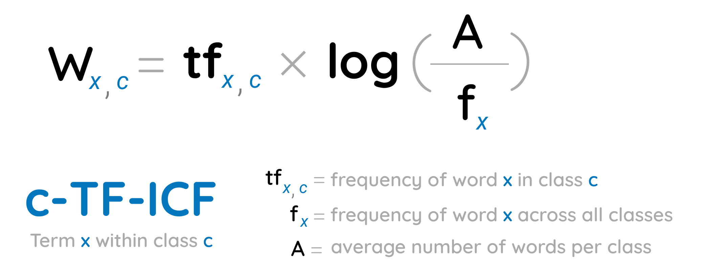

The algorithm contains, roughly, 3 stages:   
     
1. **Embed documents**
    * Extract document embeddings with BERT or any other embedding technique
2. **Cluster Documents**
    * UMAP to reduce the dimensionality of embeddings
    * HDBSCAN to cluster reduced embeddings and create clusters of semantically similar documents
3. **Create topic representation**  
    * Extract and reduce topics with c-TF-IDF
    * Improve coherence and diversity of words with Maximal Marginal Relevance  
    
##  **1. Embed documents**
We start by creating document embeddings from a set of documents using 
[sentence-transformers](https://github.com/UKPLab/sentence-transformers). These models are pre-trained for many 
languages and are great for creating either document- or sentence-embeddings. 

In BERTopic, you can choose any sentence-transformers model but there are two models that are set as defaults:

* `"all-MiniLM-L6-v2"`
* `"paraphrase-multilingual-MiniLM-L12-v2"`

The first is an English language model trained specifically for semantic similarity tasks which work quite 
well for most use-cases. The second model is very similar to the first with one major difference is that the 
`multilingual` models work for 50+ languages. This model is quite a bit larger than the first and is only selected if 
you select any language other than English.

!!! tip Embedding Models

    Although BERTopic uses sentence-transformers models as a default, you can choose 
    any embedding model that fits your use case. Follow the guide [here](https://maartengr.github.io/BERTopic/getting_started/embeddings/embeddings.html) for selecting 
    and customizing your model.

##  **2. Cluster Documents**

Typically, clustering algorithms have difficulty clustering data in high dimensional space. Before we are 
going to cluster our documents, we first need to reduce the dimensionality of the embeddings that we generated. 
As a default, we use UMAP since it preserves both the local and global structure of embeddings quite well. 

!!! tip Dimensionality Reduction Models

    Although BERTopic uses UMAP as a default, you can choose 
    any dimensionality reduction model that fits your use case. Follow the guide [here](https://maartengr.github.io/BERTopic/getting_started/dim_reduction/dim_reduction.html) for selecting 
    and customizing your model.

Then, after reducing our embeddings, we leverage a density-based clustering technique, HDBSCAN, to create our clusters and identify outliers where possible. 

!!! tip Cluster Models

    Although BERTopic uses HDBSCAN as a default, you can choose 
    any cluster model that fits your use case. Follow the guide [here](https://maartengr.github.io/BERTopic/getting_started/clustering/clustering.html) for selecting 
    and customizing your model.

##  **3. Create topic representation**
What we want to know from the clusters that we generated, is what makes one cluster, based on its content, 
different from another? To solve this, we can modify TF-IDF such that it allows for interesting words per cluster 
of documents instead of per individual document. 

When you apply TF-IDF as usual on a set of documents, what you are doing is comparing the importance of 
words between documents. Now, what if, we instead treat all documents in a single category (e.g., a cluster) 
as a single document and then apply TF-IDF? The result would be importance scores for words within a cluster. 
The more important words are within a cluster, the more it is representative of that topic. In other words, 
if we extract the most important words per cluster, we get descriptions of **topics**! This model is called 
class-based TF-IDF

  

Each cluster is converted to a single document instead of a set of documents. Then, we extract the frequency 
of word `x` in class `c`, where `c` refers to the cluster we created before. This results in our class-based 
 `tf` representation. 

Then, we take take the logarithm of one plus the average number of words per class `A` divided by the frequency 
of word `x` across all classes. We add plus one within the logarithm to force values to be positive. 
This results in our class-based `idf` representation. 

Like with the classic TF-IDF, we then multiply `tf` with `idf` to get the importance score per word in each class. 

!!! tip CountVectorizer Models

    This c-TF-IDF representation first create a vocabulary through the use of scikit-learn's `CountVectorizer` 
    module. This module allows us to preprocess the topic representation without actually preprocessing 
    the data input. Follow the guide [here](http://127.0.0.1:8000/BERTopic/getting_started/countvectorizer/countvectorizer.html) for selecting 
    and customizing the `CountVectorizer`.

## **(Optional) Maximal Marginal Relevance Coherence**  
After having generated the c-TF-IDF representations, we have a set of words that describe a collection of documents. 
Technically, this does not mean that this collection of words describes a coherent topic. In practice, we will 
see that many of the words do describe a similar topic but some words will, in a way, overfit the documents. For 
example, if you have a set of documents that are written by the same person whose signature will be in the topic 
description. 

To improve the coherence of words, Maximal Marginal Relevance was used to find the most coherent words 
without having too much overlap between the words themselves. This results in the removal of words that do not contribute 
to a topic.  

You can also use this technique to diversify the words generated in the topic representation. At times, many variations 
of the same word can end up in the topic representation. To reduce the number of synonyms, we can increase the diversity 
among words whilst still being similar to the topic representation. 
