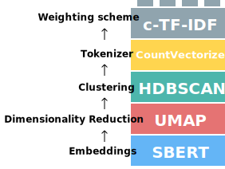
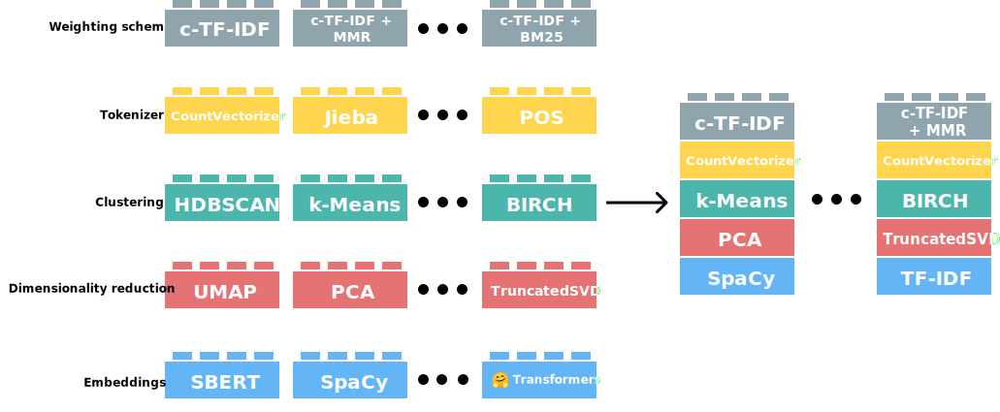

---
hide:
  - navigation
---

# The Algorithm

Below, you will find different types of overviews of each step in BERTopic's main algorithm. Each successive overview will be more in-depth than the previous overview. This approach aims to make the underlying algorithm as intuitive as possible for a wide range of users. 

## **Visual Overview**

BERTopic can be viewed as a sequence of steps to create its topic representations. There are five steps to this process:



Although these steps are the default, there is some modularity to BERTopic. Each step in this process was carefully selected such that they are all somewhat independent from one another. For example, the tokenization step is not directly influenced by the embedding model that was used to convert the documents which allow us to be creative in how we perform the tokenization step. 

This effect is especially strong in the clustering step. Models like HDBSCAN assume that clusters can have different shapes and forms. As a result, using a centroid-based technique to model the topic representations would not be beneficial since the centroid is not always representative of these types of clusters. A bag-of-words representation, however, makes very few assumptions concerning the shape and form of a cluster. 

As a result, BERTopic is quite modular and can maintain its quality of topic generation throughout a variety of sub-models. In other words, BERTopic essentially allows you to **build your own topic model**:



There is extensive documentation on how to use each step in this pipeline:

1. [Embeddings](../getting_started/embeddings/embeddings.html)
2. [Dimensionality Reduction](../getting_started/dim_reduction/dim_reduction.html)
3. [Clustering](../getting_started/clustering/clustering.html)
4. [Tokenizer](../getting_started/vectorizers/vectorizers.html)
5. [Weighting Scheme](../getting_started/ctfidf/ctfidf.html)
6. [Representation Tuning](../getting_started/representation/representation.html)
    * [Large Language Models (LLM)](../getting_started/representation/llm.html)

## **Code Overview**
After going through the visual overview, this code overview demonstrates the algorithm using BERTopic. An advantage of using BERTopic is each major step in its algorithm can be explicitly defined, thereby making the process not only transparent but also more intuitive. 


```python
from umap import UMAP
from hdbscan import HDBSCAN
from sentence_transformers import SentenceTransformer
from sklearn.feature_extraction.text import CountVectorizer

from bertopic import BERTopic
from bertopic.representation import KeyBERTInspired
from bertopic.vectorizers import ClassTfidfTransformer


# Step 1 - Extract embeddings
embedding_model = SentenceTransformer("all-MiniLM-L6-v2")

# Step 2 - Reduce dimensionality
umap_model = UMAP(n_neighbors=15, n_components=5, min_dist=0.0, metric='cosine')

# Step 3 - Cluster reduced embeddings
hdbscan_model = HDBSCAN(min_cluster_size=15, metric='euclidean', cluster_selection_method='eom', prediction_data=True)

# Step 4 - Tokenize topics
vectorizer_model = CountVectorizer(stop_words="english")

# Step 5 - Create topic representation
ctfidf_model = ClassTfidfTransformer()

# Step 6 - (Optional) Fine-tune topic representations with 
# a `bertopic.representation` model
representation_model = KeyBERTInspired()

# All steps together
topic_model = BERTopic(
  embedding_model=embedding_model,          # Step 1 - Extract embeddings
  umap_model=umap_model,                    # Step 2 - Reduce dimensionality
  hdbscan_model=hdbscan_model,              # Step 3 - Cluster reduced embeddings
  vectorizer_model=vectorizer_model,        # Step 4 - Tokenize topics
  ctfidf_model=ctfidf_model,                # Step 5 - Extract topic words
  representation_model=representation_model # Step 6 - (Optional) Fine-tune topic representations
)
```


## **Detailed Overview**
This overview describes each step in more detail such that you can get an intuitive feeling as to what models might fit best at each step in your use case. 

###  **1. Embed documents**
We start by converting our documents to numerical representations. Although there are many methods for doing so the default in BERTopic is [sentence-transformers](https://github.com/UKPLab/sentence-transformers). These models are often optimized for semantic similarity which helps tremendously in our clustering task. Moreover, they are great for creating either document- or sentence-embeddings. 
<br>
In BERTopic, you can choose any sentence-transformers model but two models are set as defaults:

* `"all-MiniLM-L6-v2"`
* `"paraphrase-multilingual-MiniLM-L12-v2"`

The first is an English language model trained specifically for semantic similarity tasks which works quite 
well for most use cases. The second model is very similar to the first with one major difference being that the 
`multilingual` models work for 50+ languages. This model is quite a bit larger than the first and is only selected if 
you select any language other than English.

!!! tip Embedding models

    Although BERTopic uses sentence-transformers models as a default, you can choose 
    any embedding model that fits your use case. Follow the guide [here](https://maartengr.github.io/BERTopic/getting_started/embeddings/embeddings.html) for selecting 
    and customizing your model.


### **2. Dimensionality reduction**
After having created our numerical representations of the documents we have to reduce the dimensionality of these representations. Cluster models typically have difficulty handling high dimensional data due to the curse of dimensionality. There are great approaches that can reduce dimensionality, such as PCA, but as a default [UMAP](https://github.com/lmcinnes/umap) is selected in BERTopic. It is a technique that can keep some of a dataset's local and global structure when reducing its dimensionality. This structure is important to keep as it contains the information necessary to create clusters of semantically similar documents. 

!!! tip Dimensionality reduction models

    Although BERTopic uses UMAP as a default, you can choose 
    any dimensionality reduction model that fits your use case. Follow the guide [here](https://maartengr.github.io/BERTopic/getting_started/dim_reduction/dim_reduction.html) for selecting 
    and customizing your model.

###  **3. Cluster Documents**
After having reduced our embeddings, we can start clustering our data. For that, we leverage a density-based clustering technique, HDBSCAN. It can find clusters of different shapes and has the nice feature of identifying outliers where possible. As a result, we do not force documents into a cluster where they might not belong. This will improve the resulting topic representation as there is less noise to draw from. 

!!! tip Cluster models

    Although BERTopic uses HDBSCAN as a default, you can choose 
    any cluster model that fits your use case. Follow the guide [here](https://maartengr.github.io/BERTopic/getting_started/clustering/clustering.html) for selecting 
    and customizing your model.

### **4. Bag-of-words**
Before we can start creating the topic representation we first need to select a technique that allows for modularity in BERTopic's algorithm. When we use HDBSCAN as a cluster model, we may assume that our clusters have different degrees of density and different shapes. This means that a centroid-based topic representation technique might not be the best-fitting model. In other words, we want a topic representation technique that makes little to no assumption on the expected structure of the clusters. 
<br>
To do this, we first combine all documents in a cluster into a single document. That, very long, document then represents the cluster. Then, we can count how often each word appears in each cluster. This generates something called a bag-of-words representation in which the frequency of each word in each cluster can be found. This bag-of-words representation is therefore on a cluster level and not on a document level. This distinction is important as we are interested in words on a topic level (i.e., cluster level). By using a bag-of-words representation, no assumption is made concerning the structure of the clusters. Moreover, the bag-of-words representation is L1-normalized to account for clusters that have different sizes. 

!!! tip Bag-of-words and tokenization

    There are many ways you can tune or change the bag-of-words step. This step allows for processing the documents however you want without affecting the first step, embedding the documents. You can follow the guide [here](https://maartengr.github.io/BERTopic/getting_started/vectorizers/vectorizers.html) for more information about tokenization options in BERTopic.

###  **5. Topic representation**
From the generated bag-of-words representation, we want to know what makes one cluster different from another. Which words are typical for cluster 1 and not so much for all other clusters? To solve this, we need to modify TF-IDF such that it considers topics (i.e., clusters) instead of documents. 
<br>    
When you apply TF-IDF as usual on a set of documents, what you are doing is comparing the importance of 
words between documents. Now, what if, we instead treat all documents in a single category (e.g., a cluster) as a single document and then apply TF-IDF? The result would be importance scores for words within a cluster. The more important words are within a cluster, the more it is representative of that topic. In other words, if we extract the most important words per cluster, we get descriptions of **topics**! This model is called **class-based TF-IDF**:
<br><br>
  


<br>
Each cluster is converted to a single document instead of a set of documents. Then, we extract the frequency of word `x` in class `c`, where `c` refers to the cluster we created before. This results in our class-based `tf` representation. This representation is L1-normalized to account for the differences in topic sizes. 
  <br><br>
Then, we take the logarithm of one plus the average number of words per class `A` divided by the frequency of word `x` across all classes. We add plus one within the logarithm to force values to be positive. This results in our class-based `idf` representation. Like with the classic TF-IDF, we then multiply `tf` with `idf` to get the importance score per word in each class. In other words, the classical TF-IDF procedure is **not** used here but a modified version of the algorithm that allows for a much better representation. 

!!! tip c-TF-IDF parameters

    In the `ClassTfidfTransformer`, there are a few parameters that might be worth exploring, including an option to perform additional BM-25 weighting. You can find more information about that [here](https://maartengr.github.io/BERTopic/getting_started/ctfidf/ctfidf.html).

### **6. (Optional) Fine-tune Topic representation**  
After having generated the c-TF-IDF representations, we have a set of words that describe a collection of documents. c-TF-IDF 
is a method that can quickly generate accurate topic representations. However, with the fast developments in NLP-world, new 
and exciting methods are released weekly. In order to keep up with what is happening, there is the possibility to further fine-tune 
these c-TF-IDF topics using GPT, T5, KeyBERT, Spacy, and other techniques. Many are implemented in BERTopic for you to use and play around with. 

More specifically, we can consider the c-TF-IDF generated topics to be candidate topics. They each contain a set of keywords and 
representative documents that we can use to further fine-tune the topic representations. Having a set of representative documents 
for each topic is huge advantage as it allows for fine-tuning on a reduced number of documents. This reduces computation for 
large models as they only need to operate on that small set of representative documents for each topic. As a result, 
large language models like GPT and T5 becomes feasible in production settings and typically take less wall time than the dimensionality reduction 
and clustering steps. 

The following models are implemented in `bertopic.representation`:

* `MaximalMarginalRelevance`
* `PartOfSpeech`
* `KeyBERTInspired`
* `ZeroShotClassification`
* `TextGeneration`
* `Cohere`
* `OpenAI`
* `LangChain`
