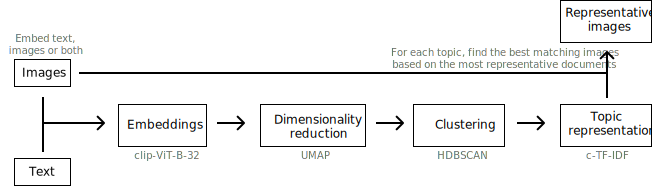

---
hide:
  - navigation
---

# Changelog


## **Version 0.16.4**
*Release date: 9 October, 2024*

<h3><b>Fixes:</a></b></h3>

* Fix ValueError in Guided Topic Modeling by [@RTChou](https://github.com/RTChou) in [#2115](https://github.com/MaartenGr/BERTopic/pull/2115)
* Fix saving BERTopic when c-TF-IDF is None by [@sete39](https://github.com/sete39) in [#2112](https://github.com/MaartenGr/BERTopic/pull/2112)
* Fix `KeyError: 'topics_from'` in [#2101](https://github.com/MaartenGr/BERTopic/pull/2101)
* Fix issues related Zero-shot Topic Modeling by [@ianrandman](https://github.com/ianrandman) in [#2105](https://github.com/MaartenGr/BERTopic/pull/2105)
* Fix regex matching being used in PartOfSpeech representation model by [@woranov](https://github.com/woranov) in [#2138](https://github.com/MaartenGr/BERTopic/pull/2138)
* Update typo by [@saikumaru](https://github.com/saikumaru) in [#2162](https://github.com/MaartenGr/BERTopic/pull/2162)


## **Version 0.16.3**
*Release date: 22 July, 2024*

<h3><b>Highlights:</a></b></h3>

* Simplify zero-shot topic modeling by [@ianrandman](https://github.com/ianrandman) in [#2060](https://github.com/MaartenGr/BERTopic/pull/2060)
* Option to choose between c-TF-IDF and Topic Embeddings in many functions by [@azikoss](https://github.com/azikoss) in [#1894](https://github.com/MaartenGr/BERTopic/pull/1894)
    * Use the `use_ctfidf` parameter in the following function to choose between c-TF-IDF and topic embeddings:
        * `hierarchical_topics`, `reduce_topics`, `visualize_hierarchy`, `visualize_heatmap`, `visualize_topics`
* Linting with Ruff by [@afuetterer](https://github.com/afuetterer) in [#2033](https://github.com/MaartenGr/BERTopic/pull/2033)
* Switch from setup.py to pyproject.toml by [@afuetterer](https://github.com/afuetterer) in [#1978](https://github.com/MaartenGr/BERTopic/pull/1978)
* In multi-aspect context, allow Main model to be chained by [@ddicato](https://github.com/ddicato) in [#2002](https://github.com/MaartenGr/BERTopic/pull/2002)

<h3><b>Fixes:</a></b></h3>

* Added templates for [issues](https://github.com/MaartenGr/BERTopic/tree/master/.github/ISSUE_TEMPLATE) and [pull requests](https://github.com/MaartenGr/BERTopic/blob/master/.github/PULL_REQUEST_TEMPLATE.md)
* Update River documentation example by [@Proteusiq](https://github.com/Proteusiq) in [#2004](https://github.com/MaartenGr/BERTopic/pull/2004)
* Fix PartOfSpeech reproducibility by [@Greenpp](https://github.com/Greenpp) in [#1996](https://github.com/MaartenGr/BERTopic/pull/1996)
* Fix PartOfSpeech ignoring first word by [@Greenpp](https://github.com/Greenpp) in [#2024](https://github.com/MaartenGr/BERTopic/pull/2024)
* Make sklearn embedding backend auto-select more cautious by [@freddyheppell](https://github.com/freddyheppell) in [#1984](https://github.com/MaartenGr/BERTopic/pull/1984)
* Fix typos by [@afuetterer](https://github.com/afuetterer) in [#1974](https://github.com/MaartenGr/BERTopic/pull/1974)
* Fix hierarchical_topics(...) when the distances between three clusters are the same by [@azikoss](https://github.com/azikoss) in [#1929](https://github.com/MaartenGr/BERTopic/pull/1929)
* Fixes to chain strategy example in outlier_reduction.md by [@reuning](https://github.com/reuning) in [#2065](https://github.com/MaartenGr/BERTopic/pull/2065)
* Remove obsolete flake8 config and update line length by [@afuetterer](https://github.com/afuetterer) in [#22066](https://github.com/MaartenGr/BERTopic/pull/2066)


## **Version 0.16.2**
*Release date: 12 May, 2024*

<h3><b>Fixes:</a></b></h3>

* Fix issue with zeroshot topic modeling missing outlier [#1957](https://github.com/MaartenGr/BERTopic/issues/1957)
* Bump github actions versions by [@afuetterer](https://github.com/afuetterer) in [#1941](https://github.com/MaartenGr/BERTopic/pull/1941)
* Drop support for python 3.7 by [@afuetterer](https://github.com/afuetterer) in [#1949](https://github.com/MaartenGr/BERTopic/pull/1949)
* Add testing python 3.10+ in Github actions by [@afuetterer](https://github.com/afuetterer) in [#1968](https://github.com/MaartenGr/BERTopic/pull/1968)
* Speed up fitting CountVectorizer by [@dannywhuang](https://github.com/dannywhuang) in [#1938](https://github.com/MaartenGr/BERTopic/pull/1938)
* Fix `transform` when using cuML HDBSCAN by [@beckernick](https://github.com/beckernick) in [#1960](https://github.com/MaartenGr/BERTopic/pull/1960)
* Fix wrong link in algorithm documentation by [@naeyn](https://github.com/naeyn) in [#1970](https://github.com/MaartenGr/BERTopic/pull/1970)


## **Version 0.16.1**
*Release date: 21 April, 2024*

<h3><b>Highlights:</a></b></h3>

* Add Quantized [LLM Tutorial](https://colab.research.google.com/drive/1DdSHvVPJA3rmNfBWjCo2P1E9686xfxFx?usp=sharing)
* Add optional [datamapplot](https://github.com/TutteInstitute/datamapplot) visualization using `topic_model.visualize_document_datamap` by [@lmcinnes](https://github.com/lmcinnes) in [#1750](https://github.com/MaartenGr/BERTopic/pull/1750)
* Migrated OpenAIBackend to openai>=1 by [@peguerosdc](https://github.com/peguerosdc) in [#1724](https://github.com/MaartenGr/BERTopic/pull/1724)
* Add automatic height scaling and font resize by [@ir2718](https://github.com/ir2718) in [#1863](https://github.com/MaartenGr/BERTopic/pull/1863)
* Use `[KEYWORDS]` tags with the LangChain representation model by [@mcantimmy](https://github.com/mcantimmy) in [#1871](https://github.com/MaartenGr/BERTopic/pull/1871)


<h3><b>Fixes:</a></b></h3>

* Fixed issue with `.merge_models` seemingly skipping topic [#1898](https://github.com/MaartenGr/BERTopic/issues/1898)
* Fixed Cohere client.embed TypeError [#1904](https://github.com/MaartenGr/BERTopic/issues/1904)
* Fixed `AttributeError: 'TextGeneration' object has no attribute 'random_state'` [#1870](https://github.com/MaartenGr/BERTopic/issues/1870)
* Fixed topic embeddings not properly updated if all outliers were removed [#1838](https://github.com/MaartenGr/BERTopic/issues/1838)
* Fixed issue with representation models not properly merging [#1762](https://github.com/MaartenGr/BERTopic/issues/1762)
* Fixed Embeddings not ordered correctly when using `.merge_models` [#1804](https://github.com/MaartenGr/BERTopic/issues/1804)
* Fixed Outlier topic not in the 0th position when using zero-shot topic modeling causing prediction issues (amongst others) [#1804](https://github.com/MaartenGr/BERTopic/issues/1804)
* Fixed Incorrect label in ZeroShot doc SVG [#1732](https://github.com/MaartenGr/BERTopic/issues/1732)
* Fixed MultiModalBackend throws error with clip-ViT-B-32-multilingual-v1 [#1670](https://github.com/MaartenGr/BERTopic/issues/1670)
* Fixed AuthenticationError while using OpenAI() [#1678](https://github.com/MaartenGr/BERTopic/issues/1678)

* Update FAQ on Apple Silicon by [@benz0li](https://github.com/benz0li) in [#1901](https://github.com/MaartenGr/BERTopic/pull/1901)
* Add documentation DataMapPlot + FAQ for running on Apple Silicon by [@dkapitan](https://github.com/dkapitan) in [#1854](https://github.com/MaartenGr/BERTopic/pull/1854)
* Remove commas from pip install reference in readme by [@luisoala](https://github.com/luisoala) in [#1850](https://github.com/MaartenGr/BERTopic/pull/1850)
* Spelling corrections by [@joouha](https://github.com/joouha) in [#1801](https://github.com/MaartenGr/BERTopic/pull/1801)
* Replacing the deprecated `text-ada-001` model with the latest `text-embedding-3-small` from OpenAI by [@atmb4u](https://github.com/atmb4u) in [#1800](https://github.com/MaartenGr/BERTopic/pull/1800)
* Prevent invalid empty input error when retrieving embeddings with openai backend by [@liaoelton](https://github.com/liaoelton) in [#1827](https://github.com/MaartenGr/BERTopic/pull/1827)
* Remove spurious warning about missing embedding model by [@sliedes](https://github.com/sliedes) in [#1774](https://github.com/MaartenGr/BERTopic/pull/1774)
* Fix type hint in ClassTfidfTransformer constructor [@snape](https://github.com/snape) in [#1803](https://github.com/MaartenGr/BERTopic/pull/1803)
* Fix typo and simplify wording in OnlineCountVectorizer docstring by [@chrisji](https://github.com/chrisji) in [#1802](https://github.com/MaartenGr/BERTopic/pull/1802)
* Fixed warning when saving a topic model without an embedding model by [@zilch42](https://github.com/zilch42) in [#1740](https://github.com/MaartenGr/BERTopic/pull/1740)
* Fix bug in `TextGeneration` by [@manveersadhal](https://github.com/manveersadhal) in [#1726](https://github.com/MaartenGr/BERTopic/pull/1726)
* Fix an incorrect link to usecases.md by [@nicholsonjf](https://github.com/nicholsonjf) in [#1731](https://github.com/MaartenGr/BERTopic/pull/1731)
* Prevent `model` argument being passed twice when using `generator_kwargs` in OpenAI by [@ninavandiermen](https://github.com/ninavandiermen) in [#1733](https://github.com/MaartenGr/BERTopic/pull/1733)
* Several fixes to the docstrings by [@arpadikuma](https://github.com/arpadikuma) in [#1719](https://github.com/MaartenGr/BERTopic/pull/1719)
* Remove unused `cluster_df` variable in `hierarchical_topics` by [@shadiakiki1986](https://github.com/shadiakiki1986) in [#1701](https://github.com/MaartenGr/BERTopic/pull/1701)
* Removed redundant quotation mark by [@LawrenceFulton](https://github.com/LawrenceFulton) in [#1695](https://github.com/MaartenGr/BERTopic/pull/1695)
* Fix typo in merge models docs by [@zilch42](https://github.com/zilch42) in [#1660](https://github.com/MaartenGr/BERTopic/pull/1660)


## **Version 0.16.0**
*Release date: 26 November, 2023*

<h3><b>Highlights:</a></b></h3>

* Merge pre-trained BERTopic models with [**`.merge_models`**](https://maartengr.github.io/BERTopic/getting_started/merge/merge.html)
    * Combine models with different representations together!
    * Use this for *incremental/online topic modeling* to detect new incoming topics
    * First step towards *federated learning* with BERTopic
* [**Zero-shot**](https://maartengr.github.io/BERTopic/getting_started/zeroshot/zeroshot.html) Topic Modeling
    * Use a predefined list of topics to assign documents
    * If needed, allows for further exploration of undefined topics
* [**Seed (domain-specific) words**](https://maartengr.github.io/BERTopic/getting_started/seed_words/seed_words.html) with `ClassTfidfTransformer`
    * Make sure selected words are more likely to end up in the representation without influencing the clustering process
* Added params to [**truncate documents**](https://maartengr.github.io/BERTopic/getting_started/representation/llm.html#truncating-documents) to length when using LLMs
* Added [**LlamaCPP**](https://maartengr.github.io/BERTopic/getting_started/representation/llm.html#llamacpp) as a representation model
* LangChain: Support for **LCEL Runnables** by [@joshuasundance-swca](https://github.com/joshuasundance-swca) in [#1586](https://github.com/MaartenGr/BERTopic/pull/1586)
* Added `topics` parameter to `.topics_over_time` to select a subset of documents and topics
* Documentation:
    * [Best practices Guide](https://maartengr.github.io/BERTopic/getting_started/best_practices/best_practices.html)
    * [Llama 2 Tutorial](https://maartengr.github.io/BERTopic/getting_started/representation/llm.html#llama-2)
    * [Zephyr Tutorial](https://maartengr.github.io/BERTopic/getting_started/representation/llm.html#zephyr-mistral-7b)
    * Improved [embeddings guidance](https://maartengr.github.io/BERTopic/getting_started/embeddings/embeddings.html#sentence-transformers) (MTEB)
    * Improved logging throughout the package
* Added support for **Cohere's Embed v3**:
```python
cohere_model = CohereBackend(
    client,
    embedding_model="embed-english-v3.0",
    embed_kwargs={"input_type": "clustering"}
)
```

<h3><b>Fixes:</a></b></h3>

* Fixed n-gram Keywords need delimiting in OpenAI() [#1546](https://github.com/MaartenGr/BERTopic/issues/1546)
* Fixed OpenAI v1.0 issues [#1629](https://github.com/MaartenGr/BERTopic/issues/1629)
* Improved documentation/logging to address [#1589](https://github.com/MaartenGr/BERTopic/issues/1589), [#1591](https://github.com/MaartenGr/BERTopic/issues/1591)
* Fixed engine support for Azure OpenAI embeddings [#1577](https://github.com/MaartenGr/BERTopic/issues/1487)
* Fixed OpenAI Representation: KeyError: 'content' [#1570](https://github.com/MaartenGr/BERTopic/issues/1570)
* Fixed Loading topic model with multiple topic aspects changes their format [#1487](https://github.com/MaartenGr/BERTopic/issues/1487)
*  Fix expired link in algorithm.md by [@burugaria7](https://github.com/burugaria7) in [#1396](https://github.com/MaartenGr/BERTopic/pull/1396)
*  Fix guided topic modeling in cuML's UMAP by [@stevetracvc](https://github.com/stevetracvc) in [#1326](https://github.com/MaartenGr/BERTopic/pull/1326)
*  OpenAI: Allow retrying on Service Unavailable errors by [@agamble](https://github.com/agamble) in [#1407](https://github.com/MaartenGr/BERTopic/pull/1407)
*  Fixed parameter naming for HDBSCAN in best practices by [@rnckp](https://github.com/rnckp) in [#1408](https://github.com/MaartenGr/BERTopic/pull/1408)
*  Fixed typo in tips_and_tricks.md by [@aronnoordhoek](https://github.com/aronnoordhoek) in [#1446](https://github.com/MaartenGr/BERTopic/pull/1446)
*  Fix typos in documentation by [@bobchien](https://github.com/bobchien) in [#1481](https://github.com/MaartenGr/BERTopic/pull/1481)
*  Fix IndexError when all outliers are removed by reduce_outliers by [@Aratako](https://github.com/Aratako) in [#1466](https://github.com/MaartenGr/BERTopic/pull/1466)
*  Fix TypeError on reduce_outliers "probabilities" by [@ananaphasia](https://github.com/ananaphasia) in [#1501](https://github.com/MaartenGr/BERTopic/pull/1501)
*  Add new line to fix markdown bullet point formatting by [@saeedesmaili](https://github.com/saeedesmaili) in [#1519](https://github.com/MaartenGr/BERTopic/pull/1519)
*  Update typo in topicrepresentation.md by [@oliviercaron](https://github.com/oliviercaron) in [#1537](https://github.com/MaartenGr/BERTopic/pull/1537)
*  Fix typo in FAQ by [@sandijou](https://github.com/sandijou) in [#1542](https://github.com/MaartenGr/BERTopic/pull/1542)
*  Fixed typos in best practices documentation by [@poomkusa](https://github.com/poomkusa) in [#1557](https://github.com/MaartenGr/BERTopic/pull/1557)
*  Correct TopicMapper doc example by [@chrisji](https://github.com/chrisji) in [#1637](https://github.com/MaartenGr/BERTopic/pull/1637)
* Fix typing in hierarchical_topics by [@dschwalm](https://github.com/dschwalm) in [#1364](https://github.com/MaartenGr/BERTopic/pull/1364)
*  Fixed typing issue with threshold parameter in reduce_outliers by [@dschwalm](https://github.com/dschwalm) in [#1380](https://github.com/MaartenGr/BERTopic/pull/1380)
* Fix several typos by [@mertyyanik](https://github.com/mertyyanik) in [#1307](https://github.com/MaartenGr/BERTopic/pull/1307)
(#1307)
* Fix inconsistent naming by [@rolanderdei](https://github.com/rolanderdei) in [#1073](https://github.com/MaartenGr/BERTopic/pull/1073)

<h3><b><a href="https://maartengr.github.io/BERTopic/getting_started/merge/merge.html">Merge Pre-trained BERTopic Models</a></b></h3>

The new `.merge_models` feature allows for any number of fitted BERTopic models to be merged. Doing so allows for a number of use cases:

* **Incremental topic modeling** -- Continuously merge models together to detect whether new topics have appeared
* **Federated Learning** - Train BERTopic models on different clients and combine them on a central server
* **Minimal compute** - We can essentially batch the training process into multiple instances to reduce compute
* **Different datasets** - When you have different datasets that you want to train separately on, for example with different languages, you can train each model separately and join them after training

To demonstrate merging different topic models with BERTopic, we use the ArXiv paper abstracts to see which topics they generally contain.

First, we train three separate models on different parts of the data:

```python
from umap import UMAP
from bertopic import BERTopic
from datasets import load_dataset

dataset = load_dataset("CShorten/ML-ArXiv-Papers")["train"]

# Extract abstracts to train on and corresponding titles
abstracts_1 = dataset["abstract"][:5_000]
abstracts_2 = dataset["abstract"][5_000:10_000]
abstracts_3 = dataset["abstract"][10_000:15_000]

# Create topic models
umap_model = UMAP(n_neighbors=15, n_components=5, min_dist=0.0, metric='cosine', random_state=42)
topic_model_1 = BERTopic(umap_model=umap_model, min_topic_size=20).fit(abstracts_1)
topic_model_2 = BERTopic(umap_model=umap_model, min_topic_size=20).fit(abstracts_2)
topic_model_3 = BERTopic(umap_model=umap_model, min_topic_size=20).fit(abstracts_3)
```

Then, we can combine all three models into one with `.merge_models`:

```python
# Combine all models into one
merged_model = BERTopic.merge_models([topic_model_1, topic_model_2, topic_model_3])
```

<h3><b><a href="https://maartengr.github.io/BERTopic/getting_started/zeroshot/zeroshot.html">Zero-shot Topic Modeling</a></b></h3>
Zeroshot Topic Modeling is a technique that allows you to find pre-defined topics in large amounts of documents. This method allows you to not only find those specific topics but also create new topics for documents that would not fit with your predefined topics. 
This allows for extensive flexibility as there are three scenario's to explore.

* No zeroshot topics were detected. This means that none of the documents would fit with the predefined topics and a regular BERTopic would be run. 
* Only zeroshot topics were detected. Here, we would not need to find additional topics since all original documents were assigned to one of the predefined topics.
* Both zeroshot topics and clustered topics were detected. This means that some documents would fit with the predefined topics where others would not. For the latter, new topics were found.


In order to use zero-shot BERTopic, we create a list of topics that we want to assign to our documents. However, 
there may be several other topics that we know should be in the documents. The dataset that we use is small subset of ArXiv papers.
We know the data and believe there to be at least the following topics: *clustering*, *topic modeling*, and *large language models*. 
However, we are not sure whether other topics exist and want to explore those.

Using this feature is straightforward:

```python
from datasets import load_dataset

from bertopic import BERTopic
from bertopic.representation import KeyBERTInspired

# We select a subsample of 5000 abstracts from ArXiv
dataset = load_dataset("CShorten/ML-ArXiv-Papers")["train"]
docs = dataset["abstract"][:5_000]

# We define a number of topics that we know are in the documents
zeroshot_topic_list = ["Clustering", "Topic Modeling", "Large Language Models"]

# We fit our model using the zero-shot topics
# and we define a minimum similarity. For each document,
# if the similarity does not exceed that value, it will be used
# for clustering instead.
topic_model = BERTopic(
    embedding_model="thenlper/gte-small", 
    min_topic_size=15,
    zeroshot_topic_list=zeroshot_topic_list,
    zeroshot_min_similarity=.85,
    representation_model=KeyBERTInspired()
)
topics, _ = topic_model.fit_transform(docs)
```

When we run `topic_model.get_topic_info()` you will see something like this:


<h3><b><a href="https://maartengr.github.io/BERTopic/getting_started/seed_words/seed_words.html">Seed (Domain-specific) Words</a></b></h3>


When performing Topic Modeling, you are often faced with data that you are familiar with to a certain extend or that speaks a very specific language. In those cases, topic modeling techniques might have difficulties capturing and representing the semantic nature of domain specific abbreviations, slang, short form, acronyms, etc. For example, the *"TNM"* classification is a method for identifying the stage of most cancers. The word *"TNM"* is an abbreviation and might not be correctly captured in generic embedding models. 

To make sure that certain domain specific words are weighted higher and are more often used in topic representations, you can set any number of `seed_words` in the `bertopic.vectorizer.ClassTfidfTransformer`. To do so, let's take a look at an example. We have a dataset of article abstracts and want to perform some topic modeling. Since we might be familiar with the data, there are certain words that we know should be generally important. Let's assume that we have in-depth knowledge about reinforcement learning and know that words like "agent" and "robot" should be important in such a topic were it to be found. Using the `ClassTfidfTransformer`, we can define those `seed_words` and also choose by how much their values are multiplied. 

The full example is then as follows:

```python
from umap import UMAP
from datasets import load_dataset
from bertopic import BERTopic
from bertopic.vectorizers import ClassTfidfTransformer

# Let's take a subset of ArXiv abstracts as the training data
dataset = load_dataset("CShorten/ML-ArXiv-Papers")["train"]
abstracts = dataset["abstract"][:5_000]

# For illustration purposes, we make sure the output is fixed when running this code multiple times
umap_model = UMAP(n_neighbors=15, n_components=5, min_dist=0.0, metric='cosine', random_state=42)

# We can choose any number of seed words for which we want their representation
# to be strengthen. We increase the importance of these words as we want them to be more
# likely to end up in the topic representations.
ctfidf_model = ClassTfidfTransformer(
    seed_words=["agent", "robot", "behavior", "policies", "environment"], 
    seed_multiplier=2
)

# We run the topic model with the seeded words
topic_model = BERTopic(
    umap_model=umap_model,
    min_topic_size=15,
    ctfidf_model=ctfidf_model,
).fit(abstracts)
```

<h3><b><a href="https://maartengr.github.io/BERTopic/getting_started/representation/llm.html#truncating-documents">Truncate Documents in LLMs</a></b></h3>

When using LLMs with BERTopic, we can truncate the input documents in `[DOCUMENTS]` in order to reduce the number of tokens that we have in our input prompt. To do so, all text generation modules have two parameters that we can tweak:

* `doc_length` - The maximum length of each document. If a document is longer, it will be truncated. If None, the entire document is passed.
* `tokenizer` - The tokenizer used to calculate to split the document into segments used to count the length of a document. 
    * Options include `'char'`, `'whitespace'`, `'vectorizer'`, and a callable

This means that the definition of `doc_length` changes depending on what constitutes a token in the `tokenizer` parameter. If a token is a character, then `doc_length` refers to max length in characters. If a token is a word, then `doc_length` refers to the max length in words.

Let's illustrate this with an example. In the code below, we will use [`tiktoken`](https://github.com/openai/tiktoken) to count the number of tokens in each document and limit them to 100 tokens. All documents that have more than 100 tokens will be truncated.

We use `bertopic.representation.OpenAI` to represent our topics with nicely written labels. We specify that documents that we put in the prompt cannot exceed 100 tokens each. Since we will put 4 documents in the prompt, they will total roughly 400 tokens:

```python
import openai
import tiktoken
from bertopic.representation import OpenAI
from bertopic import BERTopic

# Tokenizer
tokenizer= tiktoken.encoding_for_model("gpt-3.5-turbo")

# Create your representation model
client = openai.OpenAI(api_key="sk-...")
representation_model = OpenAI(
    client,
    model="gpt-3.5-turbo",
    delay_in_seconds=2, 
    chat=True,
    nr_docs=4,
    doc_length=100,
    tokenizer=tokenizer
)

# Use the representation model in BERTopic on top of the default pipeline
topic_model = BERTopic(representation_model=representation_model)
```


## **Version 0.15.0**
*Release date: 29 May, 2023*

<h3><b>Highlights:</a></b></h3>

* [**Multimodal**](https://maartengr.github.io/BERTopic/getting_started/multimodal/multimodal.html) Topic Modeling
    * Train your topic modeling on text, images, or images and text!
    * Use the `bertopic.backend.MultiModalBackend` to embed images, text, both or even caption images!
* [**Multi-Aspect**](https://maartengr.github.io/BERTopic/getting_started/multiaspect/multiaspect.html) Topic Modeling
    * Create multiple topic representations simultaneously 
* Improved [**Serialization**](https://maartengr.github.io/BERTopic/getting_started/serialization/serialization.html) options
    * Push your model to the HuggingFace Hub with `.push_to_hf_hub`
    * Safer, smaller and more flexible serialization options with `safetensors`
    * Thanks to a great collaboration with HuggingFace and the authors of [BERTransfer](https://github.com/opinionscience/BERTransfer)!
* Added new embedding models
    * OpenAI: `bertopic.backend.OpenAIBackend`
    * Cohere: `bertopic.backend.CohereBackend`
* Added example of [summarizing topics](https://maartengr.github.io/BERTopic/getting_started/representation/representation.html#summarization) with OpenAI's GPT-models
* Added `nr_docs` and `diversity` parameters to OpenAI and Cohere representation models
* Use `custom_labels="Aspect1"` to use the aspect labels for visualizations instead
* Added cuML support for probability calculation in `.transform`
* Updated **topic embeddings**
    * Centroids by default and c-TF-IDF weighted embeddings for `partial_fit` and `.update_topics`
* Added `exponential_backoff` parameter to `OpenAI` model

<h3><b>Fixes:</a></b></h3>

* Fixed custom prompt not working in `TextGeneration` 
* Fixed [#1142](https://github.com/MaartenGr/BERTopic/pull/1142)
* Add additional logic to handle cupy arrays by [@metasyn](https://github.com/metasyn) in [#1179](https://github.com/MaartenGr/BERTopic/pull/1179)
* Fix hierarchy viz and handle any form of distance matrix by [@elashrry](https://github.com/elashrry) in [#1173](https://github.com/MaartenGr/BERTopic/pull/1173)
* Updated languages list by [@sam9111](https://github.com/sam9111) in [#1099](https://github.com/MaartenGr/BERTopic/pull/1099)
* Added level_scale argument to visualize_hierarchical_documents by [@zilch42](https://github.com/zilch42) in [#1106](https://github.com/MaartenGr/BERTopic/pull/1106)
* Fix inconsistent naming by [@rolanderdei](https://github.com/rolanderdei) in [#1073](https://github.com/MaartenGr/BERTopic/pull/1073)

<h3><b><a href="https://maartengr.github.io/BERTopic/getting_started/multimodal/multimodal.html">Multimodal Topic Modeling</a></b></h3>

With v0.15, we can now perform multimodal topic modeling in BERTopic! The most basic example of multimodal topic modeling in BERTopic is when you have images that accompany your documents. This means that it is expected that each document has an image and vice versa. Instagram pictures, for example, almost always have some descriptions to them. 

<figure markdown>
  
  <figcaption></figcaption>
</figure>

In this example, we are going to use images from `flickr` that each have a caption associated to it: 

```python
# NOTE: This requires the `datasets` package which you can 
# install with `pip install datasets`
from datasets import load_dataset

ds = load_dataset("maderix/flickr_bw_rgb")
images = ds["train"]["image"]
docs = ds["train"]["caption"]
```

The `docs` variable contains the captions for each image in `images`. We can now use these variables to run our multimodal example:

```python
from bertopic import BERTopic
from bertopic.representation import VisualRepresentation

# Additional ways of representing a topic
visual_model = VisualRepresentation()

# Make sure to add the `visual_model` to a dictionary
representation_model = {
   "Visual_Aspect":  visual_model,
}
topic_model = BERTopic(representation_model=representation_model, verbose=True)
```

We can now access our image representations for each topic with `topic_model.topic_aspects_["Visual_Aspect"]`.
If you want an overview of the topic images together with their textual representations in jupyter, you can run the following:

```python
import base64
from io import BytesIO
from IPython.display import HTML

def image_base64(im):
    if isinstance(im, str):
        im = get_thumbnail(im)
    with BytesIO() as buffer:
        im.save(buffer, 'jpeg')
        return base64.b64encode(buffer.getvalue()).decode()


def image_formatter(im):
    return f''

# Extract dataframe
df = topic_model.get_topic_info().drop("Representative_Docs", 1).drop("Name", 1)

# Visualize the images
HTML(df.to_html(formatters={'Visual_Aspect': image_formatter}, escape=False))
```


<h3><b><a href="https://maartengr.github.io/BERTopic/getting_started/multiaspect/multiaspect.html">Multi-aspect Topic Modeling</a></b></h3>

In this new release, we introduce `multi-aspect topic modeling`! During the `.fit` or `.fit_transform` stages, you can now get multiple representations of a single topic. In practice, it works by generating and storing all kinds of different topic representations (see image below).

<figure markdown>
  
  <figcaption></figcaption>
</figure>

The approach is rather straightforward. We might want to represent our topics using a `PartOfSpeech` representation model but we might also want to try out `KeyBERTInspired` and compare those representation models. We can do this as follows:

```python
from bertopic.representation import KeyBERTInspired
from bertopic.representation import PartOfSpeech
from bertopic.representation import MaximalMarginalRelevance
from sklearn.datasets import fetch_20newsgroups

# Documents to train on
docs = fetch_20newsgroups(subset='all',  remove=('headers', 'footers', 'quotes'))['data']

# The main representation of a topic
main_representation = KeyBERTInspired()

# Additional ways of representing a topic
aspect_model1 = PartOfSpeech("en_core_web_sm")
aspect_model2 = [KeyBERTInspired(top_n_words=30), MaximalMarginalRelevance(diversity=.5)]

# Add all models together to be run in a single `fit`
representation_model = {
   "Main": main_representation,
   "Aspect1":  aspect_model1,
   "Aspect2":  aspect_model2 
}
topic_model = BERTopic(representation_model=representation_model).fit(docs)
```

As show above, to perform multi-aspect topic modeling, we make sure that `representation_model` is a dictionary where each representation model pipeline is defined. 
The main pipeline, that is used in most visualization options, is defined with the `"Main"` key. All other aspects can be defined however you want. In the example above, the two additional aspects that we are interested in are defined as `"Aspect1"` and `"Aspect2"`. 

After we have fitted our model, we can access all representations with `topic_model.get_topic_info()`:


<br>

As you can see, there are a number of different representations for our topics that we can inspect. All aspects are found in `topic_model.topic_aspects_`. 


<h3><b><a href="https://maartengr.github.io/BERTopic/getting_started/serialization/serialization.html">Serialization</a></b></h3>

Saving, loading, and sharing a BERTopic model can be done in several ways. With this new release, it is now  advised to go with `.safetensors` as that allows for a small, safe, and fast method for saving your BERTopic model. However, other formats, such as `.pickle` and pytorch `.bin` are also possible.

The methods are used as follows:

```python
topic_model = BERTopic().fit(my_docs)

# Method 1 - safetensors
embedding_model = "sentence-transformers/all-MiniLM-L6-v2"
topic_model.save("path/to/my/model_dir", serialization="safetensors", save_ctfidf=True, save_embedding_model=embedding_model)

# Method 2 - pytorch
embedding_model = "sentence-transformers/all-MiniLM-L6-v2"
topic_model.save("path/to/my/model_dir", serialization="pytorch", save_ctfidf=True, save_embedding_model=embedding_model)

# Method 3 - pickle
topic_model.save("my_model", serialization="pickle")
```

Saving the topic modeling with `.safetensors` or `pytorch` has a number of advantages:

* `.safetensors` is a relatively **safe format**
* The resulting model can be **very small** (often < 20MB>) since no sub-models need to be saved
* Although version control is important, there is a bit more **flexibility** with respect to specific versions of packages
* More easily used in **production**
* **Share** models with the HuggingFace Hub

<br><br>

<br><br>

The above image, a model trained on 100,000 documents, demonstrates the differences in sizes comparing `safetensors`, `pytorch`, and `pickle`. The difference in sizes can mostly be explained due to the efficient saving procedure and that the clustering and dimensionality reductions are not saved in safetensors/pytorch since inference can be done based on the topic embeddings. 


<h3><b><a href="https://maartengr.github.io/BERTopic/getting_started/serialization/serialization.html#huggingFace-hub">HuggingFace Hub</a></b></h3>

When you have created a BERTopic model, you can easily share it with other through the HuggingFace Hub. First, you need to log in to your HuggingFace account:

```python
from huggingface_hub import login
login()
```

When you have logged in to your HuggingFace account, you can save and upload the model as follows:

```python
from bertopic import BERTopic

# Train model
topic_model = BERTopic().fit(my_docs)

# Push to HuggingFace Hub
topic_model.push_to_hf_hub(
    repo_id="MaartenGr/BERTopic_ArXiv",
    save_ctfidf=True
)

# Load from HuggingFace
loaded_model = BERTopic.load("MaartenGr/BERTopic_ArXiv")
```

## **Version 0.14.1**
*Release date: 2 March, 2023*

<h3><b>Highlights:</a></b></h3>

* Use [**ChatGPT**](https://maartengr.github.io/BERTopic/getting_started/representation/representation.html#chatgpt) to create topic representations!:
* Added `delay_in_seconds` parameter to OpenAI and Cohere representation models for throttling the API
    * Setting this between 5 and 10 allows for trial users now to use more easily without hitting RateLimitErrors
* Fixed missing `title` param to visualization methods
* Fixed probabilities not correctly aligning ([#1024](https://github.com/MaartenGr/BERTopic/issues/1024))
* Fix typo in textgenerator  [@dkopljar27](https://github.com/dkopljar27) in [#1002](https://github.com/MaartenGr/BERTopic/pull/1002)

<h3><b><a href="https://maartengr.github.io/BERTopic/getting_started/representation/representation.html#chatgpt">ChatGPT</a></b></h3>

Within OpenAI's API, the ChatGPT models use a different API structure compared to the GPT-3 models. 
In order to use ChatGPT with BERTopic, we need to define the model and make sure to set `chat=True`:

```python
import openai
from bertopic import BERTopic
from bertopic.representation import OpenAI

# Create your representation model
openai.api_key = MY_API_KEY
representation_model = OpenAI(model="gpt-3.5-turbo", delay_in_seconds=10, chat=True)

# Use the representation model in BERTopic on top of the default pipeline
topic_model = BERTopic(representation_model=representation_model)
```

Prompting with ChatGPT is very satisfying and can be customized in BERTopic by using certain tags. 
There are currently two tags, namely `"[KEYWORDS]"` and `"[DOCUMENTS]"`. 
These tags indicate where in the prompt they are to be replaced with a topics keywords and top 4 most representative documents respectively. 
For example, if we have the following prompt:

```python
prompt = """
I have topic that contains the following documents: \n[DOCUMENTS]
The topic is described by the following keywords: [KEYWORDS]

Based on the information above, extract a short topic label in the following format:
topic: <topic label>
"""
```

then that will be rendered as follows and passed to OpenAI's API:

```python
"""
I have a topic that contains the following documents: 
- Our videos are also made possible by your support on patreon.co.
- If you want to help us make more videos, you can do so on patreon.com or get one of our posters from our shop.
- If you want to help us make more videos, you can do so there.
- And if you want to support us in our endeavor to survive in the world of online video, and make more videos, you can do so on patreon.com.

The topic is described by the following keywords: videos video you our support want this us channel patreon make on we if facebook to patreoncom can for and more watch 

Based on the information above, extract a short topic label in the following format:
topic: <topic label>
"""
```

!!! note 
    Whenever you create a custom prompt, it is important to add 
    ```
    Based on the information above, extract a short topic label in the following format:
    topic: <topic label>
    ```
    at the end of your prompt as BERTopic extracts everything that comes after `topic: `. Having 
    said that, if `topic: ` is not in the output, then it will simply extract the entire response, so 
    feel free to experiment with the prompts. 


## **Version 0.14.0**
*Release date: 14 February, 2023*

<h3><b>Highlights:</a></b></h3>

* Fine-tune [topic representations](https://maartengr.github.io/BERTopic/getting_started/representation/representation.html) with `bertopic.representation`
    * Diverse range of models, including KeyBERT, MMR, POS, Transformers, OpenAI, and more!'
    * Create your own prompts for text generation models, like GPT3:
        * Use `"[KEYWORDS]"` and `"[DOCUMENTS]"` in the prompt to decide where the keywords and set of representative documents need to be inserted.
    * Chain models to perform fine-grained fine-tuning
    * Create and customize your represention model
* Improved the topic reduction technique when using `nr_topics=int`
* Added `title` parameters for all graphs ([#800](https://github.com/MaartenGr/BERTopic/issues/800))


<h3><b>Fixes:</a></b></h3>

* Improve documentation ([#837](https://github.com/MaartenGr/BERTopic/issues/837), [#769](https://github.com/MaartenGr/BERTopic/issues/769), [#954](https://github.com/MaartenGr/BERTopic/issues/954), [#912](https://github.com/MaartenGr/BERTopic/issues/912), [#911](https://github.com/MaartenGr/BERTopic/issues/911))
* Bump pyyaml ([#903](https://github.com/MaartenGr/BERTopic/issues/903))
* Fix large number of representative docs ([#965](https://github.com/MaartenGr/BERTopic/issues/965))
* Prevent stochastisch behavior in `.visualize_topics` ([#952](https://github.com/MaartenGr/BERTopic/issues/952))
* Add custom labels parameter to `.visualize_topics` ([#976](https://github.com/MaartenGr/BERTopic/issues/976))
* Fix cuML HDBSCAN type checks by [@FelSiq](https://github.com/FelSiq) in [#981](https://github.com/MaartenGr/BERTopic/pull/981)

<h3><b>API Changes:</a></b></h3>
* The `diversity` parameter was removed in favor of `bertopic.representation.MaximalMarginalRelevance`
* The `representation_model` parameter was added to `bertopic.BERTopic`

<br>  

<h3><b><a href="https://maartengr.github.io/BERTopic/getting_started/representation/representation.html#keybertinspired">Representation Models</a></b></h3>

Fine-tune the c-TF-IDF representation with a variety of models. Whether that is through a KeyBERT-Inspired model or GPT-3, the choice is up to you! 

<iframe width="1200" height="500" src="https://user-images.githubusercontent.com/25746895/218417067-a81cc179-9055-49ba-a2b0-f2c1db535159.mp4
" title="BERTopic Overview" frameborder="0" allow="accelerometer; autoplay; clipboard-write; encrypted-media; gyroscope; picture-in-picture" allowfullscreen></iframe>

<br>  


<h3><b><a href="https://maartengr.github.io/BERTopic/getting_started/representation/representation.html#keybertinspired">KeyBERTInspired</a></b></h3>

The algorithm follows some principles of [KeyBERT](https://github.com/MaartenGr/KeyBERT) but does some optimization in order to speed up inference. Usage is straightforward:


```python
from bertopic.representation import KeyBERTInspired
from bertopic import BERTopic

# Create your representation model
representation_model = KeyBERTInspired()

# Use the representation model in BERTopic on top of the default pipeline
topic_model = BERTopic(representation_model=representation_model)
```


<h3><b><a href="https://maartengr.github.io/BERTopic/getting_started/representation/representation.html#partofspeech">PartOfSpeech</a></b></h3>

Our candidate topics, as extracted with c-TF-IDF, do not take into account a keyword's part of speech as extracting noun-phrases from all documents can be computationally quite expensive. Instead, we can leverage c-TF-IDF to perform part of speech on a subset of keywords and documents that best represent a topic. 


```python
from bertopic.representation import PartOfSpeech
from bertopic import BERTopic

# Create your representation model
representation_model = PartOfSpeech("en_core_web_sm")

# Use the representation model in BERTopic on top of the default pipeline
topic_model = BERTopic(representation_model=representation_model)
```


<h3><b><a href="https://maartengr.github.io/BERTopic/getting_started/representation/representation.html#maximalmarginalrelevance">MaximalMarginalRelevance</a></b></h3>

When we calculate the weights of keywords, we typically do not consider whether we already have similar keywords in our topic. Words like "car" and "cars" 
essentially represent the same information and often redundant. We can use `MaximalMarginalRelevance` to improve diversity of our candidate topics:


```python
from bertopic.representation import MaximalMarginalRelevance
from bertopic import BERTopic

# Create your representation model
representation_model = MaximalMarginalRelevance(diversity=0.3)

# Use the representation model in BERTopic on top of the default pipeline
topic_model = BERTopic(representation_model=representation_model)
```


<h3><b><a href="https://maartengr.github.io/BERTopic/getting_started/representation/representation.html#zero-shot-classification">Zero-Shot Classification</a></b></h3>

To perform zero-shot classification, we feed the model with the keywords as generated through c-TF-IDF and a set of candidate labels. If, for a certain topic, we find a similar enough label, then it is assigned. If not, then we keep the original c-TF-IDF keywords. 

We use it in BERTopic as follows:

```python
from bertopic.representation import ZeroShotClassification
from bertopic import BERTopic

# Create your representation model
candidate_topics = ["space and nasa", "bicycles", "sports"]
representation_model = ZeroShotClassification(candidate_topics, model="facebook/bart-large-mnli")

# Use the representation model in BERTopic on top of the default pipeline
topic_model = BERTopic(representation_model=representation_model)
```


<h3><b><a href="https://maartengr.github.io/BERTopic/getting_started/representation/representation.html#transformers">Text Generation: 🤗 Transformers</a></b></h3>

Nearly every week, there are new and improved models released on the 🤗 [Model Hub](https://huggingface.co/models) that, with some creativity, allow for 
further fine-tuning of our c-TF-IDF based topics. These models range from text generation to zero-classification. In BERTopic, wrappers around these 
methods are created as a way to support whatever might be released in the future. 

Using a GPT-like model from the huggingface hub is rather straightforward:

```python
from bertopic.representation import TextGeneration
from bertopic import BERTopic

# Create your representation model
representation_model = TextGeneration('gpt2')

# Use the representation model in BERTopic on top of the default pipeline
topic_model = BERTopic(representation_model=representation_model)
```


<h3><b><a href="https://maartengr.github.io/BERTopic/getting_started/representation/representation.html#cohere">Text Generation: Cohere</a></b></h3>

Instead of using a language model from 🤗 transformers, we can use external APIs instead that 
do the work for you. Here, we can use [Cohere](https://docs.cohere.ai/) to extract our topic labels from the candidate documents and keywords.
To use this, you will need to install cohere first:

```bash
pip install cohere
```

Then, get yourself an API key and use Cohere's API as follows:

```python
import cohere
from bertopic.representation import Cohere
from bertopic import BERTopic

# Create your representation model
co = cohere.Client(my_api_key)
representation_model = Cohere(co)

# Use the representation model in BERTopic on top of the default pipeline
topic_model = BERTopic(representation_model=representation_model)
```


<h3><b><a href="https://maartengr.github.io/BERTopic/getting_started/representation/representation.html#openai">Text Generation: OpenAI</a></b></h3>

Instead of using a language model from 🤗 transformers, we can use external APIs instead that 
do the work for you. Here, we can use [OpenAI](https://openai.com/api/) to extract our topic labels from the candidate documents and keywords.
To use this, you will need to install openai first:

```
pip install openai
```

Then, get yourself an API key and use OpenAI's API as follows:

```python
import openai
from bertopic.representation import OpenAI
from bertopic import BERTopic

# Create your representation model
openai.api_key = MY_API_KEY
representation_model = OpenAI()

# Use the representation model in BERTopic on top of the default pipeline
topic_model = BERTopic(representation_model=representation_model)
```


<h3><b><a href="https://maartengr.github.io/BERTopic/getting_started/representation/representation.html#langchain">Text Generation: LangChain</a></b></h3>

[Langchain](https://github.com/hwchase17/langchain) is a package that helps users with chaining large language models.
In BERTopic, we can leverage this package in order to more efficiently combine external knowledge. Here, this 
external knowledge are the most representative documents in each topic. 

To use langchain, you will need to install the langchain package first. Additionally, you will need an underlying LLM to support langchain,
like openai:

```bash
pip install langchain, openai
```

Then, you can create your chain as follows:

```python
from langchain.chains.question_answering import load_qa_chain
from langchain.llms import OpenAI
chain = load_qa_chain(OpenAI(temperature=0, openai_api_key=MY_API_KEY), chain_type="stuff")
```

Finally, you can pass the chain to BERTopic as follows:

```python
from bertopic.representation import LangChain

# Create your representation model
representation_model = LangChain(chain)

# Use the representation model in BERTopic on top of the default pipeline
topic_model = BERTopic(representation_model=representation_model)
```


## **Version 0.13.0**
*Release date: 4 January, 2023*

<h3><b>Highlights:</a></b></h3>

* Calculate [topic distributions](https://maartengr.github.io/BERTopic/getting_started/distribution/distribution.html) with `.approximate_distribution` regardless of the cluster model used
    * Generates topic distributions on a document- and token-levels
    * Can be used for any document regardless of its size!
* [Fully supervised BERTopic](https://maartengr.github.io/BERTopic/getting_started/supervised/supervised.html)
    * You can now use a classification model for the clustering step instead to create a fully supervised topic model
* [Manual topic modeling](https://maartengr.github.io/BERTopic/getting_started/manual/manual.html)
    * Generate topic representations from labels directly
    * Allows for skipping the embedding and clustering steps in order to go directly to the topic representation step
* [Reduce outliers](https://maartengr.github.io/BERTopic/getting_started/outlier_reduction/outlier_reduction.html) with 4 different strategies using `.reduce_outliers`
* Install BERTopic without `SentenceTransformers` for a [lightweight package](https://maartengr.github.io/BERTopic/getting_started/tips_and_tricks/tips_and_tricks.html#lightweight-installation):
    * `pip install --no-deps bertopic`
    * `pip install --upgrade numpy hdbscan umap-learn pandas scikit-learn tqdm plotly pyyaml`
* Get meta data of trained documents such as topics and probabilities using `.get_document_info(docs)`
* Added more support for cuML's HDBSCAN
    * Calculate and predict probabilities during `fit_transform`  and `transform` respectively
    * This should give a major speed-up when setting `calculate_probabilities=True`
* More images to the documentation and a lot of changes/updates/clarifications
* Get representative documents for non-HDBSCAN models by comparing document and topic c-TF-IDF representations 
* Sklearn Pipeline [Embedder](https://maartengr.github.io/BERTopic/getting_started/embeddings/embeddings.html#scikit-learn-embeddings) by [@koaning](https://github.com/koaning) in [#791](https://github.com/MaartenGr/BERTopic/pull/791)

<h3><b>Fixes:</a></b></h3>

* Improve `.partial_fit` documentation ([#837](https://github.com/MaartenGr/BERTopic/issues/837))
* Fixed scipy linkage usage ([#807](https://github.com/MaartenGr/BERTopic/issues/807))
* Fixed shifted heatmap ([#782](https://github.com/MaartenGr/BERTopic/issues/782))
* Fixed SpaCy backend ([#744](https://github.com/MaartenGr/BERTopic/issues/744))
* Fixed representative docs with small clusters (<3) ([#703](https://github.com/MaartenGr/BERTopic/issues/703))
* Typo fixed by [@timpal0l](https://github.com/timpal0l) in [#734](https://github.com/MaartenGr/BERTopic/pull/734)
* Typo fixed by [@srulikbd](https://github.com/timpal0l) in [#842](https://github.com/MaartenGr/BERTopic/pull/842)
* Correcting iframe urls by [@Mustapha-AJEGHRIR](https://github.com/Mustapha-AJEGHRIR) in [#798](https://github.com/MaartenGr/BERTopic/pull/798)
* Refactor embedding methods by [@zachschillaci27](https://github.com/zachschillaci27) in [#855](https://github.com/MaartenGr/BERTopic/pull/855)
* Added diversity parameter to update_topics() function by [@anubhabdaserrr](https://github.com/anubhabdaserrr) in [#887](https://github.com/MaartenGr/BERTopic/pull/887)

<h3><b><a href="https://maartengr.github.io/BERTopic/algorithm/algorithm.html">Documentation</a></b></h3>

Personally, I believe that documentation can be seen as a feature and is an often underestimated aspect of open-source. So I went a bit overboard😅... and created an animation about the three pillars of BERTopic using Manim. There are many other visualizations added, one of each variation of BERTopic, and many smaller changes. 

<iframe width="1200" height="500" src="https://user-images.githubusercontent.com/25746895/205490350-cd9833e7-9cd5-44fa-8752-407d748de633.mp4
" title="BERTopic Overview" frameborder="0" allow="accelerometer; autoplay; clipboard-write; encrypted-media; gyroscope; picture-in-picture" allowfullscreen></iframe>

<h3><b><a href="https://maartengr.github.io/BERTopic/getting_started/distribution/distribution.html">Topic Distributions</a></b></h3>

The difficulty with a cluster-based topic modeling technique is that it does not directly consider that documents may contain multiple topics. With the new release, we can now model the distributions of topics! We even consider that a single word might be related to multiple topics. If a document is a mixture of topics, what is preventing a single word to be the same? 

To do so, we approximate the distribution of topics in a document by calculating and summing the similarities of tokensets (achieved by applying a sliding window) with the topics:

```python
# After fitting your model run the following for either your trained documents or even unseen documents
topic_distr, _ = topic_model.approximate_distribution(docs)
```

To calculate and visualize the topic distributions in a document on a token-level, we can run the following:

```python
# We need to calculate the topic distributions on a token level
topic_distr, topic_token_distr = topic_model.approximate_distribution(docs, calculate_tokens=True)

# Create a visualization using a styled dataframe if Jinja2 is installed
df = topic_model.visualize_approximate_distribution(docs[0], topic_token_distr[0]); df
```

<h3><b><a href="https://maartengr.github.io/BERTopic/getting_started/supervised/supervised.html">Supervised Topic Modeling</a></b></h3>

BERTopic now supports fully-supervised classification! Instead of using a clustering algorithm, like HDBSCAN, we can replace it with a classifier, like Logistic Regression:

```python
from bertopic import BERTopic
from bertopic.dimensionality import BaseDimensionalityReduction
from sklearn.datasets import fetch_20newsgroups
from sklearn.linear_model import LogisticRegression

# Get labeled data
data= fetch_20newsgroups(subset='all',  remove=('headers', 'footers', 'quotes'))
docs = data['data']
y = data['target']

# Allows us to skip over the dimensionality reduction step
empty_dimensionality_model = BaseDimensionalityReduction()

# Create a classifier to be used instead of the cluster model
clf= LogisticRegression()

# Create a fully supervised BERTopic instance
topic_model= BERTopic(
        umap_model=empty_dimensionality_model,
        hdbscan_model=clf
)
topics, probs = topic_model.fit_transform(docs, y=y)
```

<h3><b><a href="https://maartengr.github.io/BERTopic/getting_started/manual/manual.html">Manual Topic Modeling</a></b></h3>

When you already have a bunch of labels and simply want to extract topic representations from them, you might not need to actually learn how those can predicted. We can bypass the `embeddings -> dimensionality reduction -> clustering` steps and go straight to the c-TF-IDF representation of our labels:

```python
from bertopic import BERTopic
from bertopic.backend import BaseEmbedder
from bertopic.cluster import BaseCluster
from bertopic.dimensionality import BaseDimensionalityReduction

# Prepare our empty sub-models and reduce frequent words while we are at it.
empty_embedding_model = BaseEmbedder()
empty_dimensionality_model = BaseDimensionalityReduction()
empty_cluster_model = BaseCluster()

# Fit BERTopic without actually performing any clustering
topic_model= BERTopic(
        embedding_model=empty_embedding_model,
        umap_model=empty_dimensionality_model,
        hdbscan_model=empty_cluster_model,
)
topics, probs = topic_model.fit_transform(docs, y=y)
```

<h3><b><a href="https://maartengr.github.io/BERTopic/getting_started/outlier_reduction/outlier_reduction.html">Outlier Reduction</a></b></h3>

Outlier reduction is an frequently-discussed topic in BERTopic as its default cluster model, HDBSCAN, has a tendency to generate many outliers. This often helps in the topic representation steps, as we do not consider documents that are less relevant, but you might want to still assign those outliers to actual topics. In the modular philosophy of BERTopic, keeping training times in mind, it is now possible to perform outlier reduction **after** having trained your topic model. This allows for ease of iteration and prevents having to train BERTopic many times to find the parameters you are searching for. There are 4 different strategies that you can use, so make sure to check out the [documentation](https://maartengr.github.io/BERTopic/getting_started/outlier_reduction/outlier_reduction.html)!

Using it is rather straightforward:

```python
new_topics = topic_model.reduce_outliers(docs, topics)
```

<h3><b><a href="https://maartengr.github.io/BERTopic/getting_started/tips_and_tricks/tips_and_tricks.html#lightweight-installation">Lightweight BERTopic</a></b></h3>

The default embedding model in BERTopic is one of the amazing sentence-transformers models, namely `"all-MiniLM-L6-v2"`. Although this model performs well out of the box, it typically needs a GPU to transform the documents into embeddings in a reasonable time. Moreover, the installation requires `pytorch` which often results in a rather large environment, memory-wise. 

Fortunately, it is possible to install BERTopic without `sentence-transformers` and use it as a lightweight solution instead. The installation can be done as follows:

```bash
pip install --no-deps bertopic
pip install --upgrade numpy hdbscan umap-learn pandas scikit-learn tqdm plotly pyyaml
```

Then, we can use BERTopic without `sentence-transformers` as follows using a CPU-based embedding technique:

```python
from sklearn.pipeline import make_pipeline
from sklearn.decomposition import TruncatedSVD
from sklearn.feature_extraction.text import TfidfVectorizer

pipe = make_pipeline(
    TfidfVectorizer(),
    TruncatedSVD(100)
)

topic_model = BERTopic(embedding_model=pipe)
```

As a result, the entire package and resulting model can be run quickly on the CPU and no GPU is necessary!

<h3><b><a href="https://maartengr.github.io/BERTopic/api/bertopic.html#bertopic._bertopic.BERTopic.get_document_info">Document Information</a></b></h3>

Get information about the documents on which the topic was trained including the documents themselves, their respective topics, the name of each topic, the top n words of each topic, whether it is a representative document, and the probability of the clustering if the cluster model supports it. There are also options to include other metadata, such as the topic distributions or the x and y coordinates of the reduced embeddings that you can learn more about <a href="https://maartengr.github.io/BERTopic/api/bertopic.html#bertopic._bertopic.BERTopic.get_document_info">here</a>.

To get the document info, you will only need to pass the documents on which the topic model was trained:


```python
>>> topic_model.get_document_info(docs)

Document                               Topic	Name	                    Top_n_words                     Probability    ...
I am sure some bashers of Pens...	    0	    0_game_team_games_season	game - team - games...	        0.200010       ...
My brother is in the market for...      -1     -1_can_your_will_any	        can - your - will...	        0.420668       ...
Finally you said what you dream...	    -1     -1_can_your_will_any	        can - your - will...            0.807259       ...
Think! It is the SCSI card doing...	    49     49_windows_drive_dos_file	windows - drive - docs...	    0.071746       ...
1) I have an old Jasmine drive...	    49     49_windows_drive_dos_file	windows - drive - docs...	    0.038983       ...
```


## **Version 0.12.0**
*Release date: 5 September, 2022*

**Highlights**:

* Perform [online/incremental topic modeling](https://maartengr.github.io/BERTopic/getting_started/online/online.html) with `.partial_fit`
* Expose [c-TF-IDF model](https://maartengr.github.io/BERTopic/getting_started/ctfidf/ctfidf.html) for customization with `bertopic.vectorizers.ClassTfidfTransformer`
    * The parameters `bm25_weighting` and `reduce_frequent_words` were added to potentially improve representations:
* Expose attributes for easier access to internal data
* Major changes to the [Algorithm](https://maartengr.github.io/BERTopic/algorithm/algorithm.html) page of the documentation, which now contains three overviews of the algorithm:
    *  [Visualize Overview](https://maartengr.github.io/BERTopic/algorithm/algorithm.html#visual-overview)
    *  [Code Overview](https://maartengr.github.io/BERTopic/algorithm/algorithm.html#code-overview)
    *  [Detailed Overview](https://maartengr.github.io/BERTopic/algorithm/algorithm.html#detailed-overview)
* Added an [example](https://maartengr.github.io/BERTopic/getting_started/tips_and_tricks/tips_and_tricks.html#keybert-bertopic) of combining BERTopic with KeyBERT
* Added many tests with the intention of making development a bit more stable

**Fixes**: 

* Fixed iteratively merging topics ([#632](https://github.com/MaartenGr/BERTopic/issues/632) and ([#648](https://github.com/MaartenGr/BERTopic/issues/648))
* Fixed 0th topic not showing up in visualizations ([#667](https://github.com/MaartenGr/BERTopic/issues/667))
* Fixed lowercasing not being optional ([#682](https://github.com/MaartenGr/BERTopic/issues/682))
* Fixed spelling ([#664](https://github.com/MaartenGr/BERTopic/issues/664) and ([#673](https://github.com/MaartenGr/BERTopic/issues/673))
* Fixed 0th topic not shown in `.get_topic_info` by [@oxymor0n](https://github.com/oxymor0n) in [#660](https://github.com/MaartenGr/BERTopic/pull/660)
* Fixed spelling by [@domenicrosati](https://github.com/domenicrosati) in [#674](https://github.com/MaartenGr/BERTopic/pull/674)
* Add custom labels and title options to barchart [@leloykun](https://github.com/leloykun) in [#694](https://github.com/MaartenGr/BERTopic/pull/694)

**Online/incremental topic modeling**:

Online topic modeling (sometimes called "incremental topic modeling") is the ability to learn incrementally from a mini-batch of instances. Essentially, it is a way to update your topic model with data on which it was not trained on before. In Scikit-Learn, this technique is often modeled through a `.partial_fit` function, which is also used in BERTopic. 

At a minimum, the cluster model needs to support a `.partial_fit` function in order to use this feature. The default HDBSCAN model will not work as it does not support online updating. 

```python
from sklearn.datasets import fetch_20newsgroups
from sklearn.cluster import MiniBatchKMeans
from sklearn.decomposition import IncrementalPCA
from bertopic.vectorizers import OnlineCountVectorizer
from bertopic import BERTopic

# Prepare documents
all_docs = fetch_20newsgroups(subset=subset,  remove=('headers', 'footers', 'quotes'))["data"]
doc_chunks = [all_docs[i:i+1000] for i in range(0, len(all_docs), 1000)]

# Prepare sub-models that support online learning
umap_model = IncrementalPCA(n_components=5)
cluster_model = MiniBatchKMeans(n_clusters=50, random_state=0)
vectorizer_model = OnlineCountVectorizer(stop_words="english", decay=.01)

topic_model = BERTopic(umap_model=umap_model,
                       hdbscan_model=cluster_model,
                       vectorizer_model=vectorizer_model)

# Incrementally fit the topic model by training on 1000 documents at a time
for docs in doc_chunks:
    topic_model.partial_fit(docs)
```

Only the topics for the most recent batch of documents are tracked. If you want to be using online topic modeling, not for a streaming setting but merely for low-memory use cases, then it is advised to also update the `.topics_` attribute as variations such as hierarchical topic modeling will not work afterward:

```python
# Incrementally fit the topic model by training on 1000 documents at a time and track the topics in each iteration
topics = []
for docs in doc_chunks:
    topic_model.partial_fit(docs)
    topics.extend(topic_model.topics_)

topic_model.topics_ = topics
```

**c-TF-IDF**:

Explicitly define, use, and adjust the `ClassTfidfTransformer` with new parameters, `bm25_weighting` and `reduce_frequent_words`, to potentially improve the topic representation: 

```python
from bertopic import BERTopic
from bertopic.vectorizers import ClassTfidfTransformer

ctfidf_model = ClassTfidfTransformer(bm25_weighting=True)
topic_model = BERTopic(ctfidf_model=ctfidf_model)
```

**Attributes**:

After having fitted your BERTopic instance, you can use the following attributes to have quick access to certain information, such as the topic assignment for each document in `topic_model.topics_`. 

| Attribute | Type | Description |
|--------------------|----|---------------------------------------------------------------------------------------------|
| topics_            | List[int]   | The topics that are generated for each document after training or updating the topic model. The most recent topics are tracked.  |
| probabilities_ | List[float] | The probability of the assigned topic per document. These are only calculated if a HDBSCAN model is used for the clustering step. When `calculate_probabilities=True`, then it is the probabilities of all topics per document. |
| topic_sizes_          | Mapping[int, int] | The size of each topic.                                                                   |
| topic_mapper_         | TopicMapper | A class for tracking topics and their mappings anytime they are merged, reduced, added, or removed.             |
| topic_representations_  | Mapping[int, Tuple[int, float]] | The top *n* terms per topic and their respective c-TF-IDF values.                            |
| c_tf_idf_             | csr_matrix | The topic-term matrix as calculated through c-TF-IDF. To access its respective words, run `.vectorizer_model.get_feature_names()` or `.vectorizer_model.get_feature_names_out()`                                      |
| topic_labels_         | Mapping[int, str] |  The default labels for each topic.                                                          |
| custom_labels_        | List[str] | Custom labels for each topic as generated through `.set_topic_labels`.                                                               |
| topic_embeddings_     | np.ndarray | The embeddings for each topic. It is calculated by taking the weighted average of word embeddings in a topic based on their c-TF-IDF values.                                                  |
| representative_docs_  | Mapping[int, str] | The representative documents for each topic if HDBSCAN is used.                                                |


## **Version 0.11.0**
*Release date: 11 July, 2022*

**Highlights**:

* Perform [hierarchical topic modeling](https://maartengr.github.io/BERTopic/getting_started/hierarchicaltopics/hierarchicaltopics.html) with `.hierarchical_topics`

```python 
hierarchical_topics = topic_model.hierarchical_topics(docs, topics) 
```

* Visualize [hierarchical topic representations](https://maartengr.github.io/BERTopic/getting_started/hierarchicaltopics/hierarchicaltopics.html#visualizations) with `.visualize_hierarchy`

```python
topic_model.visualize_hierarchy(hierarchical_topics=hierarchical_topics)
```

* Extract a [text-based hierarchical topic representation](https://maartengr.github.io/BERTopic/getting_started/hierarchicaltopics/hierarchicaltopics.html#visualizations) with `.get_topic_tree`

```python
tree = topic_model.get_topic_tree(hierarchical_topics)
```

* Visualize [2D documents](https://maartengr.github.io/BERTopic/getting_started/visualization/visualization.html#visualize-documents) with `.visualize_documents()`

```python
# Use input embeddings
topic_model.visualize_documents(docs, embeddings=embeddings)

# or use 2D reduced embeddings through a method of your own (e.g., PCA, t-SNE, UMAP, etc.)
reduced_embeddings = UMAP(n_neighbors=10, n_components=2, min_dist=0.0, metric='cosine').fit_transform(embeddings)
topic_model.visualize_documents(docs, reduced_embeddings=reduced_embeddings)
```

* Visualize [2D hierarchical documents](https://maartengr.github.io/BERTopic/getting_started/visualization/visualization.html#visualize-hierarchical-documents) with `.visualize_hierarchical_documents()` 

```python
# Run the visualization with the original embeddings
topic_model.visualize_hierarchical_documents(docs, hierarchical_topics, embeddings=embeddings)

# Or, if you have reduced the original embeddings already which speed things up quite a bit:
reduced_embeddings = UMAP(n_neighbors=10, n_components=2, min_dist=0.0, metric='cosine').fit_transform(embeddings)
topic_model.visualize_hierarchical_documents(docs, hierarchical_topics, reduced_embeddings=reduced_embeddings)
```

* Create [custom labels](https://maartengr.github.io/BERTopic/getting_started/topicrepresentation/topicrepresentation.html#custom-labels) to the topics throughout most visualizations

```python
# Generate topic labels
topic_labels = topic_model.generate_topic_labels(nr_words=3, topic_prefix=False, word_length=10, separator=", ")

# Set them internally in BERTopic
topic_model.set_topic_labels(topics_labels)
```

* Manually [merge topics](https://maartengr.github.io/BERTopic/getting_started/hierarchicaltopics/hierarchicaltopics.html#merge-topics) with `.merge_topics()`

```python
# Merge topics 1, 2, and 3
topics_to_merge = [1, 2, 3]
topic_model.merge_topics(docs, topics, topics_to_merge)

# Merge topics 1 and 2, and separately merge topics 3 and 4
topics_to_merge = [[1, 2], [3, 4]]
topic_model.merge_topics(docs, topics, topics_to_merge)
```

* Added example for finding similar topics between two models in the [tips & tricks](https://maartengr.github.io/BERTopic/getting_started/tips_and_tricks/tips_and_tricks.html) page
* Add multi-modal example in the [tips & tricks](https://maartengr.github.io/BERTopic/getting_started/tips_and_tricks/tips_and_tricks.html) page
* Added native [Hugging Face transformers](https://maartengr.github.io/BERTopic/getting_started/embeddings/embeddings.html#hugging-face-transformers) support 

**Fixes**: 

* Fix support for k-Means in `.visualize_heatmap` ([#532](https://github.com/MaartenGr/BERTopic/issues/532))
* Fix missing topic 0 in `.visualize_topics` ([#533](https://github.com/MaartenGr/BERTopic/issues/533))
* Fix inconsistencies in `.get_topic_info` ([#572](https://github.com/MaartenGr/BERTopic/issues/572)) and ([#581](https://github.com/MaartenGr/BERTopic/issues/581))
* Add `optimal_ordering` parameter to `.visualize_hierarchy` by [@rafaelvalero](https://github.com/rafaelvalero) in [#390](https://github.com/MaartenGr/BERTopic/pull/390)
* Fix RuntimeError when used as sklearn estimator by [@simonfelding](https://github.com/simonfelding) in [#448](https://github.com/MaartenGr/BERTopic/pull/448)
* Fix typo in visualization documentation by [@dwhdai](https://github.com/dwhdai) in [#475](https://github.com/MaartenGr/BERTopic/pull/475)
* Fix typo in docstrings by [@xwwwwww](https://github.com/xwwwwww) in [#549](https://github.com/MaartenGr/BERTopic/pull/549)
* Support higher Flair versions


## **Version 0.10.0**
*Release date: 30 April, 2022*


**Highlights**: 

* Use any dimensionality reduction technique instead of UMAP:

```python
from bertopic import BERTopic
from sklearn.decomposition import PCA

dim_model = PCA(n_components=5)
topic_model = BERTopic(umap_model=dim_model)
```

* Use any clustering technique instead of HDBSCAN:

```python
from bertopic import BERTopic
from sklearn.cluster import KMeans

cluster_model = KMeans(n_clusters=50)
topic_model = BERTopic(hdbscan_model=cluster_model)
```

**Documentation**: 

* Add a CountVectorizer page with tips and tricks on how to create topic representations that fit your use case
* Added pages on how to use other dimensionality reduction and clustering algorithms
 * Additional instructions on how to reduce outliers in the FAQ:

```python 
import numpy as np
probability_threshold = 0.01
new_topics = [np.argmax(prob) if max(prob) >= probability_threshold else -1 for prob in probs] 
```

**Fixes**: 

* Fixed `None` being returned for probabilities when transforming unseen documents
* Replaced all instances of `arg:` with `Arguments:` for consistency
* Before saving a fitted BERTopic instance, we remove the stopwords in the fitted CountVectorizer model as it can get quite large due to the number of words that end in stopwords if `min_df` is set to a value larger than 1
* Set `"hdbscan>=0.8.28"` to prevent numpy issues
  * Although this was already fixed by the new release of HDBSCAN, it is technically still possible to install 0.8.27 with BERTopic which leads to these numpy issues
* Update gensim dependency to `>=4.0.0` ([#371](https://github.com/MaartenGr/BERTopic/issues/371))
* Fix topic 0 not appearing in visualizations ([#472](https://github.com/MaartenGr/BERTopic/issues/472))
* Fix ([#506](https://github.com/MaartenGr/BERTopic/issues/506))
* Fix ([#429](https://github.com/MaartenGr/BERTopic/issues/429))
* Fix typo in DTM documentation by [@hp0404](https://github.com/hp0404) in [#386](https://github.com/MaartenGr/BERTopic/pull/386)

## **Version 0.9.4**
*Release date: 14 December, 2021*

A number of fixes, documentation updates, and small features:

* Expose diversity parameter
    * Use `BERTopic(diversity=0.1)` to change how diverse the words in a topic representation are (ranges from 0 to 1)
* Improve stability of topic reduction by only computing the cosine similarity within c-TF-IDF and not the topic embeddings
* Added property to c-TF-IDF that all IDF values should be positive ([#351](https://github.com/MaartenGr/BERTopic/issues/351))
* Improve stability of `.visualize_barchart()` and `.visualize_hierarchy()`
* Major [documentation](https://maartengr.github.io/BERTopic/) overhaul (mkdocs, tutorials, FAQ, images, etc. ) ([#330](https://github.com/MaartenGr/BERTopic/issues/330))
* Drop python 3.6 ([#333](https://github.com/MaartenGr/BERTopic/issues/333))
* Relax plotly dependency ([#88](https://github.com/MaartenGr/BERTopic/issues/88))
* Additional logging for `.transform` ([#356](https://github.com/MaartenGr/BERTopic/issues/356))


## **Version 0.9.3**
*Release date:  17 October, 2021*

* Fix [#282](https://github.com/MaartenGr/BERTopic/issues/282)
    * As it turns out the old implementation of topic mapping was still found in the `transform` function
* Fix [#285](https://github.com/MaartenGr/BERTopic/issues/285)
    * Fix getting all representative docs
* Fix [#288](https://github.com/MaartenGr/BERTopic/issues/288)
    * A recent issue with the package `pyyaml` that can be found in Google Colab


## **Version 0.9.2**
*Release date:  12 October, 2021*

A release focused on algorithmic optimization and fixing several issues:

**Highlights**:  
  
* Update the non-multilingual paraphrase-* models to the all-* models due to improved [performance](https://www.sbert.net/docs/pretrained_models.html)
* Reduce necessary RAM in c-TF-IDF top 30 word [extraction](https://stackoverflow.com/questions/49207275/finding-the-top-n-values-in-a-row-of-a-scipy-sparse-matrix)

**Fixes**:  

* Fix topic mapping
    * When reducing the number of topics, these need to be mapped to the correct input/output which had some issues in the previous version
    * A new class was created as a way to track these mappings regardless of how many times they were executed
    * In other words, you can iteratively reduce the number of topics after training the model without the need to continuously train the model
* Fix typo in embeddings page ([#200](https://github.com/MaartenGr/BERTopic/issues/200)) 
* Fix link in README ([#233](https://github.com/MaartenGr/BERTopic/issues/233))
* Fix documentation `.visualize_term_rank()` ([#253](https://github.com/MaartenGr/BERTopic/issues/253)) 
* Fix getting correct representative docs ([#258](https://github.com/MaartenGr/BERTopic/issues/258))
* Update [memory FAQ](https://maartengr.github.io/BERTopic/faq.html#i-am-facing-memory-issues-help) with [HDBSCAN pr](https://github.com/MaartenGr/BERTopic/issues/151)

## **Version 0.9.1**
*Release date:  1 September, 2021*

A release focused on fixing several issues:

**Fixes**:  

* Fix TypeError when auto-reducing topics ([#210](https://github.com/MaartenGr/BERTopic/issues/210)) 
* Fix mapping representative docs when reducing topics ([#208](https://github.com/MaartenGr/BERTopic/issues/208))
* Fix visualization issues with probabilities ([#205](https://github.com/MaartenGr/BERTopic/issues/205))
* Fix missing `normalize_frequency` param in plots ([#213](https://github.com/MaartenGr/BERTopic/issues/208))
  

## **Version 0.9.0**
*Release date:  9 August, 2021*

**Highlights**:  

* Implemented a [**Guided BERTopic**](https://maartengr.github.io/BERTopic/getting_started/guided/guided.html) -> Use seeds to steer the Topic Modeling
* Get the most representative documents per topic: `topic_model.get_representative_docs(topic=1)`
    * This allows users to see which documents are good representations of a topic and better understand the topics that were created
* Added `normalize_frequency` parameter to `visualize_topics_per_class` and `visualize_topics_over_time` in order to better compare the relative topic frequencies between topics
* Return flat probabilities as default, only calculate the probabilities of all topics per document if `calculate_probabilities` is True
* Added several FAQs

**Fixes**:  

* Fix loading pre-trained BERTopic model
* Fix mapping of probabilities
* Fix [#190](https://github.com/MaartenGr/BERTopic/issues/190)


**Guided BERTopic**:    

Guided BERTopic works in two ways: 

First, we create embeddings for each seeded topics by joining them and passing them through the document embedder. 
These embeddings will be compared with the existing document embeddings through cosine similarity and assigned a label. 
If the document is most similar to a seeded topic, then it will get that topic's label. 
If it is most similar to the average document embedding, it will get the -1 label. 
These labels are then passed through UMAP to create a semi-supervised approach that should nudge the topic creation to the seeded topics. 

Second, we take all words in `seed_topic_list` and assign them a multiplier larger than 1. 
Those multipliers will be used to increase the IDF values of the words across all topics thereby increasing 
the likelihood that a seeded topic word will appear in a topic. This does, however, also increase the chance of an 
irrelevant topic having unrelated words. In practice, this should not be an issue since the IDF value is likely to 
remain low regardless of the multiplier. The multiplier is now a fixed value but may change to something more elegant, 
like taking the distribution of IDF values and its position into account when defining the multiplier. 

```python
seed_topic_list = [["company", "billion", "quarter", "shrs", "earnings"],
                   ["acquisition", "procurement", "merge"],
                   ["exchange", "currency", "trading", "rate", "euro"],
                   ["grain", "wheat", "corn"],
                   ["coffee", "cocoa"],
                   ["natural", "gas", "oil", "fuel", "products", "petrol"]]

topic_model = BERTopic(seed_topic_list=seed_topic_list)
topics, probs = topic_model.fit_transform(docs)
```


## **Version 0.8.1**
*Release date:  8 June, 2021*

**Highlights**:  

* Improved models:
    * For English documents the default is now: `"paraphrase-MiniLM-L6-v2"` 
    * For Non-English or multi-lingual documents the default is now: `"paraphrase-multilingual-MiniLM-L12-v2"` 
    * Both models show not only great performance but are much faster!  
* Add interactive visualizations to the `plotting` API documentation
  
For better performance, please use the following models:  

* English: `"paraphrase-mpnet-base-v2"`
* Non-English or multi-lingual: `"paraphrase-multilingual-mpnet-base-v2"`

**Fixes**:   

* Improved unit testing for more stability
* Set transformers version for Flair

## **Version 0.8.0**
*Release date:  31 May, 2021*

**Highlights**:  

* Additional visualizations:
    * Topic Hierarchy: `topic_model.visualize_hierarchy()` 
    * Topic Similarity Heatmap: `topic_model.visualize_heatmap()` 
    * Topic Representation Barchart: `topic_model.visualize_barchart()` 
    * Term Score Decline: `topic_model.visualize_term_rank()` 
* Created `bertopic.plotting` library to easily extend visualizations
* Improved automatic topic reduction by using HDBSCAN to detect similar topics
* Sort topic ids by their frequency. -1 is the outlier class and contains typically the most documents. After that 0 is the largest  topic, 1 the second largest, etc. 
     
**Fixes**:   

* Fix typo [#113](https://github.com/MaartenGr/BERTopic/pull/113), [#117](https://github.com/MaartenGr/BERTopic/pull/117)
* Fix [#121](https://github.com/MaartenGr/BERTopic/issues/121) by removing [these](https://github.com/MaartenGr/BERTopic/blob/5c6cf22776fafaaff728370781a5d33727d3dc8f/bertopic/_bertopic.py#L359-L360) two lines
* Fix mapping of topics after reduction (it now excludes 0) ([#103](https://github.com/MaartenGr/BERTopic/issues/103))
  
## **Version 0.7.0**
*Release date:  26 April, 2021*  

The two main features are **(semi-)supervised topic modeling** 
and several **backends** to use instead of Flair and SentenceTransformers!

**Highlights**:

* (semi-)supervised topic modeling by leveraging supervised options in UMAP
    * `model.fit(docs, y=target_classes)`
* Backends:
    * Added Spacy, Gensim, USE (TFHub)
    * Use a different backend for document embeddings and word embeddings
    * Create your own backends with `bertopic.backend.BaseEmbedder`
    * Click [here](https://maartengr.github.io/BERTopic/getting_started/embeddings/embeddings.html) for an overview of all new backends
* Calculate and visualize topics per class
    * Calculate: `topics_per_class = topic_model.topics_per_class(docs, topics, classes)`
    * Visualize: `topic_model.visualize_topics_per_class(topics_per_class)`
* Several tutorials were updated and added:

| Name  | Link  |
|---|---|
| Topic Modeling with BERTopic  | [](https://colab.research.google.com/drive/1FieRA9fLdkQEGDIMYl0I3MCjSUKVF8C-?usp=sharing)  |
| (Custom) Embedding Models in BERTopic  | [](https://colab.research.google.com/drive/18arPPe50szvcCp_Y6xS56H2tY0m-RLqv?usp=sharing) |
| Advanced Customization in BERTopic  |  [](https://colab.research.google.com/drive/1ClTYut039t-LDtlcd-oQAdXWgcsSGTw9?usp=sharing) |
| (semi-)Supervised Topic Modeling with BERTopic  |  [](https://colab.research.google.com/drive/1bxizKzv5vfxJEB29sntU__ZC7PBSIPaQ?usp=sharing)  |
| Dynamic Topic Modeling with Trump's Tweets  | [](https://colab.research.google.com/drive/1un8ooI-7ZNlRoK0maVkYhmNRl0XGK88f?usp=sharing)  |

**Fixes**:  

* Fixed issues with Torch req
* Prevent saving term frequency matrix in CTFIDF class
* Fixed DTM not working when reducing topics ([#96](https://github.com/MaartenGr/BERTopic/issues/96))
* Moved visualization dependencies to base BERTopic
    * `pip install bertopic[visualization]` becomes `pip install bertopic`
* Allow precomputed embeddings in bertopic.find_topics() ([#79](https://github.com/MaartenGr/BERTopic/issues/79)):
 
```python
model = BERTopic(embedding_model=my_embedding_model)
model.fit(docs, my_precomputed_embeddings)
model.find_topics(search_term)
```

## **Version 0.6.0**
*Release date:  1 March, 2021*

**Highlights**:

* DTM: Added a basic dynamic topic modeling technique based on the global c-TF-IDF representation 
    * `model.topics_over_time(docs, timestamps, global_tuning=True)`
* DTM: Option to evolve topics based on t-1 c-TF-IDF representation which results in evolving topics over time
    * Only uses topics at t-1 and skips evolution if there is a gap
    * `model.topics_over_time(docs, timestamps, evolution_tuning=True)`
* DTM: Function to visualize topics over time 
    * `model.visualize_topics_over_time(topics_over_time)`
* DTM: Add binning of timestamps  
    * `model.topics_over_time(docs, timestamps, nr_bins=10)`
* Add function get general information about topics (id, frequency, name, etc.) 
    *  `get_topic_info()`
* Improved stability of c-TF-IDF by taking the average number of words across all topics instead of the number of documents

**Fixes**:

*  `_map_probabilities()` does not take into account that there is no probability of the outlier class and the probabilities are mutated instead of copied (#63, #64)

## **Version 0.5.0**
*Release date:  8 Februari, 2021*

**Highlights**:
  
* Add `Flair` to allow for more (custom) token/document embeddings, including 🤗 transformers 
* Option to use custom UMAP, HDBSCAN, and CountVectorizer
* Added `low_memory` parameter to reduce memory during computation
* Improved verbosity (shows progress bar)
* Return the figure of `visualize_topics()`
* Expose all parameters with a single function: `get_params()`

**Fixes**:
    
* To simplify the API, the parameters stop_words and n_neighbors were removed. These can still be used when a custom UMAP or CountVectorizer is used.
* Set `calculate_probabilities` to False as a default. Calculating probabilities with HDBSCAN significantly increases computation time and memory usage. Better to remove calculating probabilities or only allow it by manually turning this on.
* Use the newest version of `sentence-transformers` as it speeds ups encoding significantly

## **Version 0.4.2**
*Release date:  10 Januari, 2021*

**Fixes**:  

* Selecting `embedding_model` did not work when `language` was also used. This led to the user needing 
to set `language` to None before being able to use `embedding_model`. Fixed by using `embedding_model` when 
`language` is used (as a default parameter).

## **Version 0.4.1**
*Release date:  07 Januari, 2021*

**Fixes**:  

* Simple fix by lowering the languages variable to match the lowered input language.

## **Version 0.4.0**
*Release date:  21 December, 2020*

**Highlights**:  

* Visualize Topics similar to [LDAvis](https://github.com/cpsievert/LDAvis)
* Added option to reduce topics after training
* Added option to update topic representation after training
* Added option to search topics using a search term
* Significantly improved the stability of generating clusters
* Finetune the topic words by selecting the most coherent words with the highest c-TF-IDF values 
* More extensive tutorials in the documentation

**Notable Changes**:  

* Option to select language instead of sentence-transformers models to minimize the complexity of using BERTopic
* Improved logging (remove duplicates) 
* Check if BERTopic is fitted 
* Added TF-IDF as an embedder instead of transformer models (see tutorial)
* Numpy for Python 3.6 will be dropped and was therefore removed from the workflow.
* Preprocess text before passing it through c-TF-IDF
* Merged `get_topics_freq()` with `get_topic_freq()` 

**Fixes**:  

* Fix error handling topic probabilities

## **Version 0.3.2**
*Release date:  16 November, 2020*

**Highlights**:

* Fixed a bug with the topic reduction method that seems to reduce the number of topics but not to the nr_topics as defined in the class. Since this was, to a certain extend, breaking the topic reduction method a new release was necessary.

## **Version 0.3.1**
*Release date:  4 November, 2020*

**Highlights**:

* Adding the option to use custom embeddings or embeddings that you generated beforehand with whatever package you'd like to use. This allows users to further customize BERTopic to their liking.

## **Version 0.3.0**
*Release date:  29 October, 2020*

**Highlights**:

- transform() and fit_transform() now also return the topic probability distributions
- Added visualize_distribution() which visualizes the topic probability distribution for a single document

## **Version 0.2.2**
*Release date:  17 October, 2020*

**Highlights**:

- Fixed n_gram_range not being used
- Added option for using stopwords

## **Version 0.2.1**
*Release date:  11 October, 2020*

**Highlights**:

* Improved the calculation of the class-based TF-IDF procedure by limiting the calculation to sparse matrices. This prevents out-of-memory problems when faced with large datasets.

## **Version 0.2.0**  
*Release date:  11 October, 2020*

**Highlights**:

- Changed c-TF-IDF procedure such that it implements a version of scikit-learns procedure. This should also speed up the calculation of the sparse matrix and prevent memory errors.
- Added automated unit tests  

## **Version 0.1.2**
*Release date:  1 October, 2020*

**Highlights**:

* When transforming new documents, self.mapped_topics seemed to be missing. Added to the init.

## **Version 0.1.1**
*Release date:  24 September, 2020*

**Highlights**:

* Fixed requirements --> Issue with pytorch
* Update documentation

## **Version 0.1.0**  
*Release date:  24 September, 2020*

**Highlights**:  

- First release of `BERTopic`
- Added parameters for UMAP and HDBSCAN
- Option to choose sentence-transformer model
- Method for transforming unseen documents
- Save and load trained models (UMAP and HDBSCAN)
- Extract topics and their sizes

**Notable Changes**:  

- Optimized c-TF-IDF
- Improved documentation
- Improved topic reduction
 

