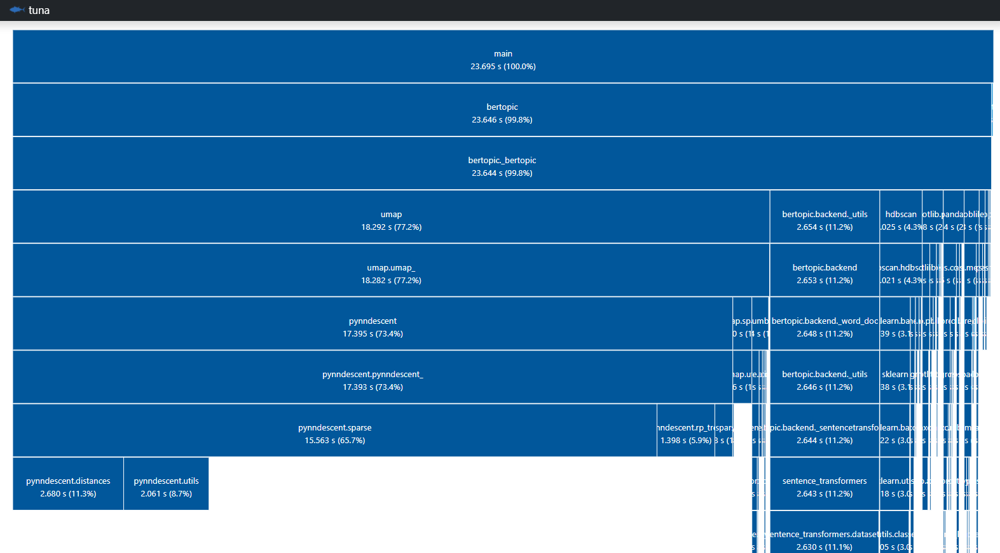

---
hide:
  - navigation
---

# Frequently Asked Questions

## **Why are the results not consistent between runs?**
Due to the stochastic nature of UMAP, the results from BERTopic might differ even if you run the same code multiple times. Using custom embeddings allows you to try out BERTopic several times until you find the topics that suit you best. You only need to generate the embeddings themselves once and run BERTopic several times
with different parameters. 

If you want to reproduce the results, at the expense of [performance](https://umap-learn.readthedocs.io/en/latest/reproducibility.html), you can set a `random_state` in UMAP to prevent 
any stochastic behavior:

```python
from bertopic import BERTopic
from umap import UMAP

umap_model = UMAP(n_neighbors=15, n_components=5, 
                  min_dist=0.0, metric='cosine', random_state=42)
topic_model = BERTopic(umap_model=umap_model)
```

## **Which embedding model should I choose?**
Unfortunately, there is not a definitive list of the best models for each language, this highly depends on your data, the model, and your specific use case. However, the default model in BERTopic (`"all-MiniLM-L6-v2"`) works great for **English** documents. In contrast, for **multi-lingual** documents or any other language, `"paraphrase-multilingual-MiniLM-L12-v2"` has shown great performance.  

If you want to use a model that provides a higher quality, but takes more computing time, then I would advise using `all-mpnet-base-v2` and `paraphrase-multilingual-mpnet-base-v2` instead. 

**MTEB Leaderboard**  
New embedding models are released frequently and their performance keeps getting better. To keep track of the best embedding models out there, you can visit the [MTEB leaderboard](https://huggingface.co/spaces/mteb/leaderboard). It is an excellent place for selecting the embedding that works best for you. For example, if you want the best of the best, then the top 5 models might the place to look. 

Many of these models can be used with `SentenceTransformers` in BERTopic, like so:

```python
from bertopic import BERTopic
from sentence_transformers import SentenceTransformer

embedding_model = SentenceTransformer("BAAI/bge-base-en-v1.5")
topic_model = BERTopic(embedding_model=embedding_model)
```

**SentenceTransformers**  
[SentenceTransformers](https://www.sbert.net/docs/pretrained_models.html#sentence-embedding-models) work typically quite well 
and are the preferred models to use. They are great at generating document embeddings and have several 
multi-lingual versions available.  

**🤗 transformers**  
BERTopic allows you to use any 🤗 transformers model. These models are typically embeddings created on a word/sentence level but can easily be pooled using Flair (see Guides/Embeddings). If you have a specific language for which you want to generate embeddings, you can choose the model [here](https://huggingface.co/models).

## **How do I reduce topic outliers?**
There are several ways we can reduce outliers.

First, the amount of datapoint classified as outliers is handled by the `min_samples` parameters in HDBSCAN. This value is automatically set to the 
same value of `min_cluster_size`. However, you can set it independently if you want to reduce the number of generated outliers. Lowering this value will 
result in less noise being generated. 

```python
from bertopic import BERTopic
from hdbscan import HDBSCAN

hdbscan_model = HDBSCAN(min_cluster_size=10, metric='euclidean', 
                        cluster_selection_method='eom', prediction_data=True, min_samples=5)
topic_model = BERTopic(hdbscan_model=hdbscan_model)
topics, probs = topic_model.fit_transform(docs)
```

!!! note "Note"
    Although this will lower outliers found in the data, this might force outliers to be put into topics where they do not belong. So make 
    sure to strike a balance between keeping noise and reducing outliers. 

Second, after training our BERTopic model, we can assign outliers to topics by making use of the `.reduce_outliers` function in BERTopic. An advantage of using this approach is that there are four built in strategies one can choose for reducing outliers. Moreover, this technique allows the user to experiment with reducing outliers across a number of strategies and parameters without actually having to re-train the topic model each time. You can learn more about the `.reduce_outlier` function [here](https://maartengr.github.io/BERTopic/getting_started/outlier_reduction/outlier_reduction.html). The following is a minimal example of how to use this function:

```python
from bertopic import BERTopic

# Train your BERTopic model
topic_model = BERTopic()
topics, probs = topic_model.fit_transform(docs)

# Reduce outliers
new_topics = topic_model.reduce_outliers(docs, topics)
```

Third, we can replace HDBSCAN with any other clustering algorithm that we want. So we can choose a clustering algorithm, like k-Means, that 
does not produce any outliers at all. Using k-Means instead of HDBSCAN is straightforward:

```python
from bertopic import BERTopic
from sklearn.cluster import KMeans

cluster_model = KMeans(n_clusters=50)
topic_model = BERTopic(hdbscan_model=cluster_model)
```


## **How do I remove stop words?**
At times, stop words might end up in our topic representations. This is something we typically want to avoid as they contribute little to the interpretation of the topics. However, removing stop words as a preprocessing step is not advised as the transformer-based embedding models that we use need the full context to create accurate embeddings. 

Instead, we can use the `CountVectorizer` to preprocess our documents **after** having generated embeddings and clustered 
our documents. I have found almost no disadvantages to using the `CountVectorizer` to remove stop words and 
it is something I would strongly advise to try out:

```python
from bertopic import BERTopic
from sklearn.feature_extraction.text import CountVectorizer

vectorizer_model = CountVectorizer(stop_words="english")
topic_model = BERTopic(vectorizer_model=vectorizer_model)
```

We can also use the `ClassTfidfTransformer` to reduce the impact of frequent words. The result is very similar to explicitly removing stop words but this process does this automatically:

```python
from bertopic import BERTopic
from bertopic.vectorizers import ClassTfidfTransformer

ctfidf_model = ClassTfidfTransformer(reduce_frequent_words=True)
topic_model = BERTopic(ctfidf_model=ctfidf_model)
```

## **How can I speed up BERTopic?**
You can speed up BERTopic by either generating your embeddings beforehand or by 
setting `calculate_probabilities` to False. Calculating the probabilities is quite expensive and can significantly increase the computation time. Thus, only use it if you do not mind waiting a bit before the model is done running or if you have less than a couple of hundred thousand documents. 

Also, make sure to use a GPU when extracting the sentence/document embeddings. Transformer models typically require a GPU and using only a CPU can slow down computation time quite a lot. However, if you do not have access to a GPU, looking into quantization might help. 

Lastly, it is also possible to speed up BERTopic with [cuML's](https://rapids.ai/start.html#rapids-release-selector) GPU acceleration of UMAP and HDBSCAN: 


```python
from bertopic import BERTopic
from cuml.cluster import HDBSCAN
from cuml.manifold import UMAP

# Create instances of GPU-accelerated UMAP and HDBSCAN
umap_model = UMAP(n_components=5, n_neighbors=15, min_dist=0.0)
hdbscan_model = HDBSCAN(min_samples=10, gen_min_span_tree=True, prediction_data=True)

# Pass the above models to be used in BERTopic
topic_model = BERTopic(umap_model=umap_model, hdbscan_model=hdbscan_model)
```


## **I am facing memory issues. Help!**
There are several ways to perform computation with large datasets:

* First, you can set `low_memory` to True when instantiating BERTopic. 
This may prevent blowing up the memory in UMAP. 

* Second, setting `calculate_probabilities` to False when instantiating BERTopic prevents a huge document-topic 
probability matrix from being created. Moreover, HDBSCAN is quite slow when it tries to calculate probabilities on large datasets. 

* Third, you can set the minimum frequency of words in the CountVectorizer class to reduce the size of the resulting 
sparse c-TF-IDF matrix. You can do this as follows:

```python
from bertopic import BERTopic
from sklearn.feature_extraction.text import CountVectorizer

vectorizer_model = CountVectorizer(ngram_range=(1, 2), stop_words="english", min_df=10)
topic_model = BERTopic(vectorizer_model=vectorizer_model)
```

The [min_df](https://scikit-learn.org/stable/modules/generated/sklearn.feature_extraction.text.CountVectorizer.html) 
parameter is used to indicate the minimum frequency of words. Setting this value larger than 1 can significantly reduce memory.

* Fourth, you can use <a href="/BERTopic/getting_started/online/online.html">online topic modeling</a> instead to use BERTopic on big data by training the model in chunks

If the problem persists, then this could be an issue related to your available memory. The processing of millions of documents is quite computationally expensive and sufficient RAM is necessary.  

## **I have only a few topics, how do I increase them?**
There are several reasons why your topic model may result in only a few topics:

* First, you might only have a few documents (~1000). This makes it very difficult to properly 
extract topics due to the little amount of data available. Increasing the number of documents 
might solve your issues. 

* Second, `min_topic_size` might be simply too large for your number of documents. If you decrease 
the minimum size of topics, then you are much more likely to increase the number of topics generated.
You could also decrease the `n_neighbors` parameter used in `UMAP` if this does not work. 

* Third, although this does not happen very often, there simply aren't that many topics to be found 
in your documents. You can often see this when you have many `-1` topics, which is not a topic 
but a category of outliers.  

## **I have too many topics, how do I decrease them?**  
If you have a large dataset, then it is possible to generate thousands of topics. Especially with large datasets, there is a good chance they contain many small topics. In practice, you might want a few hundred topics at most to interpret them nicely. 

There are a few ways of decreasing the number of generated topics: 

* First, we can set the `min_topic_size` in the BERTopic initialization much higher (e.g., 300) to make sure that those small clusters will not be generated. This is an HDBSCAN parameter that specifies the minimum number of documents needed in a cluster. More documents in a cluster mean fewer topics will be generated. 

* Second, you can create a custom UMAP model and set `n_neighbors` much higher than the default 15 (e.g., 200). This also prevents those micro clusters to be generated as it will need many neighboring documents to create a cluster. 

* Third, we can set `nr_topics` to a value that seems logical to the user. Do note that topics are forced 
to merge which might result in a lower quality of topics. In practice, I would advise using 
`nr_topic="auto"` as that will merge topics that are very similar. Dissimilar topics will 
therefore remain separated. 

## **How do I calculate the probabilities of all topics in a document?**
Although it is possible to calculate all the probabilities, the process of doing so is quite computationally 
inefficient and might significantly increase the computation time. To prevent this, the probabilities are 
not calculated as a default. To calculate them, you will have to set `calculate_probabilities` to True:

```python
from bertopic import BERTopic
topic_model = BERTopic(calculate_probabilities=True)
topics, probs = topic_model.fit_transform(docs) 
```  

!!! note
    The `calculate_probabilities` parameter is only used when using HDBSCAN or cuML's HDBSCAN model. In other words, this will not work when using a model other than HDBSCAN. Instead, we can approximate the topic distributions across all documents with [`.approximate_distribution`](https://maartengr.github.io/BERTopic/getting_started/distribution/distribution.html).
 
## **Numpy gives me an error when running BERTopic**
With the release of Numpy 1.20.0, there have been significant issues with using that version (and previous ones) due to compilation issues and pypi.   
  
This is a known issue with the order of installation using pypi. You can find more details about this issue 
[here](https://github.com/lmcinnes/umap/issues/567) and [here](https://github.com/scikit-learn-contrib/hdbscan/issues/457).

I would suggest doing one of the following:

* Install the newest version from BERTopic (>= v0.5).
* You can install hdbscan with `pip install hdbscan --no-cache-dir --no-binary :all: --no-build-isolation` which might resolve the issue
* Install BERTopic in a fresh environment using these steps. 

## **How can I run BERTopic without an internet connection?**  
The great thing about using sentence-transformers is that it searches automatically for an embedding model locally. 
If it cannot find one, it will download the pre-trained model from its servers. 
Make sure that you set the correct path for sentence-transformers to work. You can find a bit more about that 
[here](https://github.com/UKPLab/sentence-transformers/issues/888). 

You can download the corresponding model [here](https://public.ukp.informatik.tu-darmstadt.de/reimers/sentence-transformers/v0.2/)
and unzip it. Then, simply use the following to create your embedding model:

```python
from sentence_transformers import SentenceTransformer
embedding_model = SentenceTransformer('path/to/unzipped/model')
```

Then, pass it to BERTopic:

```python
from bertopic import BERTopic
topic_model = BERTopic(embedding_model=embedding_model)
```

## **Can I use the GPU to speed up the model?**
Yes. The GPU is automatically used when you use a SentenceTransformer or Flair embedding model. Using 
a CPU would then definitely slow things down. However, you can use other embeddings like TF-IDF or Doc2Vec 
embeddings in BERTopic which do not depend on GPU acceleration. 

You can use [cuML](https://rapids.ai/start.html#rapids-release-selector) to speed up both 
UMAP and HDBSCAN through GPU acceleration:

```python
from bertopic import BERTopic
from cuml.cluster import HDBSCAN
from cuml.manifold import UMAP

# Create instances of GPU-accelerated UMAP and HDBSCAN
umap_model = UMAP(n_components=5, n_neighbors=15, min_dist=0.0)
hdbscan_model = HDBSCAN(min_samples=10, gen_min_span_tree=True, prediction_data=True)

# Pass the above models to be used in BERTopic
topic_model = BERTopic(umap_model=umap_model, hdbscan_model=hdbscan_model)
topics, probs = topic_model.fit_transform(docs)
```

Depending on the embeddings you are using, you might want to normalize them first to force a cosine-related distance metric in UMAP:

```python
from cuml.preprocessing import normalize
embeddings = normalize(embeddings)
```

## **How can I use BERTopic with Chinese documents?**  
Currently, CountVectorizer tokenizes text by splitting whitespace which does not work for Chinese. 
To get it to work, you will have to create a custom `CountVectorizer` with `jieba`:

```python
from sklearn.feature_extraction.text import CountVectorizer
import jieba

def tokenize_zh(text):
    words = jieba.lcut(text)
    return words

vectorizer = CountVectorizer(tokenizer=tokenize_zh)
```

Next, we pass our custom vectorizer to BERTopic and create our topic model:

```python
from bertopic import BERTopic
topic_model = BERTopic(embedding_model=model, verbose=True, vectorizer_model=vectorizer)
topics, _ = topic_model.fit_transform(docs, embeddings=embeddings)
```

## **Why does it take so long to import BERTopic?**
The main culprit here seems to be UMAP. After running tests with [Tuna](https://github.com/nschloe/tuna) we 
can see that most of the resources when importing BERTopic can be dedicated to UMAP:   



Unfortunately, there currently is no fix for this issue. The most recent ticket regarding this 
issue can be found [here](https://github.com/lmcinnes/umap/issues/631).

## **Should I preprocess the data?**
No. By using document embeddings there is typically no need to preprocess the data as all parts of a document 
are important in understanding the general topic of the document. Although this holds in 99% of cases, if you 
have data that contains a lot of noise, for example, HTML-tags, then it would be best to remove them. HTML-tags 
typically do not contribute to the meaning of a document and should therefore be removed. However, if you apply 
topic modeling to HTML-code to extract topics of code, then it becomes important.

## **I run into issues running on Apple Silicon. What should I do?**
Apple Silicon chips (M1 & M2) are based on `arm64` (aka [`AArch64`](https://apple.stackexchange.com/questions/451238/is-m1-chip-aarch64-or-amd64), not to be confused with `amd64`/`x86_64`). There are known issues with upstream dependencies for this architecture, for example [numba](https://github.com/numba/numba/issues/5520). You may not always run into this issue, depending on the extras that you need.

One possible solution is to use [VS Code Dev Containers](https://code.visualstudio.com/docs/devcontainers/containers), which allow you to setup a Linux-based environment. To run BERTopic effectively you need to be aware of two things:

1. Make sure to use a Docker image specifically built for arm64
2. Make sure to use a *volume* instead of a *bind-mount*  
   ℹ️ the latter significantly reduces disk I/O

Using the pre-configured [Data Science Dev Containers](https://github.com/b-data/data-science-devcontainers) makes sure these setting are optimized. To start using them, do the following:

* Install and run Docker
* Clone repository [data-science-devcontainers](https://github.com/b-data/data-science-devcontainers)
* Open VS Code, build the `Python base` or `Python scipy` container and start working  
  ℹ️ Change `PYTHON_VERSION` to `3.11` in the respective `devcontainer.json` to work with the latest patch release of Python 3.11
* Note that data is persisted in the container
  * When using an unmodified `devcontainer.json`: Work in `/home/vscode`  
    👉 This is the *home directory* of user `vscode`
  * Python packages are installed to the home directory by default  
    👉 This is due to env variable `PIP_USER=1`
  * Note that the directory `/workspaces` is also persisted

### **Do these Data Science Dev Containers support GPU acceleration?**

Yes, but only on Linux and Windows.

The CUDA-enabled variants require the following in addition to Docker:

* NVIDIA GPU
* NVIDIA driver
* Linux: [NVIDIA Container Toolkit](https://docs.nvidia.com/datacenter/cloud-native/container-toolkit/latest/install-guide.html)
* Windows: [GPU support in Docker Desktop](https://docs.docker.com/desktop/gpu/)

ℹ️ The host running the GPU accelerated Dev Containers only requires the NVIDIA driver, the CUDA toolkit does not have to be installed.

See the [CUDA Version Matrix](https://github.com/b-data/jupyterlab-python-docker-stack/blob/main/CUDA_VERSION_MATRIX.md) regarding Ubuntu/CUDA/Python versions and recommended NVIDIA drivers.
