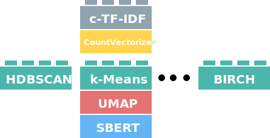

After reducing the dimensionality of our input embeddings, we need to cluster them into groups of similar embeddings to extract our topics. 
This process of clustering is quite important because the more performant our clustering technique the more accurate our topic representations are.

In BERTopic, we typically use HDBSCAN as it is quite capable of capturing structures with different densities. However, there is not one perfect 
clustering model and you might want to be using something entirely different for your use case. Moreover, what if a new state-of-the-art model 
is released tomorrow? We would like to be able to use that in BERTopic, right? Since BERTopic assumes some independence among steps, we can allow for this modularity:

<figure markdown>
  
  <figcaption></figcaption>
</figure>

As a result, the `hdbscan_model` parameter in BERTopic now allows for a variety of clustering models. To do so, the class should have 
the following attributes:
 
* `.fit(X)`  
    * A function that can be used to fit the model
* `.predict(X)` 
    * A predict function that transforms the input to cluster labels
* `.labels_`
    * The labels after fitting the model


In other words, it should have the following structure:

```python
class ClusterModel:
    def fit(self, X):
        self.labels_ = None
        return self
    
    def predict(self, X):
        return X
```

In this section, we will go through several examples of clustering algorithms and how they can be implemented.  


## **HDBSCAN**
As a default, BERTopic uses HDBSCAN to perform its clustering. To use a HDBSCAN model with custom parameters, 
we simply define it and pass it to BERTopic:

```python
from bertopic import BERTopic
from hdbscan import HDBSCAN

hdbscan_model = HDBSCAN(min_cluster_size=15, metric='euclidean', cluster_selection_method='eom', prediction_data=True)
topic_model = BERTopic(hdbscan_model=hdbscan_model)
```

Here, we can define any parameters in HDBSCAN to optimize for the best performance based on whatever validation metrics you are using. 

## **k-Means**
Although HDBSCAN works quite well in BERTopic and is typically advised, you might want to be using k-Means instead. 
It allows you to select how many clusters you would like and forces every single point to be in a cluster. Therefore, no 
outliers will be created. This also has disadvantages. When you force every single point in a cluster, it will mean 
that the cluster is highly likely to contain noise which can hurt the topic representations. As a small tip, using 
the `vectorizer_model=CountVectorizer(stop_words="english")` helps quite a bit to then improve the topic representation. 

Having said that, using k-Means is quite straightforward:

```python
from bertopic import BERTopic
from sklearn.cluster import KMeans

cluster_model = KMeans(n_clusters=50)
topic_model = BERTopic(hdbscan_model=cluster_model)
```

!!! note
    As you might have noticed, the `cluster_model` is passed to `hdbscan_model` which might be a bit confusing considering 
    you are not passing an HDBSCAN model. For now, the name of the parameter is kept the same to adhere to the current 
    state of the API. Changing the name could lead to deprecation issues, which I want to prevent as much as possible. 

## **Agglomerative Clustering**
Like k-Means, there are a bunch more clustering algorithms in `sklearn` that you can be using. Some of these models do 
not have a `.predict()` method but still can be used in BERTopic. However, using BERTopic's `.transform()` function 
will then give errors. 

Here, we will demonstrate Agglomerative Clustering:


```python
from bertopic import BERTopic
from sklearn.cluster import AgglomerativeClustering

cluster_model = AgglomerativeClustering(n_clusters=50)
topic_model = BERTopic(hdbscan_model=cluster_model)
```


## **cuML HDBSCAN**

Although the original HDBSCAN implementation is an amazing technique, it may have difficulty handling large amounts of data. Instead, 
we can use [cuML](https://rapids.ai/start.html#rapids-release-selector) to speed up HDBSCAN through GPU acceleration:

```python
from bertopic import BERTopic
from cuml.cluster import HDBSCAN

hdbscan_model = HDBSCAN(min_samples=10, gen_min_span_tree=True, prediction_data=True)
topic_model = BERTopic(hdbscan_model=hdbscan_model)
```

The great thing about using cuML's HDBSCAN implementation is that it supports many features of the original implementation. In other words, 
`calculate_probabilities=True` also works!

!!! note
    As of the v0.13 release, it is not yet possible to calculate the topic-document probability matrix for unseen data (i.e., `.transform`) using cuML's HDBSCAN. 
    However, it is still possible to calculate the topic-document probability matrix for the data on which the model was trained (i.e., `.fit` and `.fit_transform`).

!!! note
    If you want to install cuML together with BERTopic using Google Colab, you can run the following code:

    ```bash
    !pip install bertopic
    !pip install cudf-cu11 dask-cudf-cu11 --extra-index-url=https://pypi.nvidia.com
    !pip install cuml-cu11 --extra-index-url=https://pypi.nvidia.com
    !pip install cugraph-cu11 --extra-index-url=https://pypi.nvidia.com
    !pip install --upgrade cupy-cuda11x -f https://pip.cupy.dev/aarch64
    ```
