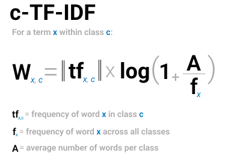
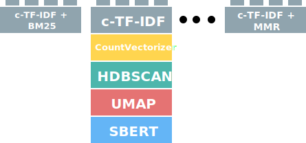
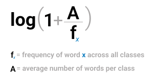
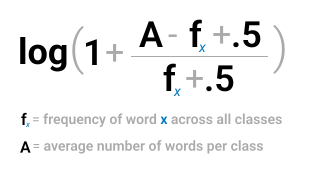
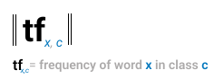
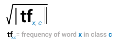

# c-TF-IDF

In BERTopic, in order to get an accurate representation of the topics from our bag-of-words matrix, TF-IDF was adjusted to work on a cluster/categorical/topic level instead of a document level. This adjusted TF-IDF representation is called **c-TF-IDF** and takes into account what makes the documents in one cluster different from documents in another cluster:
  


<br>
Each cluster is converted to a single document instead of a set of documents. Then, we extract the frequency of word `x` in class `c`, where `c` refers to the cluster we created before. This results in our class-based `tf` representation. This representation is L1-normalized to account for the differences in topic sizes. 
  <br><br>
Then, we take the logarithm of one plus the average number of words per class `A` divided by the frequency of word `x` across all classes. We add plus one within the logarithm to force values to be positive. This results in our class-based `idf` representation. Like with the classic TF-IDF, we then multiply `tf` with `idf` to get the importance score per word in each class. In other words, the classical TF-IDF procedure is **not** used here but a modified version of the algorithm that allows for a much better representation. 

Since the topic representation is somewhat independent of the clustering step, we can change how the c-TF-IDF representation will look like. This can be in the form of parameter tuning, different weighting schemes, or using a diversity metric on top of it. This allows for some modularity concerning the weighting scheme:

<figure markdown>
  
  <figcaption></figcaption>
</figure>


This class-based TF-IDF representation is enabled by default in BERTopic. However, we can explicitly pass it to BERTopic through the `ctfidf_model` allowing for parameter tuning and the customization of the topic extraction technique:

```python
from bertopic import BERTopic
from bertopic.vectorizers import ClassTfidfTransformer

ctfidf_model = ClassTfidfTransformer()
topic_model = BERTopic(ctfidf_model=ctfidf_model )
```

## **Parameters**
There are two parameters worth exploring in the `ClassTfidfTransformer`, namely `bm25_weighting` and `reduce_frequent_words`.


### bm25_weighting

The `bm25_weighting` is a boolean parameter that indicates whether a class-based BM-25 weighting measure is used instead of the default method as defined in the formula at the beginning of this page. 

Instead of using the following weighting scheme:




the class-based BM-25 weighting is used instead:



At smaller datasets, this variant can be more robust to stop words that appear in your data. It can be enabled as follows:

```python
from bertopic import BERTopic
from bertopic.vectorizers import ClassTfidfTransformer

ctfidf_model = ClassTfidfTransformer(bm25_weighting=True)
topic_model = BERTopic(ctfidf_model=ctfidf_model )
```


### reduce_frequent_words

Some words appear quite often in every topic but are generally not considered stop words as found in the `CountVectorizer(stop_words="english")` list. To further reduce these frequent words, we can use `reduce_frequent_words` to take the square root of the term frequency after applying the weighting scheme. 

Instead of the default term frequency:



we take the square root of the term frequency after normalizing the frequency matrix:



Although seemingly a small change, it can have quite a large effect on the number of stop words in the resulting topic representations. It can be enabled as follows:


```python
from bertopic import BERTopic
from bertopic.vectorizers import ClassTfidfTransformer

ctfidf_model = ClassTfidfTransformer(reduce_frequent_words=True)
topic_model = BERTopic(ctfidf_model=ctfidf_model )
```

!!! tip
	Both parameters can be used simultaneously: `ClassTfidfTransformer(bm25_weighting=True, reduce_frequent_words=True)`
