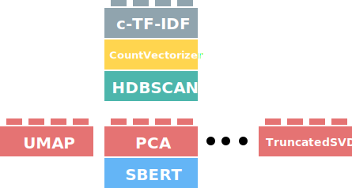

An important aspect of BERTopic is the dimensionality reduction of the input embeddings. As embeddings are often high in dimensionality, clustering becomes difficult due to the curse of dimensionality. 

A solution is to reduce the dimensionality of the embeddings to a workable dimensional space (e.g., 5) for clustering algorithms to work with. 
UMAP is used as a default in BERTopic since it can capture both the local and global high-dimensional space in lower dimensions. 
However, there are other solutions out there, such as PCA that users might be interested in trying out. Since BERTopic allows assumes some independency between steps, we can 
use any other dimensionality reduction algorithm. The image below illustrates this modularity:


<figure markdown>
  
  <figcaption></figcaption>
</figure>


As a result, the `umap_model` parameter in BERTopic now allows for a variety of dimensionality reduction models. To do so, the class should have 
the following attributes:
  
* `.fit(X)` 
    * A function that can be used to fit the model
* `.transform(X)` 
    * A transform function that transforms the input to a lower dimensional size

In other words, it should have the following structure:

```python
class DimensionalityReduction:
    def fit(self, X):
        return self
    
    def transform(self, X):
        return X
```

In this section, we will go through several examples of dimensionality reduction techniques and how they can be implemented.  


## **UMAP**
As a default, BERTopic uses UMAP to perform its dimensionality reduction. To use a UMAP model with custom parameters, 
we simply define it and pass it to BERTopic:

```python
from bertopic import BERTopic
from umap import UMAP

umap_model = UMAP(n_neighbors=15, n_components=5, min_dist=0.0, metric='cosine')
topic_model = BERTopic(umap_model=umap_model)
```

Here, we can define any parameters in UMAP to optimize for the best performance based on whatever validation metrics you are using. 

## **PCA**
Although UMAP works quite well in BERTopic and is typically advised, you might want to be using PCA instead. It can be faster to train and perform
inference. To use PCA, we can simply import it from `sklearn` and pass it to the `umap_model` parameter:


```python
from bertopic import BERTopic
from sklearn.decomposition import PCA

dim_model = PCA(n_components=5)
topic_model = BERTopic(umap_model=dim_model)
```

As a small note, PCA and k-Means have worked quite well in my experiments and might be interesting to use instead of PCA and HDBSCAN. 


!!! note
    As you might have noticed, the `dim_model` is passed to `umap_model` which might be a bit confusing considering 
    you are not passing a UMAP model. For now, the name of the parameter is kept the same to adhere to the current 
    state of the API. Changing the name could lead to deprecation issues, which I want to prevent as much as possible. 

## **Truncated SVD**
Like PCA, there are a bunch more dimensionality reduction techniques in `sklearn` that you can be using. Here, we will demonstrate Truncated SVD 
but any model can be used as long as it has both a `.fit()` and `.transform()` method:


```python
from bertopic import BERTopic
from sklearn.decomposition import TruncatedSVD

dim_model = TruncatedSVD(n_components=5)
topic_model = BERTopic(umap_model=dim_model)
```

## **cuML UMAP**

Although the original UMAP implementation is an amazing technique, it may have difficulty handling large amounts of data. Instead, 
we can use [cuML](https://rapids.ai/start.html#rapids-release-selector) to speed up UMAP through GPU acceleration:

```python
from bertopic import BERTopic
from cuml.manifold import UMAP

umap_model = UMAP(n_components=5, n_neighbors=15, min_dist=0.0)
topic_model = BERTopic(umap_model=umap_model)
```

!!! note
    If you want to install cuML together with BERTopic using Google Colab, you can run the following code:

    ```bash
    !pip install bertopic
    !pip install cudf-cu11 dask-cudf-cu11 --extra-index-url=https://pypi.nvidia.com
    !pip install cuml-cu11 --extra-index-url=https://pypi.nvidia.com
    !pip install cugraph-cu11 --extra-index-url=https://pypi.nvidia.com
    !pip install --upgrade cupy-cuda11x -f https://pip.cupy.dev/aarch64
    ```


## **Skip dimensionality reduction**
Although BERTopic applies dimensionality reduction as a default in its pipeline, this is a step that you might want to skip. We generate an "empty" model that simply returns the data pass it to: 

```python
from bertopic import BERTopic
from bertopic.dimensionality import BaseDimensionalityReduction

# Fit BERTopic without actually performing any dimensionality reduction
empty_dimensionality_model = BaseDimensionalityReduction()
topic_model = BERTopic(umap_model=empty_dimensionality_model)
```

In other words, we go from this pipeline:

<br>
<div class="svg_image">
--8<-- "docs/getting_started/dim_reduction/default_pipeline.svg"
</div>
<br>

To the following pipeline:

<br>
<div class="svg_image">
--8<-- "docs/getting_started/dim_reduction/no_dimensionality.svg"
</div>

<br>