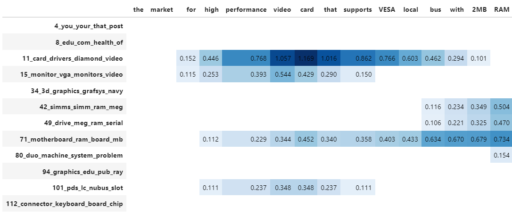

BERTopic approaches topic modeling as a cluster task and attempts to cluster semantically similar documents to extract common topics. A disadvantage of using such a method is that each document is assigned to a single cluster and therefore also a single topic. In practice, documents may contain a mixture of topics. This can be accounted for by splitting up the documents into sentences and feeding those to BERTopic. 
  
Another option is to use a cluster model that can perform soft clustering, like HDBSCAN. As BERTopic focuses on modularity, we may still want to model that mixture of topics even when we are using a hard-clustering model, like k-Means without the need to split up our documents. This is where `.approximate_distribution` comes in!

<br>
<div class="svg_image">
--8<-- "docs/getting_started/distribution/approximate_distribution.svg"
</div>
<br>

To perform this approximation, each document is split into tokens according to the provided tokenizer in the `CountVectorizer`. Then, a **sliding window** is applied on each document creating subsets of the document. For example, with a window size of 3 and stride of 1, the document: 
    
> Solving the right problem is difficult.
    
can be split up into `solving the right`, `the right problem`, `right problem is`, and `problem is difficult`. These are called token sets. 
For each of these token sets, we calculate their c-TF-IDF representation and find out how similar they are to the previously generated topics. 
Then, the similarities to the topics for each token set are summed to create a topic distribution for the entire document. 
  
Although it is often said that documents can contain a mixture of topics, these are often modeled by assigning each word to a single topic. 
With this approach, we take into account that there may be multiple topics for a single word. 
  
We can make this multiple-topic word assignment a bit more accurate by then splitting these token sets up into individual tokens and assigning
the topic distributions for each token set to each individual token. That way, we can visualize the extent to which a certain word contributes 
to a document's topic distribution.

## **Example**

To calculate our topic distributions, we first need to fit a basic topic model:

```python
from bertopic import BERTopic
from sklearn.datasets import fetch_20newsgroups

docs = fetch_20newsgroups(subset='all',  remove=('headers', 'footers', 'quotes'))['data']
topic_model = BERTopic().fit(docs)
```

After doing so, we can approximate the topic distributions for your documents:

```python
topic_distr, _ = topic_model.approximate_distribution(docs)
```

The resulting `topic_distr` is a *n* x *m* matrix where *n* are the documents and *m* the topics. We can then visualize the distribution 
of topics in a document:

```python
topic_model.visualize_distribution(topic_distr[1])
```

<iframe src="distribution_viz.html" style="width:1000px; height: 620px; border: 0px;""></iframe>

Although a topic distribution is nice, we may want to see how each token contributes to a specific topic. To do so, we need to first 
calculate topic distributions on a token level and then visualize the results:

```python
# Calculate the topic distributions on a token-level
topic_distr, topic_token_distr = topic_model.approximate_distribution(docs, calculate_tokens=True)

# Visualize the token-level distributions
df = topic_model.visualize_approximate_distribution(docs[1], topic_token_distr[1])
df
```

<br><br>

<br><br>

!!! tip
    You can also approximate the topic distributions for unseen documents. It will not be as accurate as `.transform` but it is quite fast and can serve you well in a production setting. 

!!! note
     To get the stylized dataframe for `.visualize_approximate_distribution` you will need to have Jinja installed. If you do not have this installed, an unstylized dataframe will be returned instead. You can install Jinja via `pip install jinja2`

## **Parameters**
There are a few parameters that are of interest which will be discussed below.


### **batch_size**
Creating token sets for each document can result in quite a large list of token sets. The similarity of these token sets with the topics can result a large matrix that might not fit into memory anymore. To circumvent this, we can process batches of documents instead to minimize the memory overload. The value for `batch_size` indicates the number of documents that will be processed at once:

```python
topic_distr, _ = topic_model.approximate_distribution(docs, batch_size=500)
```

### **window**
The number of tokens that are combined into token sets are defined by the `window` parameter. Seeing as we are performing a sliding window, we can change the size of the window. A larger window takes more tokens into account but setting it too large can result in considering too much information. Personally, I like to have this window between 4 and 8:

```python
topic_distr, _ = topic_model.approximate_distribution(docs, window=4)
```

### **stride**
The sliding window that is performed on a document shifts, as a default, 1 token to the right each time to create its token sets. As a result, especially with large windows, a single token gets judged several times. We can use the `stride` parameter to increase the number of tokens the window shifts to the right. By increasing
this value, we are judging each token less frequently which often results in a much faster calculation. Combining this parameter with `window` is preferred. For example, if we have a very large dataset, we can set `stride=4` and `window=8` to judge token sets that contain 8 tokens but that are shifted with 4 steps 
each time. As a result, this increases the computational speed quite a bit:

```python
topic_distr, _ = topic_model.approximate_distribution(docs, window=4)
```

### **use_embedding_model**
As a default, we compare the c-TF-IDF calculations between the token sets and all topics. Due to its bag-of-word representation, this is quite fast. However, you might want to use the selected `embedding_model` instead to do this comparison. Do note that due to the many token sets, it is often computationally quite a bit slower:

```python
topic_distr, _ = topic_model.approximate_distribution(docs, use_embedding_model=True)
```
