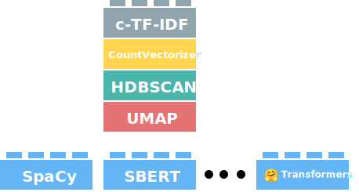

# Embedding Models
BERTopic starts with transforming our input documents into numerical representations. Although there are many ways this can be achieved, we typically use sentence-transformers (`"all-MiniLM-L6-v2"`) as it is quite capable of capturing the semantic similarity between documents. 

However, there is not one perfect 
embedding model and you might want to be using something entirely different for your use case. Since BERTopic assumes some independence among steps, we can allow for this modularity:

<figure markdown>
  
  <figcaption></figcaption>
</figure>


This modularity allows us not only to choose any embedding model to convert our documents into numerical representations, we can use essentially any data to perform our clustering. 
When new state-of-the-art pre-trained embedding models are released, BERTopic will be able to use them. As a result, BERTopic grows with any new models being released.
Out of the box, BERTopic supports several embedding techniques. In this section, we will go through several of them and how they can be implemented. 

### **Sentence Transformers**
You can select any model from sentence-transformers [here](https://www.sbert.net/docs/pretrained_models.html) 
and pass it through BERTopic with `embedding_model`:

```python
from bertopic import BERTopic
topic_model = BERTopic(embedding_model="all-MiniLM-L6-v2")
```

Or select a SentenceTransformer model with your parameters:

```python
from sentence_transformers import SentenceTransformer

sentence_model = SentenceTransformer("all-MiniLM-L6-v2")
topic_model = BERTopic(embedding_model=sentence_model)
```

!!! tip "Tip 1!"
    This embedding back-end was put here first for a reason, sentence-transformers works amazing out of the box! Playing around with different models can give you great results. Also, make sure to frequently visit [this](https://www.sbert.net/docs/pretrained_models.html) page as new models are often released. 

!!! tip "Tip 2!"
    New embedding models are released frequently and their performance keeps getting better. To keep track of the best embedding models out there, you can visit the [MTEB leaderboard](https://huggingface.co/spaces/mteb/leaderboard). It is an excellent place for selecting the embedding that works best for you. For example, if you want the best of the best, then the top 5 models might the place to look. 

    Many of these models can be used with `SentenceTransformers` in BERTopic, like so:

    ```python
    from sentence_transformers import SentenceTransformer

    embedding_model = SentenceTransformer("BAAI/bge-base-en-v1.5")
    topic_model = BERTopic(embedding_model=embedding_model)
    ```

### 🤗 Hugging Face Transformers
To use a Hugging Face transformers model, load in a pipeline and point 
to any model found on their model hub (https://huggingface.co/models):

```python
from transformers.pipelines import pipeline

embedding_model = pipeline("feature-extraction", model="distilbert-base-cased")
topic_model = BERTopic(embedding_model=embedding_model)
```

!!! tip "Tip!"
    These transformers also work quite well using `sentence-transformers` which has great optimizations tricks that make using it a bit faster. 

### **Flair**
[Flair](https://github.com/flairNLP/flair) allows you to choose almost any embedding model that 
is publicly available. Flair can be used as follows:

```python
from flair.embeddings import TransformerDocumentEmbeddings

roberta = TransformerDocumentEmbeddings('roberta-base')
topic_model = BERTopic(embedding_model=roberta)
```

You can select any 🤗 transformers model [here](https://huggingface.co/models).

Moreover, you can also use Flair to use word embeddings and pool them to create document embeddings. 
Under the hood, Flair simply averages all word embeddings in a document. Then, we can easily 
pass it to BERTopic to use those word embeddings as document embeddings: 

```python
from flair.embeddings import WordEmbeddings, DocumentPoolEmbeddings

glove_embedding = WordEmbeddings('crawl')
document_glove_embeddings = DocumentPoolEmbeddings([glove_embedding])

topic_model = BERTopic(embedding_model=document_glove_embeddings)
```

### **Spacy**
[Spacy](https://github.com/explosion/spaCy) is an amazing framework for processing text. There are 
many models available across many languages for modeling text. 
 
To use Spacy's non-transformer models in BERTopic:

```python
import spacy

nlp = spacy.load("en_core_web_md", exclude=['tagger', 'parser', 'ner', 
                                            'attribute_ruler', 'lemmatizer'])

topic_model = BERTopic(embedding_model=nlp)
```

Using spacy-transformer models:

```python
import spacy

spacy.prefer_gpu()
nlp = spacy.load("en_core_web_trf", exclude=['tagger', 'parser', 'ner', 
                                             'attribute_ruler', 'lemmatizer'])

topic_model = BERTopic(embedding_model=nlp)
```

If you run into memory issues with spacy-transformer models, try:

```python
import spacy
from thinc.api import set_gpu_allocator, require_gpu

nlp = spacy.load("en_core_web_trf", exclude=['tagger', 'parser', 'ner', 
                                             'attribute_ruler', 'lemmatizer'])
set_gpu_allocator("pytorch")
require_gpu(0)

topic_model = BERTopic(embedding_model=nlp)
```

### **Universal Sentence Encoder (USE)**
The Universal Sentence Encoder encodes text into high-dimensional vectors that are used here 
for embedding the documents. The model is trained and optimized for greater-than-word length text, 
such as sentences, phrases, or short paragraphs.

Using USE in BERTopic is rather straightforward:

```python
import tensorflow_hub
embedding_model = tensorflow_hub.load("https://tfhub.dev/google/universal-sentence-encoder/4")
topic_model = BERTopic(embedding_model=embedding_model)
```

### **Gensim**
BERTopic supports the `gensim.downloader` module, which allows it to download any word embedding model supported by Gensim. 
Typically, these are Glove, Word2Vec, or FastText embeddings:

```python
import gensim.downloader as api
ft = api.load('fasttext-wiki-news-subwords-300')
topic_model = BERTopic(embedding_model=ft)
```

!!! tip "Tip!"
    Gensim is primarily used for Word Embedding models. This works typically best for short documents since the word embeddings are pooled.


### **Scikit-Learn Embeddings**
Scikit-Learn is a framework for more than just machine learning. 
It offers many preprocessing tools, some of which can be used to create representations 
for text. Many of these tools are relatively lightweight and do not require a GPU. 
While the representations may be less expressive than many BERT models, the fact that 
it runs much faster can make it a relevant candidate to consider. 

If you have a scikit-learn compatible pipeline that you'd like to use to embed
text then you can also pass this to BERTopic. 

```python
from sklearn.pipeline import make_pipeline
from sklearn.decomposition import TruncatedSVD
from sklearn.feature_extraction.text import TfidfVectorizer

pipe = make_pipeline(
    TfidfVectorizer(),
    TruncatedSVD(100)
)

topic_model = BERTopic(embedding_model=pipe)
```

!!! Warning 
    One caveat to be aware of is that scikit-learns base `Pipeline` class does not
    support the `.partial_fit()`-API. If you have a pipeline that theoretically should
    be able to support online learning then you might want to explore
    the [scikit-partial](https://github.com/koaning/scikit-partial) project. 
    Moreover, since this backend does not generate representations on a word level, 
    it does not support the `bertopic.representation` models.


### OpenAI
To use OpenAI's external API, we need to define our key and explicitly call `bertopic.backend.OpenAIBackend`
to be used in our topic model:

```python
import openai
from bertopic.backend import OpenAIBackend

client = openai.OpenAI(api_key="sk-...")
embedding_model = OpenAIBackend(client, "text-embedding-ada-002")

topic_model = BERTopic(embedding_model=embedding_model)
```


### Cohere
To use Cohere's external API, we need to define our key and explicitly call `bertopic.backend.CohereBackend`
to be used in our topic model:

```python
import cohere
from bertopic.backend import CohereBackend

client = cohere.Client("MY_API_KEY")
embedding_model = CohereBackend(client)

topic_model = BERTopic(embedding_model=embedding_model)
```

### Multimodal
To create embeddings for both text and images in the same vector space, we can use the `MultiModalBackend`. 
This model uses a clip-vit based model that is capable of embedding text, images, or both:

```python
from bertopic.backend import MultiModalBackend
model = MultiModalBackend('clip-ViT-B-32', batch_size=32)

# Embed documents only
doc_embeddings = model.embed_documents(docs)

# Embedding images only
image_embeddings = model.embed_images(images)

# Embed both images and documents, then average them
doc_image_embeddings = model.embed(docs, images)
```


### **Custom Backend**
If your backend or model cannot be found in the ones currently available, you can use the `bertopic.backend.BaseEmbedder` class to 
create your backend. Below, you will find an example of creating a SentenceTransformer backend for BERTopic:

```python
from bertopic.backend import BaseEmbedder
from sentence_transformers import SentenceTransformer

class CustomEmbedder(BaseEmbedder):
    def __init__(self, embedding_model):
        super().__init__()
        self.embedding_model = embedding_model

    def embed(self, documents, verbose=False):
        embeddings = self.embedding_model.encode(documents, show_progress_bar=verbose)
        return embeddings 

# Create custom backend
embedding_model = SentenceTransformer("all-MiniLM-L6-v2")
custom_embedder = CustomEmbedder(embedding_model=embedding_model)

# Pass custom backend to bertopic
topic_model = BERTopic(embedding_model=custom_embedder)
```

### **Custom Embeddings**
The base models in BERTopic are BERT-based models that work well with document similarity tasks. Your documents, 
however, might be too specific for a general pre-trained model to be used. Fortunately, you can use the embedding 
model in BERTopic to create document features.   

You only need to prepare the document embeddings yourself and pass them through `fit_transform` of BERTopic:
```python
from sklearn.datasets import fetch_20newsgroups
from sentence_transformers import SentenceTransformer

# Prepare embeddings
docs = fetch_20newsgroups(subset='all',  remove=('headers', 'footers', 'quotes'))['data']
sentence_model = SentenceTransformer("all-MiniLM-L6-v2")
embeddings = sentence_model.encode(docs, show_progress_bar=False)

# Train our topic model using our pre-trained sentence-transformers embeddings
topic_model = BERTopic()
topics, probs = topic_model.fit_transform(docs, embeddings)
```

As you can see above, we used a SentenceTransformer model to create the embedding. You could also have used 
`🤗 transformers`, `Doc2Vec`, or any other embedding method. 

#### **TF-IDF**
As mentioned above, any embedding technique can be used. However, when running UMAP, the typical distance metric is 
`cosine` which does not work quite well for a TF-IDF matrix. Instead, BERTopic will recognize that a sparse matrix 
is passed and use `hellinger` instead which works quite well for the similarity between probability distributions. 

We simply create a TF-IDF matrix and use them as embeddings in our `fit_transform` method:

```python
from sklearn.datasets import fetch_20newsgroups
from sklearn.feature_extraction.text import TfidfVectorizer

# Create TF-IDF sparse matrix
docs = fetch_20newsgroups(subset='all',  remove=('headers', 'footers', 'quotes'))['data']
vectorizer = TfidfVectorizer(min_df=5)
embeddings = vectorizer.fit_transform(docs)

# Train our topic model using TF-IDF vectors
topic_model = BERTopic(stop_words="english")
topics, probs = topic_model.fit_transform(docs, embeddings)
```

Here, you will probably notice that creating the embeddings is quite fast whereas `fit_transform` is quite slow. 
This is to be expected as reducing the dimensionality of a large sparse matrix takes some time. The inverse of using 
transformer embeddings is true: creating the embeddings is slow whereas `fit_transform` is quite fast. 
