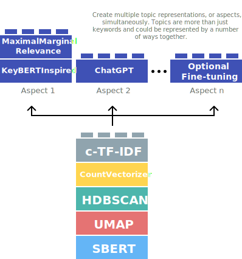
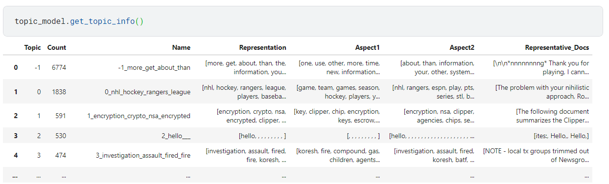

During the development of BERTopic, many different types of representations can be created, from keywords and phrases to summaries and custom labels. There is a variety of techniques that one can choose from to represent a topic. As such, there are a number of interesting and creative ways one can summarize topics. A topic is more than just a single representation.

Therefore, `multi-aspect topic modeling` is introduced! During the `.fit` or `.fit_transform` stages, you can now get multiple representations of a single topic. In practice, it works by generating and storing all kinds of different topic representations (see image below).

<figure markdown>
  
  <figcaption></figcaption>
</figure>

The approach is rather straightforward. We might want to represent our topics using a `PartOfSpeech` representation model but we might also want to try out `KeyBERTInspired` and compare those representation models. We can do this as follows:

```python
from bertopic.representation import KeyBERTInspired
from bertopic.representation import PartOfSpeech
from bertopic.representation import MaximalMarginalRelevance
from sklearn.datasets import fetch_20newsgroups

# Documents to train on
docs = fetch_20newsgroups(subset='all',  remove=('headers', 'footers', 'quotes'))['data']

# The main representation of a topic
main_representation = KeyBERTInspired()

# Additional ways of representing a topic
aspect_model1 = PartOfSpeech("en_core_web_sm")
aspect_model2 = [KeyBERTInspired(top_n_words=30), MaximalMarginalRelevance(diversity=.5)]

# Add all models together to be run in a single `fit`
representation_model = {
   "Main": main_representation,
   "Aspect1":  aspect_model1,
   "Aspect2":  aspect_model2 
}
topic_model = BERTopic(representation_model=representation_model).fit(docs)
```

As show above, to perform multi-aspect topic modeling, we make sure that `representation_model` is a dictionary where each representation model pipeline is defined. 
The main pipeline, that is used in most visualization options, is defined with the `"Main"` key. All other aspects can be defined however you want. In the example above, the two additional aspects that we are interested in are defined as `"Aspect1"` and `"Aspect2"`. 

After we have fitted our model, we can access all representations with `topic_model.get_topic_info()`:

<br><br>

<br><br>

As you can see, there are a number of different representations for our topics that we can inspect. All aspects are found in `topic_model.topic_aspects_`. 
