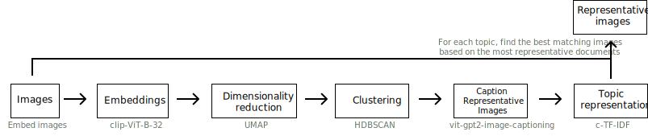

Documents or text are often accompanied by imagery or the other way around. For example, social media images with captions and products with descriptions. Topic modeling has traditionally focused on creating topics from textual representations. However, as more multi-modal representations are created, the need for multi-modal topics increases.

BERTopic can perform **multi-modal topic modeling** in a number of ways during `.fit` and `.fit_transform` stages. 

## **Text + Images**

The most basic example of multi-modal topic modeling in BERTopic is when you have images that accompany your documents. This means that it is expected that each document has an image and vice versa. Instagram pictures, for example, almost always have some descriptions to them. 

<figure markdown>
  
  <figcaption></figcaption>
</figure>

In this example, we are going to use images from `flickr` that each have a caption accociated to it: 

```python
# NOTE: This requires the `datasets` package which you can 
# install with `pip install datasets`
from datasets import load_dataset

ds = load_dataset("maderix/flickr_bw_rgb")
images = ds["train"]["image"]
docs = ds["train"]["caption"]
```

The `docs` variable contains the captions for each image in `images`. We can now use these variables to run our multi-modal example:

```python
from bertopic import BERTopic
from bertopic.representation import VisualRepresentation

# Additional ways of representing a topic
visual_model = VisualRepresentation()

# Make sure to add the `visual_model` to a dictionary
representation_model = {
   "Visual_Aspect":  visual_model,
}
topic_model = BERTopic(representation_model=representation_model, verbose=True)
```

In this example, we are clustering the documents and are then looking for the best matching images to the resulting clusters. 

We can now access our image representations for each topic with `topic_model.topic_aspects_["Visual_Aspect"]`.
If you want an overview of the topic images together with their textual representations in jupyter, you can run the following:

```python
import base64
from io import BytesIO
from IPython.display import HTML

def image_base64(im):
    if isinstance(im, str):
        im = get_thumbnail(im)
    with BytesIO() as buffer:
        im.save(buffer, 'jpeg')
        return base64.b64encode(buffer.getvalue()).decode()


def image_formatter(im):
    return f''

# Extract dataframe
df = topic_model.get_topic_info().drop("Representative_Docs", 1).drop("Name", 1)

# Visualize the images
HTML(df.to_html(formatters={'Visual_Aspect': image_formatter}, escape=False))
```

[IMAGES]


!!! Tip
    In the example above, we are clustering the documents but since you have 
    images, you might want to cluster those or cluster an aggregation of both 
    images and documents. For that, you can use the new `MultiModalBackend` 
    to generate embeddings: 

    ```python
    from bertopic.backend import MultiModalBackend
    model = MultiModalBackend('clip-ViT-B-32', batch_size=32)

    # Embed documents only
    doc_embeddings = model.embed_documents(docs)

    # Embeding images only
    image_embeddings = model.embed_images(images)

    # Embed both images and documents, then average them
    doc_image_embeddings = model.embed(docs, images)
    ```

## **Images Only**

Traditional topic modeling techniques can only be run on textual data, as is shown in the example above. However, there are plenty of cases where textual data is not available but images are. BERTopic allows topic modeling to be performed using only images as your input data.

<figure markdown>
  
  <figcaption></figcaption>
</figure>

To run BERTopic on images only, we first need to embed our images and then define a model that convert images to text:

```python
from bertopic.representation import KeyBERTInspired, VisualRepresentation
from bertopic.backend import MultiModalBackend

# Image embedding model
embedding_model = MultiModalBackend('clip-ViT-B-32', batch_size=32)

# Image to text representation model
representation_model= VisualRepresentation(text_to_image_model="nlpconnect/vit-gpt2-image-captioning")
```

Using these models, we can run our pipeline:

```python
from bertopic import BERTopic

# Train our model with images only
topic_model = BERTopic(embedding_model=embedding_model, representation_model=representation_model)
topics, probs = topic_model.fit_transform(documents=None, images=images)
```

[IMAGES]
