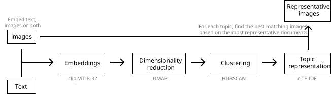
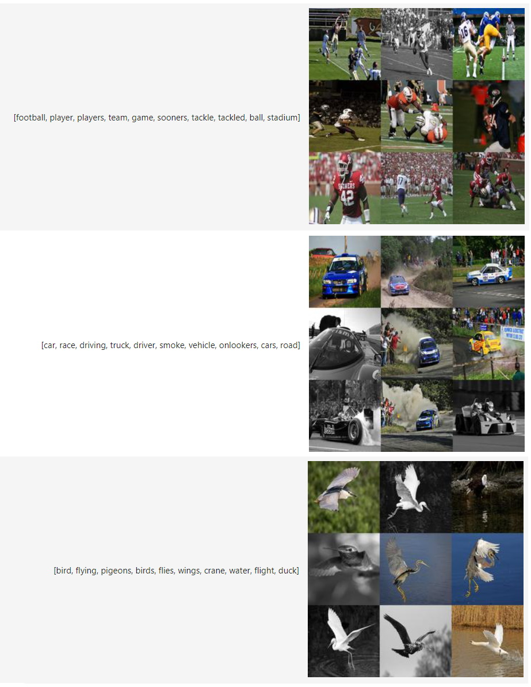
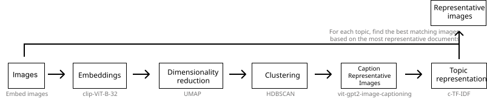
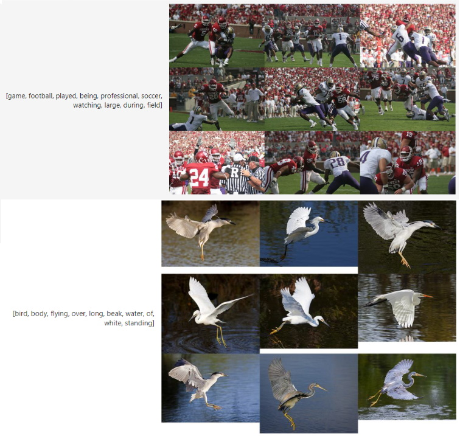

Documents or text are often accompanied by imagery or the other way around. For example, social media images with captions and products with descriptions. Topic modeling has traditionally focused on creating topics from textual representations. However, as more multimodal representations are created, the need for multimodal topics increases.

BERTopic can perform **multimodal topic modeling** in a number of ways during `.fit` and `.fit_transform` stages.

## **Text + Images**

The most basic example of multimodal topic modeling in BERTopic is when you have images that accompany your documents. This means that it is expected that each document has an image and vice versa. Instagram pictures, for example, almost always have some descriptions to them.

<figure markdown>
  
  <figcaption></figcaption>
</figure>

In this example, we are going to use images from `flickr` that each have a caption associated to it:

```python
# NOTE: This requires the `datasets` package which you can
# install with `pip install datasets`
from datasets import load_dataset

ds = load_dataset("maderix/flickr_bw_rgb")
images = ds["train"]["image"]
docs = ds["train"]["caption"]
```

The `docs` variable contains the captions for each image in `images`. We can now use these variables to run our multimodal example:

!!! Tip
    Do note that it is better to pass the paths of the images instead of the images themselves as there is no need to keep all images in memory. When passing the paths of the images, they are only opened temporarily when they are needed.

```python
from bertopic import BERTopic
from bertopic.representation import MultiModalRepresentation

# Additional ways of representing a topic
media_model = MultiModalRepresentation()

# Make sure to add the `media_model` to a dictionary
representation_model = {
   "Media":  media_model,
}
topic_model = BERTopic(representation_model=representation_model, verbose=True)
topics, probs = topic_model.fit_transform(docs, images=images)
```

In this example, we are clustering the documents and are then looking for the best matching images to the resulting clusters.

The representative images of each topic are in `topic_model.representative_items_` and the `Representative_Items` column of `topic_model.get_topic_info()`, and `topic_model.representative_images_` holds them tiled into one collage per topic.
If you want an overview of the topic images together with their textual representations in jupyter, you can run the following:

```python
import base64
from io import BytesIO
from IPython.display import HTML
from PIL import Image, ImageOps

def image_base64(image):
    if isinstance(image, str):
        image = Image.open(image)
    with BytesIO() as buffer:
        ImageOps.contain(image, (150, 150)).convert('RGB').save(buffer, 'jpeg')
        return base64.b64encode(buffer.getvalue()).decode()


def image_formatter(images):
    return ''.join(f'' for image in images)

# Extract dataframe
df = topic_model.get_topic_info().drop(columns=["Representative_Docs", "Name"])

# Visualize the images
HTML(df.to_html(formatters={'Representative_Items': image_formatter}, escape=False))
```

<br><br>

<br><br>

!!! Tip
    In the example above, we are clustering the documents but since you have
    images, you might want to cluster those or cluster an aggregation of both
    images and documents. For that, you can use the new `MultiModalBackend`
    to generate embeddings:

    ```python
    import numpy as np
    from bertopic.backend import MultiModalBackend
    model = MultiModalBackend('clip-ViT-B-32', batch_size=32)

    # Embed documents only
    doc_embeddings = model.embed_documents(docs)

    # Embedding images only
    image_embeddings = model.embed_media(images, "image")

    # Average both, which is what passing documents and images together does
    doc_image_embeddings = np.mean([doc_embeddings, image_embeddings], axis=0)
    ```

## **Images Only**

Traditional topic modeling techniques can only be run on textual data, as is shown in the example above. However, there are plenty of cases where textual data is not available but images are. BERTopic allows topic modeling to be performed using only images as your input data.

<figure markdown>
  
  <figcaption></figcaption>
</figure>

To run BERTopic on images only, we first need to embed our images and then define a model that convert images to text. To do so, we are going to need some images. We will take the same images as the above but instead save them locally and pass the paths to the images instead. As mentioned before, this will make sure that we do not hold too many images in memory whilst only a small subset is needed:


```python
import os
import glob
import zipfile
import numpy as np
import pandas as pd
from tqdm import tqdm
from sentence_transformers import util

# Flickr 8k images
img_folder = 'photos/'
caps_folder = 'captions/'
if not os.path.exists(img_folder) or len(os.listdir(img_folder)) == 0:
    os.makedirs(img_folder, exist_ok=True)

    if not os.path.exists('Flickr8k_Dataset.zip'):   #Download dataset if does not exist
        util.http_get('https://github.com/jbrownlee/Datasets/releases/download/Flickr8k/Flickr8k_Dataset.zip', 'Flickr8k_Dataset.zip')
        util.http_get('https://github.com/jbrownlee/Datasets/releases/download/Flickr8k/Flickr8k_text.zip', 'Flickr8k_text.zip')

    for folder, file in [(img_folder, 'Flickr8k_Dataset.zip'), (caps_folder, 'Flickr8k_text.zip')]:
        with zipfile.ZipFile(file, 'r') as zf:
            for member in tqdm(zf.infolist(), desc='Extracting'):
                zf.extract(member, folder)
images = list(glob.glob('photos/Flicker8k_Dataset/*.jpg'))
```

Next, we can run our pipeline:


```python
from bertopic.representation import KeyBERTInspired, MultiModalRepresentation
from bertopic.backend import MultiModalBackend

# Image embedding model
embedding_model = MultiModalBackend('clip-ViT-B-32', batch_size=32)

# Describing the images is what gives an image-only corpus its keywords
representation_model = {
    "Media": MultiModalRepresentation("HuggingFaceTB/SmolVLM-256M-Instruct")
}

```

Using these models, we can run our pipeline:

```python
from bertopic import BERTopic

# Train our model with images only
topic_model = BERTopic(embedding_model=embedding_model, representation_model=representation_model, min_topic_size=30)
topics, probs = topic_model.fit_transform(documents=None, images=images)
```

The representative images of each topic are in `topic_model.representative_items_` and the `Representative_Items` column of `topic_model.get_topic_info()`, and `topic_model.representative_images_` holds them tiled into one collage per topic.
If you want an overview of the topic images together with their textual representations in jupyter, you can run the following:

```python
import base64
from io import BytesIO
from IPython.display import HTML
from PIL import Image, ImageOps

def image_base64(image):
    if isinstance(image, str):
        image = Image.open(image)
    with BytesIO() as buffer:
        ImageOps.contain(image, (150, 150)).convert('RGB').save(buffer, 'jpeg')
        return base64.b64encode(buffer.getvalue()).decode()


def image_formatter(images):
    return ''.join(f'' for image in images)

# Extract dataframe
df = topic_model.get_topic_info().drop(columns=["Representative_Docs", "Name"])

# Visualize the images
HTML(df.to_html(formatters={'Representative_Items': image_formatter}, escape=False))
```

<br><br>

<br><br>
