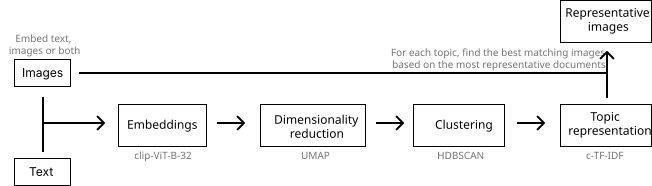
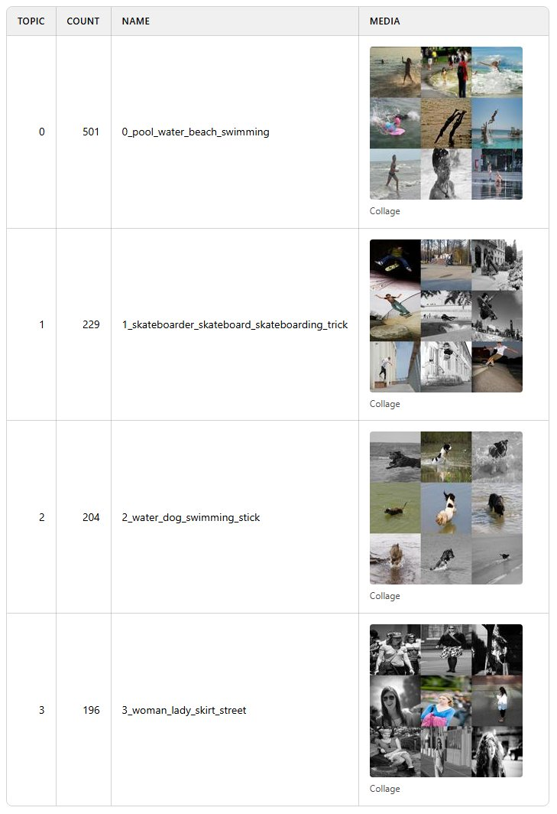
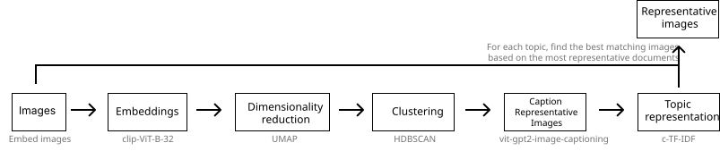
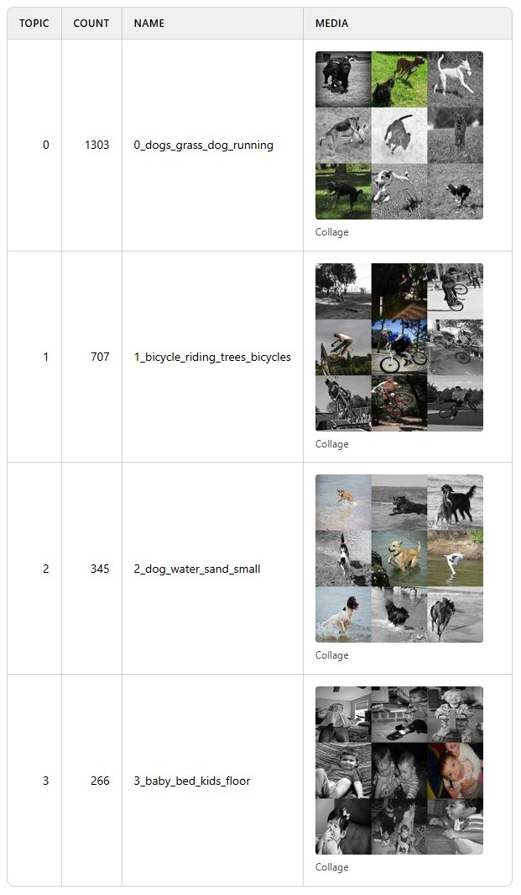
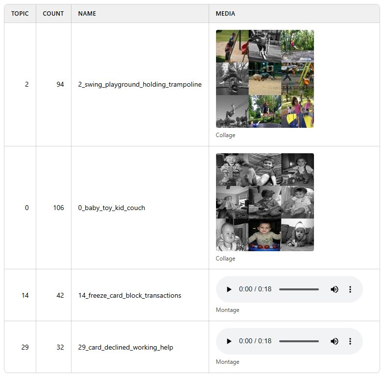
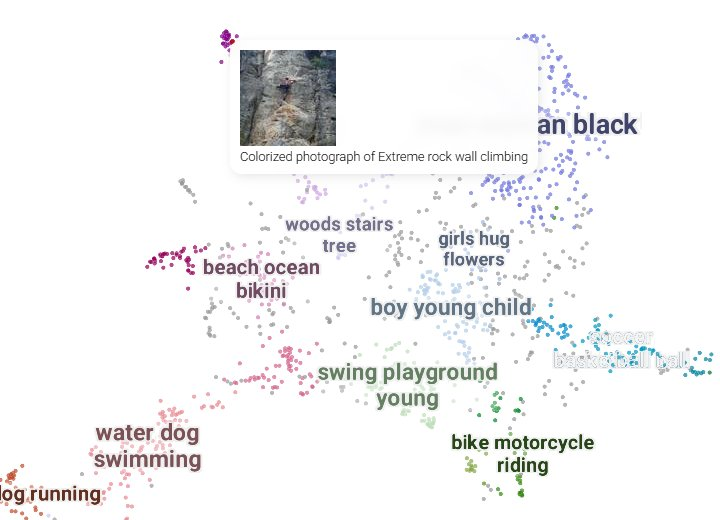

Documents or text are often accompanied by imagery or the other way around. For example, social media images with captions and products with descriptions. Topic modeling has traditionally focused on creating topics from textual representations. However, as more multimodal representations are created, the need for multimodal topics increases.

BERTopic can perform **multimodal topic modeling** on text, images, audio, video and code. Each kind is passed to `.fit` or `.fit_transform` under its own name (`documents`, `images=`, `audio=`, `video=` and `code=`), embedded, and clustered just like documents. c-TF-IDF can only count words, so a sample of each topic's media is described in words, and those words become the topic's keywords.

Images need `pip install bertopic[vision]`, audio `bertopic[audio]`, and video `bertopic[video]`, which decodes frames with `torchcodec`.

## **Models**

Two models make this work. The first is an **embedding model** that places your media in a vector space. Every example on this page uses `jina-embeddings-v5-omni-nano`, which embeds text, images, audio and video in one space, wrapped in `MultiModalBackend`:

```python
from sentence_transformers import SentenceTransformer
from bertopic.backend import MultiModalBackend

model = SentenceTransformer(
    "jinaai/jina-embeddings-v5-omni-nano",
    trust_remote_code=True,
    model_kwargs={"default_task": "retrieval"},
    default_prompt_name="document",
)
embedding_model = MultiModalBackend(model)
```

The `retrieval` setting with the `document` prompt is the one that gives each item its own embedding; under `clustering`, audio clips all end up with nearly the same one. The model needs `transformers>=5`. Each kind can also be given an embedding model of its own (`image_model=`, `audio_model=`, `video_model=` and `code_model=`), but rows of different kinds are only comparable when one model embeds them all.

The second is a **representation model**. `MultiModalRepresentation` describes up to nine items of each kind per topic, with a model for each kind, and is passed as an additional aspect. Each example below builds the one it needs, such as:

```python
from bertopic.representation import MultiModalRepresentation

representation_model = {
    "Media": MultiModalRepresentation(
        image_model="HuggingFaceTB/SmolVLM-256M-Instruct",  # describes images
        video_model="HuggingFaceTB/SmolVLM-256M-Instruct",  # describes frames of each video
        audio_model="openai/whisper-small",                 # transcribes audio
    )
}
```

Each model is loaded the first time a topic needs it, and a model that describes both images and video is loaded once. Instead of a model's name, you can also pass any callable that takes a list of items and returns one description each, such as a call to an API. Items that already have text, such as captioned images, keep it.

Descriptions and captions are written as sentences, so every example leaves English stop words out of the keywords with `CountVectorizer(stop_words="english")`.

## **Text + Images**

The most basic example of multimodal topic modeling in BERTopic is when you have images that accompany your documents. This means that it is expected that each document has an image and vice versa. Instagram pictures, for example, almost always have some descriptions to them.

<figure markdown>
  
  <figcaption></figcaption>
</figure>

In this example, we are going to use images from `flickr` that each have a caption associated to it:

```python
# NOTE: This requires the `datasets` package which you can
# install with `pip install datasets`
from datasets import load_dataset

ds = load_dataset("maderix/flickr_bw_rgb")
images = ds["train"]["image"]
docs = ds["train"]["caption"]
```

The `docs` variable contains the captions for each image in `images`. We can now use these variables to run our multimodal example:

!!! Tip
    Do note that it is better to pass the paths of the images instead of the images themselves as there is no need to keep all images in memory. When passing the paths of the images, they are only opened temporarily when they are needed. The examples on this page pass the dataset's images directly, since that is how they arrive; the cost is that a saved model cannot bring its representative items back, as those are kept as paths (see [Saving](#saving)).

```python
from sklearn.feature_extraction.text import CountVectorizer
from bertopic import BERTopic
from bertopic.representation import MultiModalRepresentation

# Every image already has its caption, so no model needs to describe them
representation_model = {"Media": MultiModalRepresentation()}

topic_model = BERTopic(
    embedding_model=embedding_model,
    vectorizer_model=CountVectorizer(stop_words="english"),
    representation_model=representation_model,
)
topics, probs = topic_model.fit_transform(docs, images=images)
```

Each caption is embedded together with its image, and the captions give the topics their words. Each topic's images are tiled into a collage, which `topic_model.visualize_media()` shows beside its name (see [Visualizing media](#visualizing-media)):

<br><br>

<br><br>

## **Images Only**

Traditional topic modeling techniques can only be run on textual data, as is shown in the example above. However, there are plenty of cases where textual data is not available but images are. BERTopic allows topic modeling to be performed using only images as your input data.

<figure markdown>
  
  <figcaption></figcaption>
</figure>

Without captions there are no words to count, so a vision model describes a sample of each topic's images, and those descriptions become its keywords. Here, the same photographs as above without their captions:

```python
from datasets import load_dataset
from sklearn.feature_extraction.text import CountVectorizer
from bertopic import BERTopic
from bertopic.representation import MultiModalRepresentation

images = load_dataset("maderix/flickr_bw_rgb", split="train")["image"]

# A vision model describes nine images from each topic
representation_model = {"Media": MultiModalRepresentation(image_model="HuggingFaceTB/SmolVLM-256M-Instruct")}

topic_model = BERTopic(
    embedding_model=embedding_model,
    vectorizer_model=CountVectorizer(stop_words="english"),
    representation_model=representation_model,
    min_topic_size=30,
)
topics, probs = topic_model.fit_transform(images=images)
```

`topic_model.get_representation(0, "Media").captions` holds what the vision model wrote about a topic's images. It starts almost every description with "In this image we can see", which the stop words leave out of the keywords.

<br><br>

<br><br>

Text and images share one space, so image topics can also be searched with a sentence: `topic_model.find_topics("dogs playing in the snow")`.

## **Audio**

Audio is passed as file paths or as arrays. An array is taken to be sampled at 16 kHz, which is what Whisper expects. Here, 563 recordings of people calling their bank about one of 14 things, such as a lost card or opening a joint account:

```python
import io
import librosa
from datasets import Audio, load_dataset
from sklearn.feature_extraction.text import CountVectorizer
from bertopic import BERTopic
from bertopic.representation import MultiModalRepresentation

# `decode=False` hands over each recording's bytes, which librosa reads at 16 kHz
minds = load_dataset("PolyAI/minds14", "en-US", split="train").cast_column("audio", Audio(decode=False))
clips = [librosa.load(io.BytesIO(row["bytes"]), sr=16_000)[0] for row in minds["audio"]]

# Whisper transcribes nine calls from each topic
representation_model = {"Media": MultiModalRepresentation(audio_model="openai/whisper-small")}

topic_model = BERTopic(
    embedding_model=embedding_model,
    vectorizer_model=CountVectorizer(stop_words="english"),
    representation_model=representation_model,
)
topics, probs = topic_model.fit_transform(audio=clips)
```

The transcripts become each topic's keywords. A call longer than Whisper's 30 seconds is transcribed in 30-second windows. Transcribing audio given as file paths needs [ffmpeg](https://ffmpeg.org/) installed, which arrays do not.

## **Video**

Videos are passed as file paths. Here, the 1,000 clips of MSR-VTT's test set, short YouTube videos in 20 categories such as music, sports and cooking:

```python
import json
from huggingface_hub import hf_hub_download, snapshot_download
from sklearn.feature_extraction.text import CountVectorizer
from bertopic import BERTopic
from bertopic.representation import MultiModalRepresentation

# Download only the clips of the test set
metadata = hf_hub_download("VLM2Vec/MSR-VTT", "msrvtt_test_1k.json", repo_type="dataset")
with open(metadata, encoding="utf-8") as file:
    test = json.load(file)
folder = snapshot_download(
    "VLM2Vec/MSR-VTT", repo_type="dataset", allow_patterns=[f"raw_videos/{clip['video']}" for clip in test]
)
videos = [f"{folder}/raw_videos/{clip['video']}" for clip in test]

# A vision model describes frames of nine clips from each topic
representation_model = {"Media": MultiModalRepresentation(video_model="HuggingFaceTB/SmolVLM-256M-Instruct")}

topic_model = BERTopic(
    embedding_model=embedding_model,
    vectorizer_model=CountVectorizer(stop_words="english"),
    representation_model=representation_model,
)
topics, probs = topic_model.fit_transform(video=videos)
```

The vision model describes three frames of each clip (`nr_frames`), taken from the middle of equal stretches of the clip so that black openings and endings are skipped, and the descriptions of a clip's frames are joined into one. A topic needs ten items by default, so for a folder of only a few dozen clips, lower `min_topic_size`.

## **Code**

Code is its own kind of input. It is embedded by the code model when the backend has one (`code_model=`), and c-TF-IDF reads it as it is, so it needs no representation model. Here, 974 short Python programs, each solving a small task such as finding the area of a circle:

```python
from datasets import load_dataset
from sklearn.feature_extraction.text import CountVectorizer
from bertopic import BERTopic

mbpp = load_dataset("google-research-datasets/mbpp", "full", split="train+validation+test+prompt")

topic_model = BERTopic(embedding_model=embedding_model, vectorizer_model=CountVectorizer(stop_words="english"))
topics, probs = topic_model.fit_transform(code=mbpp["code"])
```

## **Several kinds at once**

Several kinds can be passed together, and are then clustered in one model. Here, 2,000 of the photographs from above and the calls to a bank:

```python
import io
import librosa
from datasets import Audio, load_dataset
from sklearn.feature_extraction.text import CountVectorizer
from bertopic import BERTopic
from bertopic.representation import MultiModalRepresentation

photos = load_dataset("maderix/flickr_bw_rgb", split="train[:2000]")["image"]
minds = load_dataset("PolyAI/minds14", "en-US", split="train").cast_column("audio", Audio(decode=False))
calls = [librosa.load(io.BytesIO(row["bytes"]), sr=16_000)[0] for row in minds["audio"]]

# A model for each kind: a vision model for the photographs and Whisper for the calls
representation_model = {
    "Media": MultiModalRepresentation(
        image_model="HuggingFaceTB/SmolVLM-256M-Instruct",
        audio_model="openai/whisper-small",
    )
}

topic_model = BERTopic(
    embedding_model=embedding_model,
    vectorizer_model=CountVectorizer(stop_words="english"),
    representation_model=representation_model,
)
topics, probs = topic_model.fit_transform(images=photos, audio=calls)
```

The rows are ordered images, audio, video, documents and then code, which is also the order of `topics`. How documents are read depends on how many there are. When there are as many documents as media rows, each document describes the item at its position, as captions do, and each pair becomes one row. With any other number, the documents are rows of their own beside the media. So to caption the photographs here, pass a document for every media row, with an empty string for each call: `topic_model.fit_transform(captions + [""] * len(calls), images=photos, audio=calls)`.

Rows of different kinds are only comparable when one model embeds them all, and whether a photograph and a call about the same subject end up in one topic depends on that model. Words can find topics of either kind:

```python
photo_topics, _ = topic_model.find_topics("a child on a swing", top_n=2)
call_topics, _ = topic_model.find_topics("I lost my bank card", top_n=2)
topic_model.visualize_media(topics=photo_topics + call_topics)
```

<br><br>

<br><br>

## **Visualizing media**

The examples in this section continue with the model from [Several kinds at once](#several-kinds-at-once). Each topic keeps its representative media, the items chosen to stand for it, and one summary per kind of media: its images tiled into a collage, the middle frame of each clip tiled into a frame sheet, and the first two seconds of each recording joined into a montage.

```python
topic_model.representative_items_     # every topic's representative media, whatever their kind
topic_model.representative_images_    # every topic's collage

media = topic_model.get_representation(0, "Media")
media.items, media.summaries, media.captions
```

The representative items are also in the `Representative_Items` column of `topic_model.get_topic_info()`. To see each topic's collage, frame sheet and montage beside its name, run:

```python
topic_model.visualize_media()
```

Each montage adds about 0.8 MB to the page, so for a model with many audio topics, `top_n_topics=10` keeps the page small. The page is IPython's `HTML`, so a notebook shows it inline, and its `data` is a page that any browser opens once saved:

```python
with open("media.html", "w", encoding="utf-8") as file:
    file.write(topic_model.visualize_media().data)
```

The interactive datamap shows every image and video. Pass the same documents and media you passed to `fit`, so that every point lines up with its topic. Hovering over an image then shows it, and hovering over a video shows its middle frame, at about 3 KB of page per picture:

```python
topic_model.visualize_document_datamap(images=photos, audio=calls, interactive=True)
```

<br><br>

<br><br>

Under each thumbnail is that row's own text, so a caption, a transcript or a document appears beneath its point. The photographs here were passed without captions, which is why the tooltip above says only what kind of media it is. The datamap needs `pip install bertopic[datamap]`.

## **Saving**

With `serialization="safetensors"` or `"pytorch"`, `topic_model.save` keeps each topic's summaries, with collages and frame sheets as images and montages as audio files. Representative items are kept only as their paths, since the media they point to is already on disk, so pass your media as paths if you want them back after loading. The default, `pickle`, pickles the whole model, media included.
