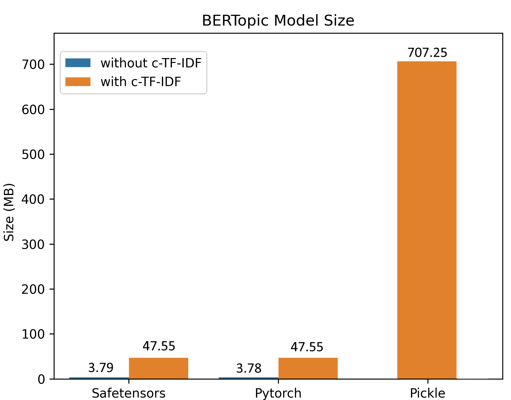

Saving, loading, and sharing a BERTopic model can be done in several ways. It is generally advised to go with `.safetensors` as that allows for a small, safe, and fast method for saving your BERTopic model. However, other formats, such as `.pickle` and pytorch `.bin` are also possible.

## **Saving**

There are three methods for saving BERTopic:

1. A light model with `.safetensors` and config files
2. A light model with pytorch `.bin` and config files
3. A full model with `.pickle`


!!! Tip "Tip"
    It is advised to use methods 1 or 2 for saving as they generated very small models. Especially method 1 (`safetensors`) 
    allows for a relatively safe format compared to the other methods. 

The methods are used as follows:

```python
topic_model = BERTopic().fit(my_docs)

# Method 1 - safetensors
embedding_model = "sentence-transformers/all-MiniLM-L6-v2"
topic_model.save("path/to/my/model_dir", serialization="safetensors", save_ctfidf=True, save_embedding_model=embedding_model)

# Method 2 - pytorch
embedding_model = "sentence-transformers/all-MiniLM-L6-v2"
topic_model.save("path/to/my/model_dir", serialization="pytorch", save_ctfidf=True, save_embedding_model=embedding_model)

# Method 3 - pickle
topic_model.save("my_model", serialization="pickle")
```

!!! Warning "Warning"
    When saving the model, make sure to also keep track of the versions of dependencies and Python used. 
    Loading and saving the model should be done using the same dependencies and Python. Moreover, models 
    saved in one version of BERTopic are not guaranteed to load in other versions. 


### **Pickle Drawbacks**
Saving the model with `pickle` allows for saving the entire topic model, including dimensionality reduction and clustering algorithms, but has several drawbacks:

* Arbitrary code can be run from `.pickle` files
* The resulting model is rather large (often > 500MB) since all sub-models need to be saved
* Explicit and specific version control is needed as they typically only run if the environment is exactly the same
 

### **Safetensors and Pytorch Advantages**
Saving the topic modeling with `.safetensors` or `pytorch` has a number of advantages:

* `.safetensors` is a relatively **safe format**
* The resulting model can be **very small** (often < 20MB>) since no sub-models need to be saved
* Although version control is important, there is a bit more **flexibility** with respect to specific versions of packages
* More easily used in **production**
* **Share** models with the HuggingFace Hub

<br><br>

<br><br>

The above image, a model trained on 100,000 documents, demonstrates the differences in sizes comparing `safetensors`, `pytorch`, and `pickle`. The difference in sizes can mostly be explained due to the efficient saving procedure and that the clustering and dimensionality reductions are not saved in safetensors/pytorch since inference can be done based on the topic embeddings. 


## **HuggingFace Hub**

When you have created a BERTopic model, you can easily share it with other through the HuggingFace Hub. First, you need to log in to your HuggingFace account which you can do in a number of ways:

* Log in to your Hugging Face account with the command below

```bash
huggingface-cli login

# or using an environment variable
huggingface-cli login --token $HUGGINGFACE_TOKEN
```

* Alternatively, you can programmatically login using login() in a notebook or a script

```python
from huggingface_hub import login
login()
```

* Or you can give a token with the `token` variable

When you have logged in to your HuggingFace account, you can save and upload the model as follows:

```python
from bertopic import BERTopic

# Train model
topic_model = BERTopic().fit(my_docs)

# Push to HuggingFace Hub
topic_model.push_to_hf_hub(
    repo_id="MaartenGr/BERTopic_ArXiv",
    save_ctfidf=True
)

# Load from HuggingFace
loaded_model = BERTopic.load("MaartenGr/BERTopic_ArXiv")
```

### **Parameters**
There are number of parameters that may be worthwhile to know:

* `private`
    * Whether to create a private repository
* `serialization`
    * The type of serialization. Either `safetensors` or `pytorch`. Make sure to run `pip install safetensors` for safetensors.
* `save_embedding_model`
    * A pointer towards a HuggingFace model to be loaded in with SentenceTransformers. E.g., `sentence-transformers/all-MiniLM-L6-v2`
* `save_ctfidf`
    * Whether to save c-TF-IDF information


## **Loading**

To load a model:

```python
# Load from directory
loaded_model = BERTopic.load("path/to/my/model_dir")

# Load from file
loaded_model = BERTopic.load("my_model")

# Load from HuggingFace
loaded_model = BERTopic.load("MaartenGr/BERTopic_Wikipedia")
```

The embedding model cannot always be saved using a non-pickle method if, for example, you are using OpenAI embeddings. Instead, you can load them in as follows:


```python
# Define embedding model
import openai
from bertopic.backend import OpenAIBackend

client = openai.OpenAI(api_key="sk-...")
embedding_model = OpenAIBackend(client, "text-embedding-ada-002")

# Load model and add embedding model
loaded_model = BERTopic.load("path/to/my/model_dir", embedding_model=embedding_model)
```
