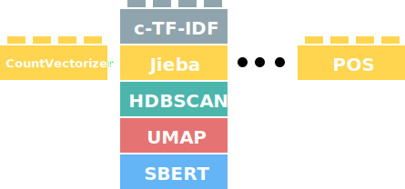

In topic modeling, the quality of the topic representations is key for interpreting the topics, communicating results, and understanding patterns. It is of utmost 
importance to make sure that the topic representations fit with your use case. 

In practice, there is not one correct way of creating topic representations. Some use cases might opt for higher n-grams, whereas others might focus more on single 
words without any stop words. The diversity in use cases also means that we need to have some flexibility in BERTopic to make sure it can be used across most use cases. 
The image below illustrates this modularity:

<figure markdown>
  
  <figcaption></figcaption>
</figure>

In this section, we will go through several examples of vectorization algorithms and how they can be implemented.  

## **CountVectorizer**

One often underestimated component of BERTopic is the `CountVectorizer` and `c-TF-IDF` calculation. Together, they are responsible for creating the topic representations and luckily 
can be quite flexible in parameter tuning. Here, we will go through tips and tricks for tuning your `CountVectorizer` and see how they might affect the topic representations. 

Before starting, it should be noted that you can pass the `CountVectorizer` before and after training your topic model. Passing it before training allows you to 
minimize the size of the resulting `c-TF-IDF` matrix:

```python
from bertopic import BERTopic
from sklearn.feature_extraction.text import CountVectorizer

# Train BERTopic with a custom CountVectorizer
vectorizer_model = CountVectorizer(min_df=10)
topic_model = BERTopic(vectorizer_model=vectorizer_model)
topics, probs = topic_model.fit_transform(docs)
```

Passing it after training allows you to fine-tune the topic representations by using `.update_topics()`:

```python
from bertopic import BERTopic
from sklearn.feature_extraction.text import CountVectorizer

# Train a BERTopic model
topic_model = BERTopic()
topics, probs = topic_model.fit_transform(docs)

# Fine-tune topic representations after training BERTopic
vectorizer_model = CountVectorizer(stop_words="english", ngram_range=(1, 3), min_df=10)
topic_model.update_topics(docs, vectorizer_model=vectorizer_model)
```

The great thing about using `.update_topics()` is that it allows you to tweak the topic representations without re-training your model! Thus, here we will be focusing 
on fine-tuning our topic representations after training our model. 


!!! note
    The great thing about processing our topic representations with the `CountVectorizer` is that it does **not** influence the quality of clusters as that is 
	being performed before generating the topic representations. 

### **Basic Usage**

First, let's start with defining our documents and training our topic model:

```python
from bertopic import BERTopic
from sklearn.datasets import fetch_20newsgroups

# Prepare documents
docs = fetch_20newsgroups(subset='all',  remove=('headers', 'footers', 'quotes'))['data']

# Train a BERTopic model
topic_model = BERTopic()
topics, probs = topic_model.fit_transform(docs)
```

Now, let's see the top 10 most frequent topics that have been generated:

```python
>>> topic_model.get_topic_info()[1:11]
Topic	Count	Name
1	0	1822	0_game_team_games_he
2	1	580	1_key_clipper_chip_encryption
3	2	532	2_ites_hello_cheek_hi
4	3	493	3_israel_israeli_jews_arab
5	4	453	4_card_monitor_video_drivers
6	5	438	5_you_your_post_jim
7	6	314	6_car_cars_engine_ford
8	7	279	7_health_newsgroup_cancer_1993
9	8	218	8_fbi_koresh_fire_gas
10	9	174	9_amp_audio_condition_asking
```

The topic representations generated already seem quite interpretable! However, I am quite sure we do much better without having 
to re-train our model. Next, we will go through common parameters in `CountVectorizer` and focus on the effects that they might have. As a baseline, we will be comparing 
them to the topic representation above. 

### **Parameters**

There are several basic parameters in the CountVectorizer that we can use to improve upon the quality of the resulting topic representations.

#### ngram_range

The `ngram_range` parameter allows us to decide how many tokens each entity is in a topic representation. For example, we have words like 
`game` and `team` with a length of 1 in a topic but it would also make sense to have words like `hockey league` with a length of 2. To allow for these words to be generated, 
we can set the `ngram_range` parameter:


```python
from sklearn.feature_extraction.text import CountVectorizer
vectorizer_model = CountVectorizer(ngram_range=(1, 3), stop_words="english")
topic_model.update_topics(docs, vectorizer_model=vectorizer_model)
```

As you might have noticed, I also added `stop_words="english"`. This is necessary as longer words tend to have many stop words and removing them allows 
for nicer topic representations:

```python
>>> topic_model.get_topic_info()[1:11]
	Topic	Count	Name
1	0	1822	0_game_team_games_players
2	1	580	1_key_clipper_chip_encryption
3	2	532	2_hello ites_forget hello_ites 15_huh hi
4	3	493	3_israel_israeli_jews_arab
5	4	453	4_card_monitor_video_drivers
6	5	438	5_post_jim_context_forged
7	6	314	6_car_cars_engine_ford
8	7	279	7_health_newsgroup_cancer_1993
9	8	218	8_fbi_koresh_gas_compound
10	9	174	9_amp_audio_condition_asking
```

Although they look very similar, if we zoom in on topic 8, we can see longer words in our representation:

```python
>>> topic_model.get_topic(8)
[('fbi', 0.019637149205975653),
 ('koresh', 0.019054514637064403),
 ('gas', 0.014156057632897179),
 ('compound', 0.012381224868591681),
 ('batf', 0.010349992314076047),
 ('children', 0.009336408916322387),
 ('tear gas', 0.008941747802855279),
 ('tear', 0.008446786597564537),
 ('davidians', 0.007911119583253022),
 ('started', 0.007398687505638955)]
```

`tear` and `gas` have now been combined into a single representation. This helps us understand what those individual words might have been representing. 

#### stop_words

In some of the topics, we can see stop words appearing like `he` or `the`.  
Stop words are something we typically want to prevent in our topic representations as they do not give additional information to the topic. 
To prevent those stop words, we can use the `stop_words` parameter in the `CountVectorizer` to remove them from the representations:

```python
from sklearn.feature_extraction.text import CountVectorizer
vectorizer_model = CountVectorizer(stop_words="english")
topic_model.update_topics(docs, vectorizer_model=vectorizer_model)
```

After running the above, we get the following output:

```python
>>> topic_model.get_topic_info()[1:11]
	Topic	Count	Name
1	0	1822	0_game_team_games_players
2	1	580	1_key_clipper_chip_encryption
3	2	532	2_ites_cheek_hello_hi
4	3	493	3_israel_israeli_jews_arab
5	4	453	4_monitor_card_video_vga
6	5	438	5_post_jim_context_forged
7	6	314	6_car_cars_engine_ford
8	7	279	7_health_newsgroup_cancer_tobacco
9	8	218	8_fbi_koresh_gas_compound
10	9	174	9_amp_audio_condition_stereo
```

As you can see, the topic representations already look much better! Stop words are removed and the representations are more interpretable. 
We can also pass in a list of stop words if you have multiple languages to take into account. 


#### min_df

One important parameter to keep in mind is the `min_df`. This is typically an integer representing how frequent a word must be before 
being added to our representation. You can imagine that if we have a million documents and a certain word only appears a single time across all of them, then 
it would be highly unlikely to be representative of a topic. Typically, the `c-TF-IDF` calculation removes that word from the topic representation but when 
you have millions of documents, that will also lead to a very large topic-term matrix. To prevent a huge vocabulary, we can set the `min_df` to only accept 
words that have a minimum frequency. 

When you have millions of documents or error issues, I would advise increasing the value of `min_df` as long as the topic representations might sense:

```python
from sklearn.feature_extraction.text import CountVectorizer
vectorizer_model = CountVectorizer(min_df=10)
topic_model.update_topics(docs, vectorizer_model=vectorizer_model)
```

With the following topic representation:

```python
>>> topic_model.get_topic_info()[1:11]
	Topic	Count	Name
1	0	1822	0_game_team_games_he
2	1	580	1_key_clipper_chip_encryption
3	2	532	2_hello_hi_yep_huh
4	3	493	3_israel_jews_jewish_peace
5	4	453	4_card_monitor_video_drivers
6	5	438	5_you_your_post_jim
7	6	314	6_car_cars_engine_ford
8	7	279	7_health_newsgroup_cancer_1993
9	8	218	8_fbi_koresh_fire_gas
10	9	174	9_audio_condition_stereo_asking
```

As you can see, the output is nearly the same which is what we would like to achieve. All words that appear less than 10 times are now removed 
from our topic-term matrix (i.e., `c-TF-IDF` matrix) which drastically lowers the matrix in size. 


#### max_features

A parameter similar to `min_df` is `max_features` which allows you to select the top n most frequent words to be used in the topic representation. 
Setting this, for example, to `10_000` creates a topic-term matrix with `10_000` terms. This helps you control the size of the topic-term matrix 
directly without having to fiddle around with the `min_df` parameter:

```python
from sklearn.feature_extraction.text import CountVectorizer
vectorizer_model = CountVectorizer(max_features=10_000)
topic_model.update_topics(docs, vectorizer_model=vectorizer_model)
```

With the following representation:

```python
>>> topic_model.get_topic_info()[1:11]
Topic	Count	Name
1	0	1822	0_game_team_games_he
2	1	580	1_key_clipper_chip_encryption
3	2	532	2_hello_hi_yep_huh
4	3	493	3_israel_israeli_jews_arab
5	4	453	4_card_monitor_video_drivers
6	5	438	5_you_your_post_jim
7	6	314	6_car_cars_engine_ford
8	7	279	7_health_newsgroup_cancer_1993
9	8	218	8_fbi_koresh_fire_gas
10	9	174	9_amp_audio_condition_asking
```

As with `min_df`, we would like the topic representations to be very similar. 

#### tokenizer

The default tokenizer in the CountVectorizer works well for western languages but fails to tokenize some non-western languages, like Chinese.
Fortunately, we can use the `tokenizer` variable in the CountVectorizer to use [`jieba`](https://github.com/fxsjy/jieba), which is a package
for Chinese text segmentation. Using it is straightforward:

```python
from sklearn.feature_extraction.text import CountVectorizer
import jieba

def tokenize_zh(text):
    words = jieba.lcut(text)
    return words

vectorizer = CountVectorizer(tokenizer=tokenize_zh)
```

Then, we can simply pass the vectorizer to update our topic representations:

```python
topic_model.update_topics(docs, vectorizer_model=vectorizer_model)
```


## **OnlineCountVectorizer**

When using the online/incremental variant of BERTopic, we need a `CountVectorizer` than can incrementally update its representation. For that purpose, `OnlineCountVectorizer` was created that not only updates out-of-vocabulary words but also implements decay and cleaning functions to prevent the sparse bag-of-words matrix to become too large. It is a class that can be found in `bertopic.vectorizers` which extends `sklearn.feature_extraction.text.CountVectorizer`. In other words, you can use the exact same parameter in `OnlineCountVectorizer` as found in Scikit-Learn's `CountVectorizer`. We can use it as follows:

```python
from bertopic import BERTopic
from bertopic.vectorizers import OnlineCountVectorizer

# Train BERTopic with a custom OnlineCountVectorizer
vectorizer_model = OnlineCountVectorizer()
topic_model = BERTopic(vectorizer_model=vectorizer_model)
```

### **Parameters**

Other than parameters found in `CountVectorizer`, such as `stop_words`  and `ngram_range`, we can two parameters in `OnlineCountVectorizer` to adjust the way old data is processed and kept. 

#### decay

At each iteration, we sum the bag-of-words representation of the new documents with the bag-of-words representation of all documents processed thus far. In other words, the bag-of-words matrix keeps increasing with each iteration. However, especially in a streaming setting, older documents might become less and less relevant as time goes on. Therefore, a `decay` parameter was implemented that decays the bag-of-words' frequencies at each iteration before adding the document frequencies of new documents. The `decay` parameter is a value between 0 and 1 and indicates the percentage of frequencies the previous bag-of-words matrix should be reduced to. For example, a value of `.1` will decrease the frequencies in the bag-of-words matrix by 10% at each iteration before adding the new bag-of-words matrix. This will make sure that recent data has more weight than previous iterations. 

#### delete_min_df

In BERTopic, we might want to remove words from the topic representation that appear infrequently. The `min_df` in the `CountVectorizer` works quite well for that. However, when we have a streaming setting, the `min_df` does not work as well since a word's frequency might start below `min_df` but will end up higher than that over time. Setting that value high might not always be advised. 

As a result, the vocabulary of the resulting bag-of-words matrix can become quite large. Similarly, if we implement the `decay` parameter, then some values will decrease over time until they are below `min_df`. For these reasons, the `delete_min_df` parameter was implemented. The parameter takes positive integers and indicates, at each iteration, which words will be removed. If the value is set to 5, it will check after each iteration if the total frequency of a word is exceeded by that value. If so, the word will be removed in its entirety from the bag-of-words matrix. This helps to keep the bag-of-words matrix of a manageable size. 

!!! note
	Although the `delete_min_df` parameter removes words from the bag-of-words matrix, it is not permanent. If new documents come in where those previously deleted words are used frequently, they get added back to the matrix. 