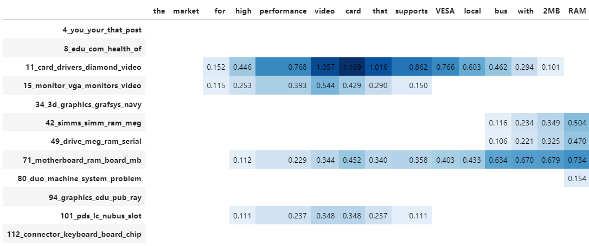

Visualizing BERTopic and its derivatives is important in understanding the model, how it works, and more importantly, where it works.
Since topic modeling can be quite a subjective field it is difficult for users to validate their models. Looking at the topics and seeing
if they make sense is an important factor in alleviating this issue.

## **Visualize Topics**
After having trained our `BERTopic` model, we can iteratively go through hundreds of topics to get a good
understanding of the topics that were extracted. However, that takes quite some time and lacks a global representation.
Instead, we can visualize the topics that were generated in a way very similar to
[LDAvis](https://github.com/cpsievert/LDAvis).

We embed our c-TF-IDF representation of the topics in 2D using Umap and then visualize the two dimensions using
plotly such that we can create an interactive view.

First, we need to train our model:

```python
from bertopic import BERTopic
from sklearn.datasets import fetch_20newsgroups

docs = fetch_20newsgroups(subset='all',  remove=('headers', 'footers', 'quotes'))['data']
topic_model = BERTopic()
topics, probs = topic_model.fit_transform(docs)
```

Then, we can call `.visualize_topics` to create a 2D representation of your topics. The resulting graph is a
plotly interactive graph which can be converted to HTML:

```python
topic_model.visualize_topics()
```

<iframe src="viz.html" style="width:1000px; height: 680px; border: 0px;""></iframe>

You can use the slider to select the topic which then lights up red. If you hover over a topic, then general
information is given about the topic, including the size of the topic and its corresponding words.

## **Visualize Documents**
Using the previous method, we can visualize the topics and get insight into their relationships. However,
you might want a more fine-grained approach where we can visualize the documents inside the topics to see
if they were assigned correctly or whether they make sense. To do so, we can use the `topic_model.visualize_documents()`
function. This function recalculates the document embeddings and reduces them to 2-dimensional space for easier visualization
purposes. This process can be quite expensive, so it is advised to adhere to the following pipeline:

```python
from sklearn.datasets import fetch_20newsgroups
from sentence_transformers import SentenceTransformer
from bertopic import BERTopic
from umap import UMAP

# Prepare embeddings
docs = fetch_20newsgroups(subset='all',  remove=('headers', 'footers', 'quotes'))['data']
sentence_model = SentenceTransformer("all-MiniLM-L6-v2")
embeddings = sentence_model.encode(docs, show_progress_bar=False)

# Train BERTopic
topic_model = BERTopic().fit(docs, embeddings)

# Run the visualization with the original embeddings
topic_model.visualize_documents(docs, embeddings=embeddings)

# Reduce dimensionality of embeddings, this step is optional but much faster to perform iteratively:
reduced_embeddings = UMAP(n_neighbors=10, n_components=2, min_dist=0.0, metric='cosine').fit_transform(embeddings)
topic_model.visualize_documents(docs, reduced_embeddings=reduced_embeddings)
```

<iframe src="documents.html" style="width:1200px; height: 800px; border: 0px;""></iframe>


!!! note
    The visualization above was generated with the additional parameter `hide_document_hover=True` which disables the
    option to hover over the individual points and see the content of the documents. This was done for demonstration purposes
    as saving all those documents in the visualization can be quite expensive and result in large files. However,
    it might be interesting to set `hide_document_hover=False` in order to hover over the points and see the content of the documents.

### **Custom Hover**

When you visualize the documents, you might not always want to see the complete document over hover. Many documents have shorter information that might be more interesting to visualize, such as its title. To create the hover based on a documents' title instead of its content, you can simply pass a variable (`titles`) containing the title for each document:

```python
topic_model.visualize_documents(titles, reduced_embeddings=reduced_embeddings)
```

## **Visualize Topic Hierarchy**
The topics that were created can be hierarchically reduced. In order to understand the potential hierarchical
structure of the topics, we can use `scipy.cluster.hierarchy` to create clusters and visualize how
they relate to one another. This might help to select an appropriate `nr_topics` when reducing the number
of topics that you have created. To visualize this hierarchy, run the following:

```python
topic_model.visualize_hierarchy()
```

<iframe src="hierarchy.html" style="width:1000px; height: 680px; border: 0px;""></iframe>

!!! note
    Do note that this is not the actual procedure of `.reduce_topics()` when `nr_topics` is set to
    auto since HDBSCAN is used to automatically extract topics. The visualization above closely resembles
    the actual procedure of `.reduce_topics()` when any number of `nr_topics` is selected.

### **Hierarchical labels**

Although visualizing this hierarchy gives us information about the structure, it would be helpful to see what happens
to the topic representations when merging topics. To do so, we first need to calculate the representations of the
hierarchical topics:


First, we train a basic BERTopic model:

```python
from bertopic import BERTopic
from sklearn.datasets import fetch_20newsgroups

docs = fetch_20newsgroups(subset='all',  remove=('headers', 'footers', 'quotes'))["data"]
topic_model = BERTopic(verbose=True)
topics, probs = topic_model.fit_transform(docs)
hierarchical_topics = topic_model.hierarchical_topics(docs)
```

To visualize these results, we simply need to pass the resulting `hierarchical_topics` to our `.visualize_hierarchy` function:

```python
topic_model.visualize_hierarchy(hierarchical_topics=hierarchical_topics)
```
<iframe src="hierarchical_topics.html" style="width:1000px; height: 2150px; border: 0px;""></iframe>


If you **hover** over the black circles, you will see the topic representation at that level of the hierarchy. These representations
help you understand the effect of merging certain topics. Some might be logical to merge whilst others might not. Moreover,
we can now see which sub-topics can be found within certain larger themes.

### **Text-based topic tree**

Although this gives a nice overview of the potential hierarchy, hovering over all black circles can be tiresome. Instead, we can
use `topic_model.get_topic_tree` to create a text-based representation of this hierarchy. Although the general structure is more difficult
to view, we can see better which topics could be logically merged:

```python
>>> tree = topic_model.get_topic_tree(hierarchical_topics)
>>> print(tree)
.
└─atheists_atheism_god_moral_atheist
     ├─atheists_atheism_god_atheist_argument
     │    ├─■──atheists_atheism_god_atheist_argument ── Topic: 21
     │    └─■──br_god_exist_genetic_existence ── Topic: 124
     └─■──moral_morality_objective_immoral_morals ── Topic: 29
```

<details>
  <summary>Click here to view the full tree.</summary>

  ```bash
    .
    ├─people_armenian_said_god_armenians
    │    ├─god_jesus_jehovah_lord_christ
    │    │    ├─god_jesus_jehovah_lord_christ
    │    │    │    ├─jehovah_lord_mormon_mcconkie_god
    │    │    │    │    ├─■──ra_satan_thou_god_lucifer ── Topic: 94
    │    │    │    │    └─■──jehovah_lord_mormon_mcconkie_unto ── Topic: 78
    │    │    │    └─jesus_mary_god_hell_sin
    │    │    │         ├─jesus_hell_god_eternal_heaven
    │    │    │         │    ├─hell_jesus_eternal_god_heaven
    │    │    │         │    │    ├─■──jesus_tomb_disciples_resurrection_john ── Topic: 69
    │    │    │         │    │    └─■──hell_eternal_god_jesus_heaven ── Topic: 53
    │    │    │         │    └─■──aaron_baptism_sin_law_god ── Topic: 89
    │    │    │         └─■──mary_sin_maria_priest_conception ── Topic: 56
    │    │    └─■──marriage_married_marry_ceremony_marriages ── Topic: 110
    │    └─people_armenian_armenians_said_mr
    │         ├─people_armenian_armenians_said_israel
    │         │    ├─god_homosexual_homosexuality_atheists_sex
    │         │    │    ├─homosexual_homosexuality_sex_gay_homosexuals
    │         │    │    │    ├─■──kinsey_sex_gay_men_sexual ── Topic: 44
    │         │    │    │    └─homosexuality_homosexual_sin_homosexuals_gay
    │         │    │    │         ├─■──gay_homosexual_homosexuals_sexual_cramer ── Topic: 50
    │         │    │    │         └─■──homosexuality_homosexual_sin_paul_sex ── Topic: 27
    │         │    │    └─god_atheists_atheism_moral_atheist
    │         │    │         ├─islam_quran_judas_islamic_book
    │         │    │         │    ├─■──jim_context_challenges_articles_quote ── Topic: 36
    │         │    │         │    └─islam_quran_judas_islamic_book
    │         │    │         │         ├─■──islam_quran_islamic_rushdie_muslims ── Topic: 31
    │         │    │         │         └─■──judas_scripture_bible_books_greek ── Topic: 33
    │         │    │         └─atheists_atheism_god_moral_atheist
    │         │    │              ├─atheists_atheism_god_atheist_argument
    │         │    │              │    ├─■──atheists_atheism_god_atheist_argument ── Topic: 21
    │         │    │              │    └─■──br_god_exist_genetic_existence ── Topic: 124
    │         │    │              └─■──moral_morality_objective_immoral_morals ── Topic: 29
    │         │    └─armenian_armenians_people_israel_said
    │         │         ├─armenian_armenians_israel_people_jews
    │         │         │    ├─tax_rights_government_income_taxes
    │         │         │    │    ├─■──rights_right_slavery_slaves_residence ── Topic: 106
    │         │         │    │    └─tax_government_taxes_income_libertarians
    │         │         │    │         ├─■──government_libertarians_libertarian_regulation_party ── Topic: 58
    │         │         │    │         └─■──tax_taxes_income_billion_deficit ── Topic: 41
    │         │         │    └─armenian_armenians_israel_people_jews
    │         │         │         ├─gun_guns_militia_firearms_amendment
    │         │         │         │    ├─■──blacks_penalty_death_cruel_punishment ── Topic: 55
    │         │         │         │    └─■──gun_guns_militia_firearms_amendment ── Topic: 7
    │         │         │         └─armenian_armenians_israel_jews_turkish
    │         │         │              ├─■──israel_israeli_jews_arab_jewish ── Topic: 4
    │         │         │              └─■──armenian_armenians_turkish_armenia_azerbaijan ── Topic: 15
    │         │         └─stephanopoulos_president_mr_myers_ms
    │         │              ├─■──serbs_muslims_stephanopoulos_mr_bosnia ── Topic: 35
    │         │              └─■──myers_stephanopoulos_president_ms_mr ── Topic: 87
    │         └─batf_fbi_koresh_compound_gas
    │              ├─■──reno_workers_janet_clinton_waco ── Topic: 77
    │              └─batf_fbi_koresh_gas_compound
    │                   ├─batf_koresh_fbi_warrant_compound
    │                   │    ├─■──batf_warrant_raid_compound_fbi ── Topic: 42
    │                   │    └─■──koresh_batf_fbi_children_compound ── Topic: 61
    │                   └─■──fbi_gas_tear_bds_building ── Topic: 23
    └─use_like_just_dont_new
        ├─game_team_year_games_like
        │    ├─game_team_games_25_year
        │    │    ├─game_team_games_25_season
        │    │    │    ├─window_printer_use_problem_mhz
        │    │    │    │    ├─mhz_wire_simms_wiring_battery
        │    │    │    │    │    ├─simms_mhz_battery_cpu_heat
        │    │    │    │    │    │    ├─simms_pds_simm_vram_lc
        │    │    │    │    │    │    │    ├─■──pds_nubus_lc_slot_card ── Topic: 119
        │    │    │    │    │    │    │    └─■──simms_simm_vram_meg_dram ── Topic: 32
        │    │    │    │    │    │    └─mhz_battery_cpu_heat_speed
        │    │    │    │    │    │         ├─mhz_cpu_speed_heat_fan
        │    │    │    │    │    │         │    ├─mhz_cpu_speed_heat_fan
        │    │    │    │    │    │         │    │    ├─■──fan_cpu_heat_sink_fans ── Topic: 92
        │    │    │    │    │    │         │    │    └─■──mhz_speed_cpu_fpu_clock ── Topic: 22
        │    │    │    │    │    │         │    └─■──monitor_turn_power_computer_electricity ── Topic: 91
        │    │    │    │    │    │         └─battery_batteries_concrete_duo_discharge
        │    │    │    │    │    │              ├─■──duo_battery_apple_230_problem ── Topic: 121
        │    │    │    │    │    │              └─■──battery_batteries_concrete_discharge_temperature ── Topic: 75
        │    │    │    │    │    └─wire_wiring_ground_neutral_outlets
        │    │    │    │    │         ├─wire_wiring_ground_neutral_outlets
        │    │    │    │    │         │    ├─wire_wiring_ground_neutral_outlets
        │    │    │    │    │         │    │    ├─■──leds_uv_blue_light_boards ── Topic: 66
        │    │    │    │    │         │    │    └─■──wire_wiring_ground_neutral_outlets ── Topic: 120
        │    │    │    │    │         │    └─scope_scopes_phone_dial_number
        │    │    │    │    │         │         ├─■──dial_number_phone_line_output ── Topic: 93
        │    │    │    │    │         │         └─■──scope_scopes_motorola_generator_oscilloscope ── Topic: 113
        │    │    │    │    │         └─celp_dsp_sampling_antenna_digital
        │    │    │    │    │              ├─■──antenna_antennas_receiver_cable_transmitter ── Topic: 70
        │    │    │    │    │              └─■──celp_dsp_sampling_speech_voice ── Topic: 52
        │    │    │    │    └─window_printer_xv_mouse_windows
        │    │    │    │         ├─window_xv_error_widget_problem
        │    │    │    │         │    ├─error_symbol_undefined_xterm_rx
        │    │    │    │         │    │    ├─■──symbol_error_undefined_doug_parse ── Topic: 63
        │    │    │    │         │    │    └─■──rx_remote_server_xdm_xterm ── Topic: 45
        │    │    │    │         │    └─window_xv_widget_application_expose
        │    │    │    │         │         ├─window_widget_expose_application_event
        │    │    │    │         │         │    ├─■──gc_mydisplay_draw_gxxor_drawing ── Topic: 103
        │    │    │    │         │         │    └─■──window_widget_application_expose_event ── Topic: 25
        │    │    │    │         │         └─xv_den_polygon_points_algorithm
        │    │    │    │         │              ├─■──den_polygon_points_algorithm_polygons ── Topic: 28
        │    │    │    │         │              └─■──xv_24bit_image_bit_images ── Topic: 57
        │    │    │    │         └─printer_fonts_print_mouse_postscript
        │    │    │    │              ├─printer_fonts_print_font_deskjet
        │    │    │    │              │    ├─■──scanner_logitech_grayscale_ocr_scanman ── Topic: 108
        │    │    │    │              │    └─printer_fonts_print_font_deskjet
        │    │    │    │              │         ├─■──printer_print_deskjet_hp_ink ── Topic: 18
        │    │    │    │              │         └─■──fonts_font_truetype_tt_atm ── Topic: 49
        │    │    │    │              └─mouse_ghostscript_midi_driver_postscript
        │    │    │    │                   ├─ghostscript_midi_postscript_files_file
        │    │    │    │                   │    ├─■──ghostscript_postscript_pageview_ghostview_dsc ── Topic: 104
        │    │    │    │                   │    └─midi_sound_file_windows_driver
        │    │    │    │                   │         ├─■──location_mar_file_host_rwrr ── Topic: 83
        │    │    │    │                   │         └─■──midi_sound_driver_blaster_soundblaster ── Topic: 98
        │    │    │    │                   └─■──mouse_driver_mice_ball_problem ── Topic: 68
        │    │    │    └─game_team_games_25_season
        │    │    │         ├─1st_sale_condition_comics_hulk
        │    │    │         │    ├─sale_condition_offer_asking_cd
        │    │    │         │    │    ├─condition_stereo_amp_speakers_asking
        │    │    │         │    │    │    ├─■──miles_car_amfm_toyota_cassette ── Topic: 62
        │    │    │         │    │    │    └─■──amp_speakers_condition_stereo_audio ── Topic: 24
        │    │    │         │    │    └─games_sale_pom_cds_shipping
        │    │    │         │    │         ├─pom_cds_sale_shipping_cd
        │    │    │         │    │         │    ├─■──size_shipping_sale_condition_mattress ── Topic: 100
        │    │    │         │    │         │    └─■──pom_cds_cd_sale_picture ── Topic: 37
        │    │    │         │    │         └─■──games_game_snes_sega_genesis ── Topic: 40
        │    │    │         │    └─1st_hulk_comics_art_appears
        │    │    │         │         ├─1st_hulk_comics_art_appears
        │    │    │         │         │    ├─lens_tape_camera_backup_lenses
        │    │    │         │         │    │    ├─■──tape_backup_tapes_drive_4mm ── Topic: 107
        │    │    │         │         │    │    └─■──lens_camera_lenses_zoom_pouch ── Topic: 114
        │    │    │         │         │    └─1st_hulk_comics_art_appears
        │    │    │         │         │         ├─■──1st_hulk_comics_art_appears ── Topic: 105
        │    │    │         │         │         └─■──books_book_cover_trek_chemistry ── Topic: 125
        │    │    │         │         └─tickets_hotel_ticket_voucher_package
        │    │    │         │              ├─■──hotel_voucher_package_vacation_room ── Topic: 74
        │    │    │         │              └─■──tickets_ticket_june_airlines_july ── Topic: 84
        │    │    │         └─game_team_games_season_hockey
        │    │    │              ├─game_hockey_team_25_550
        │    │    │              │    ├─■──espn_pt_pts_game_la ── Topic: 17
        │    │    │              │    └─■──team_25_game_hockey_550 ── Topic: 2
        │    │    │              └─■──year_game_hit_baseball_players ── Topic: 0
        │    │    └─bike_car_greek_insurance_msg
        │    │         ├─car_bike_insurance_cars_engine
        │    │         │    ├─car_insurance_cars_radar_engine
        │    │         │    │    ├─insurance_health_private_care_canada
        │    │         │    │    │    ├─■──insurance_health_private_care_canada ── Topic: 99
        │    │         │    │    │    └─■──insurance_car_accident_rates_sue ── Topic: 82
        │    │         │    │    └─car_cars_radar_engine_detector
        │    │         │    │         ├─car_radar_cars_detector_engine
        │    │         │    │         │    ├─■──radar_detector_detectors_ka_alarm ── Topic: 39
        │    │         │    │         │    └─car_cars_mustang_ford_engine
        │    │         │    │         │         ├─■──clutch_shift_shifting_transmission_gear ── Topic: 88
        │    │         │    │         │         └─■──car_cars_mustang_ford_v8 ── Topic: 14
        │    │         │    │         └─oil_diesel_odometer_diesels_car
        │    │         │    │              ├─odometer_oil_sensor_car_drain
        │    │         │    │              │    ├─■──odometer_sensor_speedo_gauge_mileage ── Topic: 96
        │    │         │    │              │    └─■──oil_drain_car_leaks_taillights ── Topic: 102
        │    │         │    │              └─■──diesel_diesels_emissions_fuel_oil ── Topic: 79
        │    │         │    └─bike_riding_ride_bikes_motorcycle
        │    │         │         ├─bike_ride_riding_bikes_lane
        │    │         │         │    ├─■──bike_ride_riding_lane_car ── Topic: 11
        │    │         │         │    └─■──bike_bikes_miles_honda_motorcycle ── Topic: 19
        │    │         │         └─■──countersteering_bike_motorcycle_rear_shaft ── Topic: 46
        │    │         └─greek_msg_kuwait_greece_water
        │    │              ├─greek_msg_kuwait_greece_water
        │    │              │    ├─greek_msg_kuwait_greece_dog
        │    │              │    │    ├─greek_msg_kuwait_greece_dog
        │    │              │    │    │    ├─greek_kuwait_greece_turkish_greeks
        │    │              │    │    │    │    ├─■──greek_greece_turkish_greeks_cyprus ── Topic: 71
        │    │              │    │    │    │    └─■──kuwait_iraq_iran_gulf_arabia ── Topic: 76
        │    │              │    │    │    └─msg_dog_drugs_drug_food
        │    │              │    │    │         ├─dog_dogs_cooper_trial_weaver
        │    │              │    │    │         │    ├─■──clinton_bush_quayle_reagan_panicking ── Topic: 101
        │    │              │    │    │         │    └─dog_dogs_cooper_trial_weaver
        │    │              │    │    │         │         ├─■──cooper_trial_weaver_spence_witnesses ── Topic: 90
        │    │              │    │    │         │         └─■──dog_dogs_bike_trained_springer ── Topic: 67
        │    │              │    │    │         └─msg_drugs_drug_food_chinese
        │    │              │    │    │              ├─■──msg_food_chinese_foods_taste ── Topic: 30
        │    │              │    │    │              └─■──drugs_drug_marijuana_cocaine_alcohol ── Topic: 72
        │    │              │    │    └─water_theory_universe_science_larsons
        │    │              │    │         ├─water_nuclear_cooling_steam_dept
        │    │              │    │         │    ├─■──rocketry_rockets_engines_nuclear_plutonium ── Topic: 115
        │    │              │    │         │    └─water_cooling_steam_dept_plants
        │    │              │    │         │         ├─■──water_dept_phd_environmental_atmospheric ── Topic: 97
        │    │              │    │         │         └─■──cooling_water_steam_towers_plants ── Topic: 109
        │    │              │    │         └─theory_universe_larsons_larson_science
        │    │              │    │              ├─■──theory_universe_larsons_larson_science ── Topic: 54
        │    │              │    │              └─■──oort_cloud_grbs_gamma_burst ── Topic: 80
        │    │              │    └─helmet_kirlian_photography_lock_wax
        │    │              │         ├─helmet_kirlian_photography_leaf_mask
        │    │              │         │    ├─kirlian_photography_leaf_pictures_deleted
        │    │              │         │    │    ├─deleted_joke_stuff_maddi_nickname
        │    │              │         │    │    │    ├─■──joke_maddi_nickname_nicknames_frank ── Topic: 43
        │    │              │         │    │    │    └─■──deleted_stuff_bookstore_joke_motto ── Topic: 81
        │    │              │         │    │    └─■──kirlian_photography_leaf_pictures_aura ── Topic: 85
        │    │              │         │    └─helmet_mask_liner_foam_cb
        │    │              │         │         ├─■──helmet_liner_foam_cb_helmets ── Topic: 112
        │    │              │         │         └─■──mask_goalies_77_santore_tl ── Topic: 123
        │    │              │         └─lock_wax_paint_plastic_ear
        │    │              │              ├─■──lock_cable_locks_bike_600 ── Topic: 117
        │    │              │              └─wax_paint_ear_plastic_skin
        │    │              │                   ├─■──wax_paint_plastic_scratches_solvent ── Topic: 65
        │    │              │                   └─■──ear_wax_skin_greasy_acne ── Topic: 116
        │    │              └─m4_mp_14_mw_mo
        │    │                   ├─m4_mp_14_mw_mo
        │    │                   │    ├─■──m4_mp_14_mw_mo ── Topic: 111
        │    │                   │    └─■──test_ensign_nameless_deane_deanebinahccbrandeisedu ── Topic: 118
        │    │                   └─■──ites_cheek_hello_hi_ken ── Topic: 3
        │    └─space_medical_health_disease_cancer
        │         ├─medical_health_disease_cancer_patients
        │         │    ├─■──cancer_centers_center_medical_research ── Topic: 122
        │         │    └─health_medical_disease_patients_hiv
        │         │         ├─patients_medical_disease_candida_health
        │         │         │    ├─■──candida_yeast_infection_gonorrhea_infections ── Topic: 48
        │         │         │    └─patients_disease_cancer_medical_doctor
        │         │         │         ├─■──hiv_medical_cancer_patients_doctor ── Topic: 34
        │         │         │         └─■──pain_drug_patients_disease_diet ── Topic: 26
        │         │         └─■──health_newsgroup_tobacco_vote_votes ── Topic: 9
        │         └─space_launch_nasa_shuttle_orbit
        │              ├─space_moon_station_nasa_launch
        │              │    ├─■──sky_advertising_billboard_billboards_space ── Topic: 59
        │              │    └─■──space_station_moon_redesign_nasa ── Topic: 16
        │              └─space_mission_hst_launch_orbit
        │                   ├─space_launch_nasa_orbit_propulsion
        │                   │    ├─■──space_launch_nasa_propulsion_astronaut ── Topic: 47
        │                   │    └─■──orbit_km_jupiter_probe_earth ── Topic: 86
        │                   └─■──hst_mission_shuttle_orbit_arrays ── Topic: 60
        └─drive_file_key_windows_use
            ├─key_file_jpeg_encryption_image
            │    ├─key_encryption_clipper_chip_keys
            │    │    ├─■──key_clipper_encryption_chip_keys ── Topic: 1
            │    │    └─■──entry_file_ripem_entries_key ── Topic: 73
            │    └─jpeg_image_file_gif_images
            │         ├─motif_graphics_ftp_available_3d
            │         │    ├─motif_graphics_openwindows_ftp_available
            │         │    │    ├─■──openwindows_motif_xview_windows_mouse ── Topic: 20
            │         │    │    └─■──graphics_widget_ray_3d_available ── Topic: 95
            │         │    └─■──3d_machines_version_comments_contact ── Topic: 38
            │         └─jpeg_image_gif_images_format
            │              ├─■──gopher_ftp_files_stuffit_images ── Topic: 51
            │              └─■──jpeg_image_gif_format_images ── Topic: 13
            └─drive_db_card_scsi_windows
                ├─db_windows_dos_mov_os2
                │    ├─■──copy_protection_program_software_disk ── Topic: 64
                │    └─■──db_windows_dos_mov_os2 ── Topic: 8
                └─drive_card_scsi_drives_ide
                        ├─drive_scsi_drives_ide_disk
                        │    ├─■──drive_scsi_drives_ide_disk ── Topic: 6
                        │    └─■──meg_sale_ram_drive_shipping ── Topic: 12
                        └─card_modem_monitor_video_drivers
                            ├─■──card_monitor_video_drivers_vga ── Topic: 5
                            └─■──modem_port_serial_irq_com ── Topic: 10
  ```
</details>

## **Visualize Hierarchical Documents**
We can extend the previous method by calculating the topic representation at different levels of the hierarchy and
plotting them on a 2D plane. To do so, we first need to calculate the hierarchical topics:

```python
from sklearn.datasets import fetch_20newsgroups
from sentence_transformers import SentenceTransformer
from bertopic import BERTopic
from umap import UMAP

# Prepare embeddings
docs = fetch_20newsgroups(subset='all',  remove=('headers', 'footers', 'quotes'))['data']
sentence_model = SentenceTransformer("all-MiniLM-L6-v2")
embeddings = sentence_model.encode(docs, show_progress_bar=False)

# Train BERTopic and extract hierarchical topics
topic_model = BERTopic().fit(docs, embeddings)
hierarchical_topics = topic_model.hierarchical_topics(docs)
```
Then, we can visualize the hierarchical documents by either supplying it with our embeddings or by
reducing their dimensionality ourselves:

```python
# Run the visualization with the original embeddings
topic_model.visualize_hierarchical_documents(docs, hierarchical_topics, embeddings=embeddings)

# Reduce dimensionality of embeddings, this step is optional but much faster to perform iteratively:
reduced_embeddings = UMAP(n_neighbors=10, n_components=2, min_dist=0.0, metric='cosine').fit_transform(embeddings)
topic_model.visualize_hierarchical_documents(docs, hierarchical_topics, reduced_embeddings=reduced_embeddings)
```

<iframe src="hierarchical_documents.html" style="width:1200px; height: 800px; border: 0px;""></iframe>

!!! note
    The visualization above was generated with the additional parameter `hide_document_hover=True` which disables the
    option to hover over the individual points and see the content of the documents. This makes the resulting visualization
    smaller and fit into your RAM. However, it might be interesting to set `hide_document_hover=False` to hover
    over the points and see the content of the documents.

## **Visualize Terms**
We can visualize the selected terms for a few topics by creating bar charts out of the c-TF-IDF scores
for each topic representation. Insights can be gained from the relative c-TF-IDF scores between and within
topics. Moreover, you can easily compare topic representations to each other.
To visualize this hierarchy, run the following:

```python
topic_model.visualize_barchart()
```

<iframe src="bar_chart.html" style="width:1100px; height: 660px; border: 0px;""></iframe>


## **Visualize Topic Similarity**
Having generated topic embeddings, through both c-TF-IDF and embeddings, we can create a similarity
matrix by simply applying cosine similarities through those topic embeddings. The result will be a
matrix indicating how similar certain topics are to each other.
To visualize the heatmap, run the following:

```python
topic_model.visualize_heatmap()
```

<iframe src="heatmap.html" style="width:1000px; height: 720px; border: 0px;""></iframe>


!!! note
    You can set `n_clusters` in `visualize_heatmap` to order the topics by their similarity.
    This will result in blocks being formed in the heatmap indicating which clusters of topics are
    similar to each other. This step is very much recommended as it will make reading the heatmap easier.


## **Visualize Term Score Decline**
Topics are represented by a number of words starting with the best representative word.
Each word is represented by a c-TF-IDF score. The higher the score, the more representative a word
to the topic is. Since the topic words are sorted by their c-TF-IDF score, the scores slowly decline
with each word that is added. At some point adding words to the topic representation only marginally
increases the total c-TF-IDF score and would not be beneficial for its representation.

To visualize this effect, we can plot the c-TF-IDF scores for each topic by the term rank of each word.
In other words, the position of the words (term rank), where the words with
the highest c-TF-IDF score will have a rank of 1, will be put on the x-axis. Whereas the y-axis
will be populated by the c-TF-IDF scores. The result is a visualization that shows you the decline
of c-TF-IDF score when adding words to the topic representation. It allows you, using the elbow method,
the select the best number of words in a topic.

To visualize the c-TF-IDF score decline, run the following:

```python
topic_model.visualize_term_rank()
```

<iframe src="term_rank.html" style="width:1000px; height: 530px; border: 0px;""></iframe>

To enable the log scale on the y-axis for a better view of individual topics, run the following:

```python
topic_model.visualize_term_rank(log_scale=True)
```

<iframe src="term_rank_log.html" style="width:1000px; height: 530px; border: 0px;""></iframe>

This visualization was heavily inspired by the "Term Probability Decline" visualization found in an
analysis by the amazing [tmtoolkit](https://tmtoolkit.readthedocs.io/).
Reference to that specific analysis can be found
[here](https://wzbsocialsciencecenter.github.io/tm_corona/tm_analysis.html).

## **Visualize Topics over Time**
After creating topics over time with Dynamic Topic Modeling, we can visualize these topics by
leveraging the interactive abilities of Plotly. Plotly allows us to show the frequency
of topics over time whilst giving the option of hovering over the points to show the time-specific topic representations.
Simply call `.visualize_topics_over_time` with the newly created topics over time:


```python
import re
import pandas as pd
from bertopic import BERTopic

# Prepare data
trump = pd.read_csv('https://drive.google.com/uc?export=download&id=1xRKHaP-QwACMydlDnyFPEaFdtskJuBa6')
trump.text = trump.apply(lambda row: re.sub(r"http\S+", "", row.text).lower(), 1)
trump.text = trump.apply(lambda row: " ".join(filter(lambda x:x[0]!="@", row.text.split())), 1)
trump.text = trump.apply(lambda row: " ".join(re.sub("[^a-zA-Z]+", " ", row.text).split()), 1)
trump = trump.loc[(trump.isRetweet == "f") & (trump.text != ""), :]
timestamps = trump.date.to_list()
tweets = trump.text.to_list()

# Create topics over time
model = BERTopic(verbose=True)
topics, probs = model.fit_transform(tweets)
topics_over_time = model.topics_over_time(tweets, timestamps)
```

Then, we visualize some interesting topics:

```python
model.visualize_topics_over_time(topics_over_time, topics=[9, 10, 72, 83, 87, 91])
```
<iframe src="trump.html" style="width:1000px; height: 680px; border: 0px;""></iframe>

## **Visualize Topics per Class**
You might want to extract and visualize the topic representation per class. For example, if you have
specific groups of users that might approach topics differently, then extracting them would help understanding
how these users talk about certain topics. In other words, this is simply creating a topic representation for
certain classes that you might have in your data.

First, we need to train our model:

```python
from bertopic import BERTopic
from sklearn.datasets import fetch_20newsgroups

# Prepare data and classes
data = fetch_20newsgroups(subset='all',  remove=('headers', 'footers', 'quotes'))
docs = data["data"]
classes = [data["target_names"][i] for i in data["target"]]

# Create topic model and calculate topics per class
topic_model = BERTopic()
topics, probs = topic_model.fit_transform(docs)
topics_per_class = topic_model.topics_per_class(docs, classes=classes)
```

Then, we visualize the topic representation of major topics per class:

```python
topic_model.visualize_topics_per_class(topics_per_class)
```

<iframe src="topics_per_class.html" style="width:1400px; height: 1000px; border: 0px;""></iframe>


## **Visualize Probabilities or Distribution**

We can generate the topic-document probability matrix by simply setting `calculate_probabilities=True` if a HDBSCAN model is used:

```python
from bertopic import BERTopic
topic_model = BERTopic(calculate_probabilities=True)
topics, probs = topic_model.fit_transform(docs)
```

The resulting `probs` variable contains the soft-clustering as done through HDBSCAN.

If a non-HDBSCAN model is used, we can estimate the topic distributions after training our model:

```python
from bertopic import BERTopic

topic_model = BERTopic()
topics, _ = topic_model.fit_transform(docs)
topic_distr, _ = topic_model.approximate_distribution(docs, min_similarity=0)
```

Then, we either pass the `probs` or `topic_distr` variable to `.visualize_distribution` to visualize either the probability distributions or the topic distributions:

```python
# To visualize the probabilities of topic assignment
topic_model.visualize_distribution(probs[0])

# To visualize the topic distributions in a document
topic_model.visualize_distribution(topic_distr[0])
```

<iframe src="probabilities.html" style="width:1000px; height: 500px; border: 0px;""></iframe>

Although a topic distribution is nice, we may want to see how each token contributes to a specific topic. To do so, we need to first calculate topic distributions on a token level and then visualize the results:

```python
# Calculate the topic distributions on a token-level
topic_distr, topic_token_distr = topic_model.approximate_distribution(docs, calculate_tokens=True)

# Visualize the token-level distributions
df = topic_model.visualize_approximate_distribution(docs[1], topic_token_distr[1])
df
```

<br><br>

<br><br>

!!! note
     To get the styled table for `.visualize_approximate_distribution` you will need to have Great Tables installed. If you do not have this installed, a plain polars DataFrame will be returned instead. You can install Great Tables via `pip install great_tables`

!!! note
    The distribution of the probabilities does not give an indication to
    the distribution of the frequencies of topics across a document. It merely shows
    how confident BERTopic is that certain topics can be found in a document.
