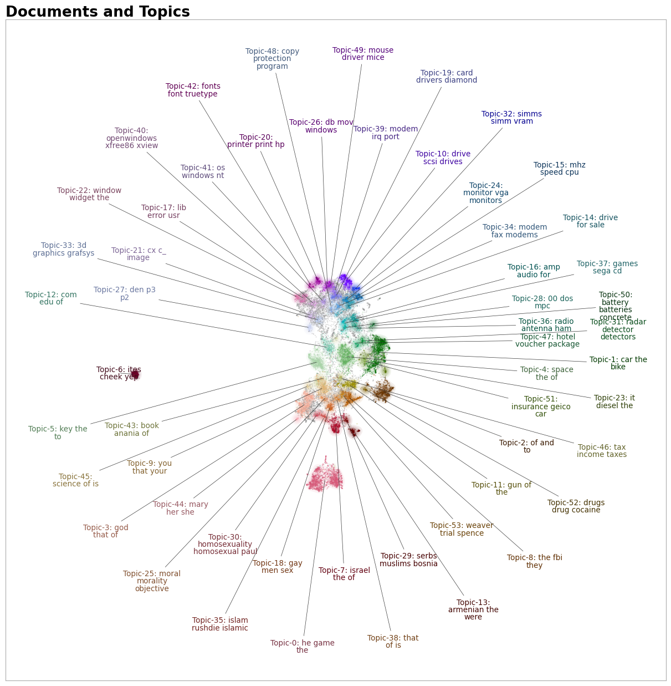
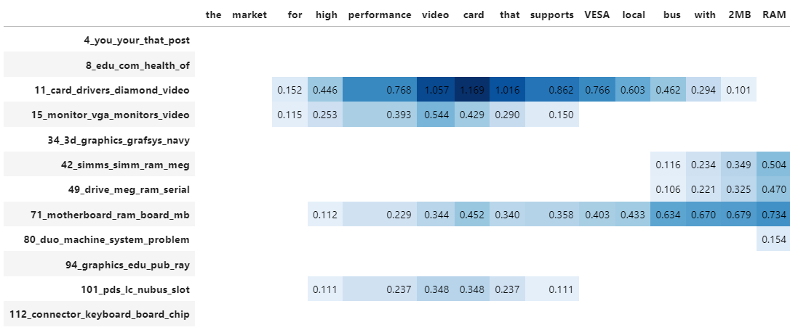

## **Visualize documents with Plotly**

Using the `.visualize_topics`, we can visualize the topics and get insight into their relationships. However, 
you might want a more fine-grained approach where we can visualize the documents inside the topics to see 
if they were assigned correctly or whether they make sense. To do so, we can use the `topic_model.visualize_documents()` 
function. This function recalculates the document embeddings and reduces them to 2-dimensional space for easier visualization 
purposes. This process can be quite expensive, so it is advised to adhere to the following pipeline:

```python
from sklearn.datasets import fetch_20newsgroups
from sentence_transformers import SentenceTransformer
from bertopic import BERTopic
from umap import UMAP

# Prepare embeddings
docs = fetch_20newsgroups(subset='all',  remove=('headers', 'footers', 'quotes'))['data']
sentence_model = SentenceTransformer("all-MiniLM-L6-v2")
embeddings = sentence_model.encode(docs, show_progress_bar=False)

# Train BERTopic
topic_model = BERTopic().fit(docs, embeddings)

# Run the visualization with the original embeddings
topic_model.visualize_documents(docs, embeddings=embeddings)

# Reduce dimensionality of embeddings, this step is optional but much faster to perform iteratively:
reduced_embeddings = UMAP(n_neighbors=10, n_components=2, min_dist=0.0, metric='cosine').fit_transform(embeddings)
topic_model.visualize_documents(docs, reduced_embeddings=reduced_embeddings)
```

<iframe src="documents.html" style="width:1200px; height: 800px; border: 0px;""></iframe>


!!! note
    The visualization above was generated with the additional parameter `hide_document_hover=True` which disables the 
    option to hover over the individual points and see the content of the documents. This was done for demonstration purposes 
    as saving all those documents in the visualization can be quite expensive and result in large files. However, 
    it might be interesting to set `hide_document_hover=False` in order to hover over the points and see the content of the documents.    

### **Custom Hover**

When you visualize the documents, you might not always want to see the complete document over hover. Many documents have shorter information that might be more interesting to visualize, such as its title. To create the hover based on a documents' title instead of its content, you can simply pass a variable (`titles`) containing the title for each document:

```python
topic_model.visualize_documents(titles, reduced_embeddings=reduced_embeddings)
```

## **Visualize documents with DataMapPlot**

`.visualize_document_datamap` provides an alternative way to visualize the documents inside the topics as a static [DataMapPlot](https://datamapplot.readthedocs.io/en/latest/intro_splash.html). Using the same pipeline as above, you can generate a DataMapPlot by running:

```python

# with the original embeddings
topic_model.visualize_document_datamap(docs, embeddings=embeddings)

# with the reduced embeddings
topic_model.visualize_document_datamap(docs, reduced_embeddings=reduced_embeddings)
```

<br><br>

<br><br>

Or if you want to save the resulting figure:

```python
fig = topic_model.visualize_document_datamap(docs, reduced_embeddings=reduced_embeddings)
fig.savefig("path/to/file.png", bbox_inches="tight")
```

## **Visualize Probabilities or Distribution**

We can generate the topic-document probability matrix by simply setting `calculate_probabilities=True` if a HDBSCAN model is used:

```python
from bertopic import BERTopic
topic_model = BERTopic(calculate_probabilities=True)
topics, probs = topic_model.fit_transform(docs) 
```

The resulting `probs` variable contains the soft-clustering as done through HDBSCAN. 

If a non-HDBSCAN model is used, we can estimate the topic distributions after training our model:

```python
from bertopic import BERTopic

topic_model = BERTopic()
topics, _ = topic_model.fit_transform(docs) 
topic_distr, _ = topic_model.approximate_distribution(docs, min_similarity=0)
```

Then, we either pass the `probs` or `topic_distr` variable to `.visualize_distribution` to visualize either the probability distributions or the topic distributions:

```python
# To visualize the probabilities of topic assignment
topic_model.visualize_distribution(probs[0])

# To visualize the topic distributions in a document
topic_model.visualize_distribution(topic_distr[0])
```

<iframe src="probabilities.html" style="width:1000px; height: 500px; border: 0px;""></iframe>

Although a topic distribution is nice, we may want to see how each token contributes to a specific topic. To do so, we need to first calculate topic distributions on a token level and then visualize the results:

```python
# Calculate the topic distributions on a token-level
topic_distr, topic_token_distr = topic_model.approximate_distribution(docs, calculate_tokens=True)

# Visualize the token-level distributions
df = topic_model.visualize_approximate_distribution(docs[1], topic_token_distr[1])
df
```

<br><br>

<br><br>

!!! note
     To get the stylized dataframe for `.visualize_approximate_distribution` you will need to have Jinja installed. If you do not have this installed, an unstylized dataframe will be returned instead. You can install Jinja via `pip install jinja2`

!!! note
    The distribution of the probabilities does not give an indication to 
    the distribution of the frequencies of topics across a document. It merely shows
    how confident BERTopic is that certain topics can be found in a document.


