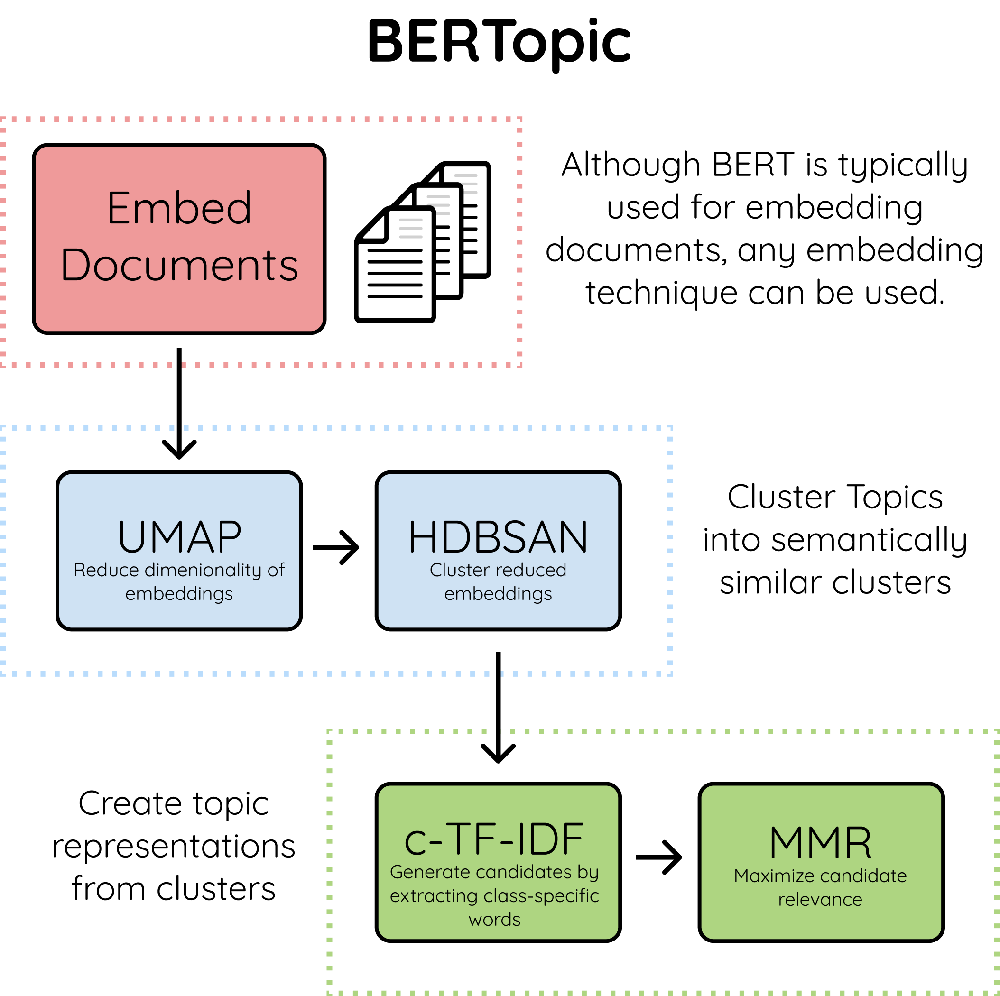

The algorithm contains, roughly, 3 stages:   
     
1. **Embed documents**
    * Extract document embeddings with BERT or any other embedding technique
2. **Cluster Documents**
    * UMAP to reduce the dimensionality of embeddings
    * HDBSCAN to cluster reduced embeddings and create clusters of semantically similar documents
3. **Create topic representation**  
    * Extract and reduce topics with c-TF-IDF
    * Improve coherence of words with Maximal Marginal Relevance  
    
##  **Embed documents**
We start by creating document embeddings from a set of documents using 
[sentence-transformers](https://github.com/UKPLab/sentence-transformers). These models are pre-trained for many 
language and are great for creating either document- or sentence-embeddings. 

In BERTopic, you can choose any sentence transformers model but there are two models that are set as defaults:

* `"distilbert-base-nli-stsb-mean-tokens"`
* `"xlm-r-bert-base-nli-stsb-mean-tokens"`

The first is an English BERT-based model trained specifically for semantic similarity tasks which work quite 
well for most use-cases. The second model is very similar to the first with one major difference is that the 
`xlm` models work for 50+ languages. This model is quite a bit larger than the first and is only selected if 
you select any language other than English.

##  **Cluster Documents**
Next, in order to cluster the documents using a clustering algorithm such as HDBSCAN we first need to 
reduce its dimensionality as HDBCAN is prone to the curse of dimensionality.

Thus, we first lower dimensionality with UMAP as it preserves local structure well after which we can 
use HDBSCAN to cluster similar documents.  

##  **Create topic representation**
What we want to know from the clusters that we generated, is what makes one cluster, based on its content, 
different from another? To solve this, we can modify TF-IDF such that it allows for interesting words per topic
instead of per document. 

When you apply TF-IDF as usual on a set of documents, what you are doing is comparing the importance of 
words between documents. Now, what if, we instead treat all documents in a single category (e.g., a cluster) 
as a single document and then apply TF-IDF? The result would be importance scores for words within a cluster. 
The more important words are within a cluster, the more it is representative of that topic. In other words, 
if we extract the most important words per cluster, we get descriptions of **topics**! This model is called 
class-based TF-IDF

  

Each cluster is converted to a single document instead of a set of documents. 
Then, the frequency of word `t` are extracted for each class `i` and divided by the total number of words `w`. 
This action can now be seen as a form of regularization of frequent words in the class.
Next, the average number of words per class `m` is divided by the total frequency of word `t` across all classes `n`.

### **Topic Coherence**  
This step is executed if you do not use custom embeddings but generate the document embeddings within BERTopic 
itself. The embedding model provided by BERTopic will be used to improve the coherence of words within a topic. 
After having generated the c-TF-IDF representations, we have a set of words that describe a collection of documents. 
Technically, this does not mean that this collection of words describes a coherent topic. In practice, we will 
see that many of the words do describe a similar topic but some words will, in a way, overfit the documents. For 
example, if you have a set of documents that are written by the same person whose signature will be in the topic 
description. 

To improve the coherence of words, Maximal Marginal Relevance was used to find the most coherent words 
without having too much overlap between the words themselves. This results in the removal of words that do not contribute 
to a topic.  