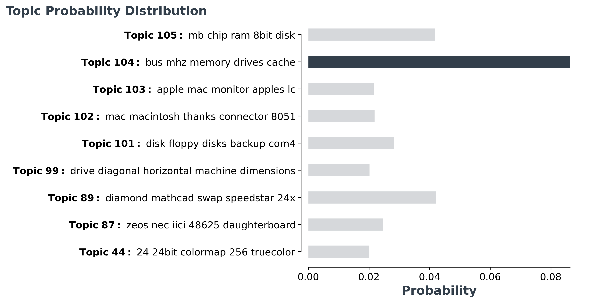

## **Visualize Topics**
After having trained our `BERTopic` model, we can iteratively go through perhaps a hundred topic to get a good 
understanding of the topics that were extract. However, that takes quite some time and lacks a global representation. 
Instead, we can visualize the topics that were generated in a way very similar to 
[LDAvis](https://github.com/cpsievert/LDAvis). 

We embed our c-TF-IDF representation of the topics in 2D using Umap and then visualize the two dimensions using 
plotly such that we can create an interactive view.

First, we need to train our model:

```python
from bertopic import BERTopic
from sklearn.datasets import fetch_20newsgroups

# Create topics
docs = fetch_20newsgroups(subset='train')['data']
model = BERTopic()
topics, probs = model.fit_transform(docs)
```

Then, we simply call `model.visualize_topics()` in order to visualize our topics. The resulting graph is a 
plotly interactive graph which can be converted to html. 

Thus, you can play around with the results below:

<iframe src="viz.html" style="width:1000px; height: 680px; border: 0px;""></iframe>

You can use the slider to select the topic which then lights up red. If you hover over a topic, then general 
information is given about the topic, including size of the topic and its corresponding words.

## **Visualize Probablities**
The variable `probabilities` that is returned from `transform()` or `fit_transform()` can be used to understand how 
confident BERTopic is that certain topics can be found in a document.

```python
from bertopic import BERTopic
from sklearn.datasets import fetch_20newsgroups

# Create topics
docs = fetch_20newsgroups(subset='train')['data']
model = BERTopic()
topics, probs = model.fit_transform(docs)
```

To visualize the distributions, we simply call:

```python
model.visualize_distribution(probabilities[0])
```

